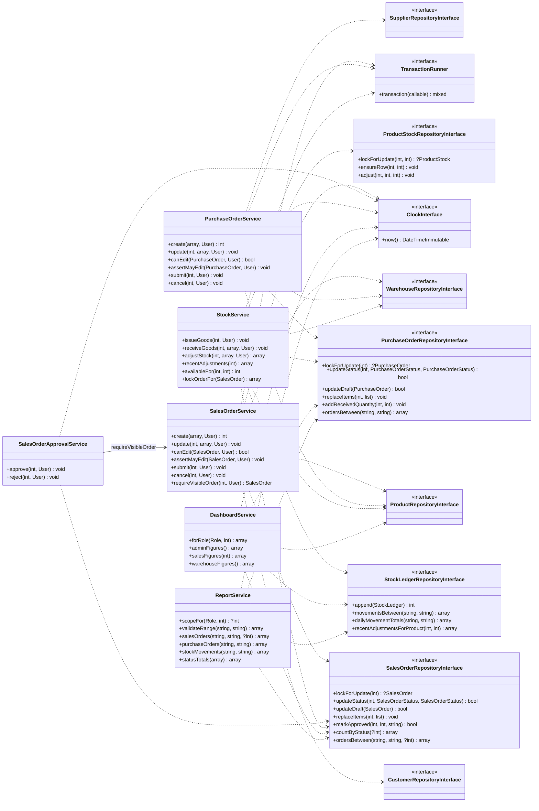
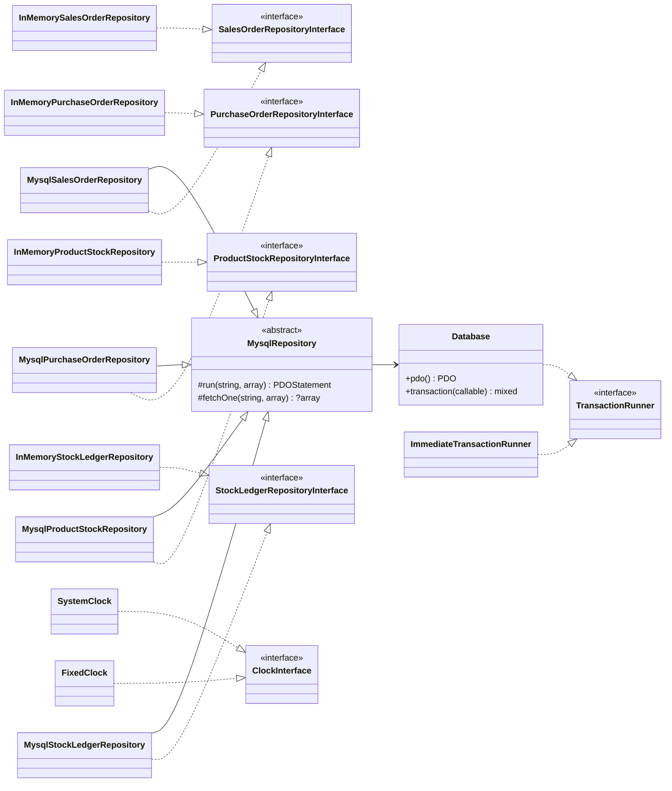
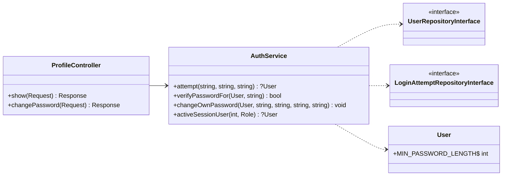

# Class Diagram — As-built (setelah implementasi)

**Diperbarui**: 2026-10-04 (+ 005-stock-movement-chart) · **Pasangannya**: [`../planning/class-diagram-initial.md`](../planning/class-diagram-initial.md)

Diagram ini menggambarkan kode yang **benar-benar ada**, bukan rancangan awalnya. Setiap panah
dependency di bawah sesuai dengan parameter constructor class-nya, yang dirangkai di
[`config/container.php`](../../config/container.php). Perbedaannya terhadap diagram awal dicatat
di bagian akhir.

**Cakupan.** Yang digambar adalah alur kritikal: Sales Order, Purchase Order, stock, dashboard,
report, dan JSON API, beserta seluruh dependency class-class tersebut. Service master data
(`ProductService`, `MasterDataService`, `PartyService`, `UserService`, `AuthService`) hanya
muncul sebagai dependency controller. Pola mereka sama: Service final yang bergantung pada
interface repository.

## Arah dependency

```
Controller  ──▶  Service  ──▶  RepositoryInterface  ◀── Mysql*Repository ──▶ Database
                                       ▲
                                       └── InMemory*Repository (unit test)
```

Dependency mengalir satu arah. Repository tidak pernah mengenal Service maupun Controller.

**Membedakan dependency pada interface dari dependency pada class konkret** — inilah yang
membuktikan Dependency Inversion benar-benar ada, bukan sekadar dinamai demikian:

| Notasi | Arti |
| --- | --- |
| `..>` garis putus | bergantung pada **interface** (dapat ditukar, dapat di-fake) |
| `-->` garis penuh | bergantung pada **class konkret** |
| `..\|>` | mengimplementasikan interface |
| `--\|>` | mewarisi class |

## 1. Service → interface



Tidak ada satu pun Service yang bergantung pada class konkret. Seluruh panah keluar dari
Service adalah `..>`.

## 2. Implementasi di balik interface



Kiri: produksi (`app/`). Kanan: test double di `tests/Unit/Fake/`. Pola yang sama berlaku untuk
**sebelas** interface repository (masing-masing punya satu `Mysql*` dan satu `InMemory*`).
Yang digambar di sini hanya empat repository yang dipakai alur stock.

## 3. Controller → Service konkret

```mermaid
classDiagram
    direction LR

    class SalesOrderController
    class SalesOrderApprovalController
    class GoodsIssueController
    class PurchaseOrderController
    class GoodsReceiptController
    class DashboardController
    class ReportController
    class StockApiController
    class ProfileController
    class StockAdjustmentController
    class ProductController

    class SalesOrderService
    class SalesOrderApprovalService
    class PurchaseOrderService
    class StockService
    class DashboardService
    class ReportService
    class ProductService
    class PartyService
    class MasterDataService
    class UserService
    class AuthService
    class View
    class Session
    class Csrf

    SalesOrderController --> SalesOrderService
    SalesOrderController --> StockService
    SalesOrderController --> ProductService
    SalesOrderController --> PartyService
    SalesOrderController --> MasterDataService
    SalesOrderController --> UserService
    SalesOrderController --> View
    SalesOrderController --> Session
    SalesOrderController --> Csrf

    SalesOrderApprovalController --> SalesOrderApprovalService
    SalesOrderApprovalController --> UserService
    SalesOrderApprovalController --> Session

    GoodsIssueController --> SalesOrderService
    GoodsIssueController --> StockService
    GoodsIssueController --> ProductService
    GoodsIssueController --> PartyService
    GoodsIssueController --> MasterDataService

    GoodsReceiptController --> PurchaseOrderService
    GoodsReceiptController --> StockService
    GoodsReceiptController --> ProductService
    GoodsReceiptController --> PartyService
    GoodsReceiptController --> MasterDataService

    PurchaseOrderController --> PurchaseOrderService
    PurchaseOrderController --> StockService
    PurchaseOrderController --> ProductService
    PurchaseOrderController --> PartyService
    PurchaseOrderController --> MasterDataService
    PurchaseOrderController --> UserService
    PurchaseOrderController --> View
    PurchaseOrderController --> Session
    PurchaseOrderController --> Csrf

    DashboardController --> DashboardService
    DashboardController --> View
    DashboardController --> Session

    ReportController --> ReportService
    ReportController --> View
    ReportController --> Session

    StockApiController --> ProductService
    StockApiController --> MasterDataService

    ProfileController --> AuthService
    ProfileController --> UserService
    ProfileController --> View
    ProfileController --> Session
    ProfileController --> Csrf

    StockAdjustmentController --> StockService
    StockAdjustmentController --> ProductService
    StockAdjustmentController --> MasterDataService
    StockAdjustmentController --> UserService
    StockAdjustmentController --> View
    StockAdjustmentController --> Session
    StockAdjustmentController --> Csrf

    ProductController --> StockService
```



Ini **disengaja**. Service adalah class final tanpa interface: tidak ada implementasi kedua,
dan menambahkan interface hanya demi simetri adalah lapisan tanpa masalah nyata (constitution
Principle I, spec C-003). Dependency inversion diminta ARCH-01 pada **boundary repository** —
di sanalah ada dua implementasi sungguhan, dan di sanalah interface-nya ada.

`StockApiController` sengaja **tidak** menerima `Session`: authentication dan authorization
sudah selesai di route table dan guard sebelum request sampai ke controller, sehingga bentuk
responsnya dapat di-unit-test penuh tanpa session.

### Profil sendiri dan validasi ulang session (002-user-profile-page)

`ProfileController` membaca identitas pemilik profil **hanya** dari `Session`; tidak ada id pada
route. Dua aturan barunya tinggal di `AuthService`, yang tetap bergantung pada interface
repository saja. `activeSessionUser()` juga dipanggil front controller (`public/index.php`) pada
setiap request terautentikasi, sehingga akun yang dinonaktifkan atau diganti role-nya kehilangan
akses pada request berikutnya.



`changeOwnPassword()` memakai counter `login_attempt` yang sama dengan `attempt()`, jadi tebakan
password di halaman login dan di halaman profil dihitung bersama. Panjang minimum password
kini satu konstanta di `User`, dipakai `AuthService` dan `UserService` (refactor-log R-7).

### Koreksi stock (003-stock-adjustment)

`StockAdjustmentController` meneruskan body request mentah ke `StockService::adjustStock()`, yang
tetap menjadi satu-satunya jalan stock berubah. Untuk itu `StockService` mendapat dependency
ketujuh, `WarehouseRepositoryInterface` (warehouse koreksi harus aktif), dan
`ProductStockRepositoryInterface` mendapat `ensureRow()` (ADR-002 addendum, refactor-log R-8).
`ProductController` kini bergantung pada `StockService` untuk riwayat koreksi di detail product,
yang hanya dimuat untuk Admin dan Warehouse Staff. `ProductController` sebelumnya tidak digambar
karena bukan alur kritikal; ia muncul di diagram 3 karena kini menyentuh `StockService`.

### Edit order Draft (004-edit-draft-orders)

`SalesOrderService` dan `PurchaseOrderService` masing-masing mendapat `update()`, `canEdit()`, dan
`assertMayEdit()`, serta dependency keenam, `TransactionRunner` — pola yang sama dengan
`StockService` — karena header dan line hasil edit harus tersimpan bersama atau tidak sama sekali.
Kedua repository interface mendapat `updateDraft()` (UPDATE bersyarat `status = 'Draft'`) dan
`replaceItems()`. Controller-nya mendapat action `edit()` dan `update()`; panah controller → service
di diagram 3 tidak berubah. `assertMayEdit()` dipakai controller **dan** service supaya layar edit
dan penyimpanan memeriksa dengan urutan yang sama (D-04).

### Pemecahan class order (tech-debt TD-11)

Approve/reject keluar dari `SalesOrderService` menjadi `SalesOrderApprovalService` (dengan
`SalesOrderApprovalController`), sehingga aturan segregation of duties berada di satu class kecil;
service itu memakai `SalesOrderService::requireVisibleOrder()` agar scoping 404 untuk Sales tidak
disalin. Goods issue dan goods receipt keluar dari controller order menjadi `GoodsIssueController`
dan `GoodsReceiptController` — pergerakan stock, seperti `StockAdjustmentController`. URL tidak
berubah. Helper total line pindah ke `Support\Money::lineTotal()`. Rinciannya di refactor-log
R-9 … R-11. Untuk keterbacaan, dependency `View`/`UserService`/`Session`/`Csrf` milik
`GoodsIssueController` dan `GoodsReceiptController` tidak digambar.

### Grafik stock movement di dashboard (005-stock-movement-chart, bonus)

`DashboardService` mendapat dependency keempat dan kelima, `StockLedgerRepositoryInterface` dan
`ClockInterface`, untuk figure `stockMovement` (unit masuk/keluar per hari, 30 hari terakhir) yang
hanya dihitung untuk Admin dan Warehouse Staff. Repository ledger mendapat `dailyMovementTotals()`:
satu query `GROUP BY DATE(created_at)` dengan aturan rentang yang sama dengan `movementsBetween()`,
sehingga grafik dan CSV stock movement tidak bisa berbeda. Geometri grafik dihitung class tampilan
kecil `Support\BarChartScale` (tanpa dependency, dipanggil oleh view `dashboard/_movement-chart`);
ia tidak digambar karena tidak memiliki collaborator.

## Yang berubah dari diagram awal, dan mengapa

**Ringkasnya:** Service membutuhkan lebih banyak collaborator daripada yang dirancang, karena
validasi referensi (customer, warehouse, product) ternyata aturan bisnis, bukan urusan
controller. `StockService` kini memuat dan mengunci order-nya sendiri di dalam transaction,
dan menerima `TransactionRunner` alih-alih `Database`. Dua Service baru, `DashboardService` dan
`ReportService`, lahir dari kebutuhan dashboard dan export CSV.

Rinciannya:

**1. Service memerlukan lebih banyak collaborator daripada yang digambar.**
`SalesOrderService` dirancang dengan tiga dependency (`orders`, `stocks`, `clock`). Nyatanya
lima: `orders`, `customers`, `warehouses`, `products`, `clock`. `stocks` tidak lagi
dibutuhkan, karena Sales Order tidak pernah menyentuh stock; hanya `StockService` yang boleh.
Penyebab tambahannya adalah validasi: membuat order menuntut pembuktian bahwa customer,
warehouse, dan setiap product benar-benar ada dan aktif. `PurchaseOrderService` mengikuti
pola yang sama, dengan supplier menggantikan customer.

**2. `StockService` tumbuh dari tiga menjadi enam dependency** (tujuh sejak spec 003, lihat
"Koreksi stock" di atas).
Selain `stocks` dan `ledger`, ia kini memuat order lewat `salesOrders` dan `purchaseOrders`.
Order itu dikunci dengan `lockForUpdate()` dan statusnya dibaca ulang **di dalam**
transaction, supaya satu order tidak dapat di-issue atau di-receive dua kali (ADR-002). Ia
juga membaca label product lewat `products` untuk pesan penolakan, dan menerima
`TransactionRunner` menggantikan `Database`. Transaction adalah batas tempat ARCH-02
ditegakkan, jadi harus terlihat pada signature Service. Interface ini juga yang memungkinkan
unit test menyuntikkan `ImmediateTransactionRunner`.

**3. Dua Service baru, dan prediksi diagram awal yang tidak terjadi.**
`DashboardService` dan `ReportService` bergantung pada interface repository order yang sama.
Kesepakatan angka dashboard dan isi file export (FR-027) dijaga oleh
`DashboardReportConsistencyTest` terhadap MySQL sungguhan. Dashboard memakai agregasi
`countByStatus()`, sedangkan report memakai baris `ordersBetween()` yang dihitung ulang dari
baris yang sama dengan isi file.

Ketiga prediksi diagram awal ternyata tidak terjadi:
- `StockService` tidak dipecah menjadi `GoodsReceiptService` dan `GoodsIssueService`, karena
  stock harus berubah lewat satu jalur saja (lihat `refactor-log.md`, catatan audit SRP).
- Signature `adjust()` tidak berubah: lock diambil lewat `lockForUpdate()` yang terpisah.
- `nextOrderNumber()` tetap di Service.

Urutan argument juga dibalik, dari `(User, int)` menjadi `(int, User)`, dan `create()` kini
mengembalikan id (`int`), bukan entity.
