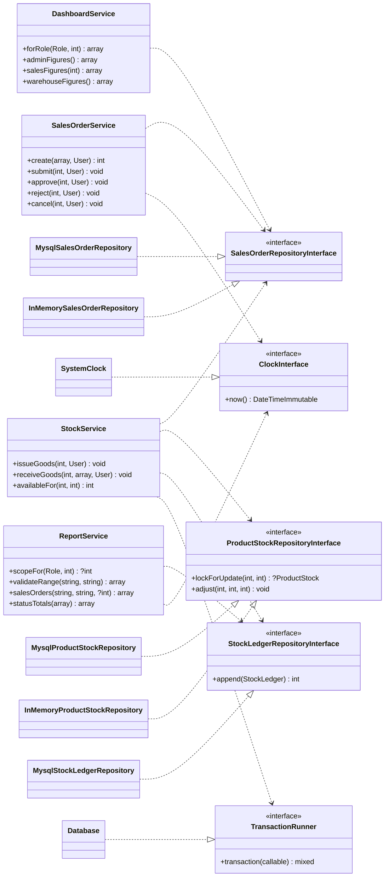
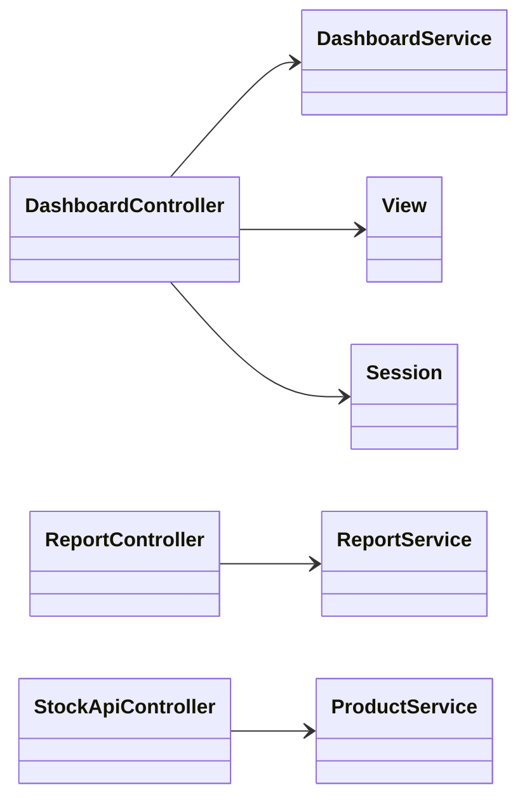

# Class Diagram — As-built (setelah implementasi)

**Tanggal**: 2026-09-14 · **Pasangannya**: [`../planning/class-diagram-initial.md`](../planning/class-diagram-initial.md)

Diagram ini menggambarkan kode yang **benar-benar ada**, bukan rancangan awalnya. Perbedaannya
terhadap diagram awal dicatat di bagian akhir.

## Arah dependency

```
Controller  ──▶  Service  ──▶  RepositoryInterface  ◀── Mysql*Repository
                                       ▲
                                       └── InMemory*Repository (unit test)
```

Dependency mengalir satu arah. Repository tidak pernah mengenal Service maupun Controller.

**Membedakan dependency pada interface dari dependency pada class konkret** — inilah yang
membuktikan Dependency Inversion benar-benar ada, bukan sekadar dinamai demikian:

| Notasi | Arti |
| --- | --- |
| `..>` garis putus | bergantung pada **interface** (dapat ditukar, dapat di-fake) |
| `-->` garis penuh | bergantung pada **class konkret** |

## Diagram



### Controller bergantung pada Service konkret



Ini **disengaja**. Service adalah class final tanpa interface: tidak ada implementasi kedua,
dan menambahkan interface hanya demi simetri adalah lapisan tanpa masalah nyata (constitution
Principle I, spec C-003). Dependency inversion diminta ARCH-01 pada **boundary repository** —
di sanalah ada dua implementasi sungguhan, dan di sanalah interface-nya ada.

`StockApiController` sengaja **tidak** menerima `Session`: authentication dan authorization
sudah selesai di route table dan guard sebelum request sampai ke controller, sehingga bentuk
responsnya dapat di-unit-test penuh tanpa session.

## Yang berubah dari diagram awal, dan mengapa

**1. Service memerlukan lebih banyak collaborator daripada yang digambar.**
`SalesOrderService` dirancang dengan dua dependency (`orders`, `stocks`, `clock`); nyatanya
lima — `orders`, `customers`, `warehouses`, `products`, `clock`. Penyebabnya validasi: membuat
order menuntut pembuktian bahwa customer, warehouse, dan setiap product benar-benar ada dan
aktif. Rancangan awal memperlakukan itu sebagai urusan controller; ternyata itu aturan bisnis,
dan tempatnya di Service.

`StockService` justru **kehilangan** `stocks` sebagai satu-satunya sumber dan memperoleh
`TransactionRunner`. Transaction bukan detail implementasi repository — ia adalah batas
tempat ARCH-02 ditegakkan, sehingga harus terlihat pada signature Service.

**2. Dua Service baru yang tidak ada di rancangan awal.**
`DashboardService` dan `ReportService` lahir dari FR-026 dan FR-027. Keduanya memanggil
**method repository yang sama**, karena FR-027 menuntut angka dashboard dan isi file export
sepakat — cara menjaganya bukan mencocokkan dua perhitungan, melainkan menghapus kemungkinan
keduanya berbeda (research R-008).

**3. `TransactionRunner` dipisahkan dari `Database`.**
Awalnya `StockService` akan menerima `Database`. Memisahkan interface `TransactionRunner`
membuat unit test dapat menyuntikkan `ImmediateTransactionRunner`, dan — lebih penting —
membuat kebutuhan transaction terbaca dari signature-nya sendiri.
