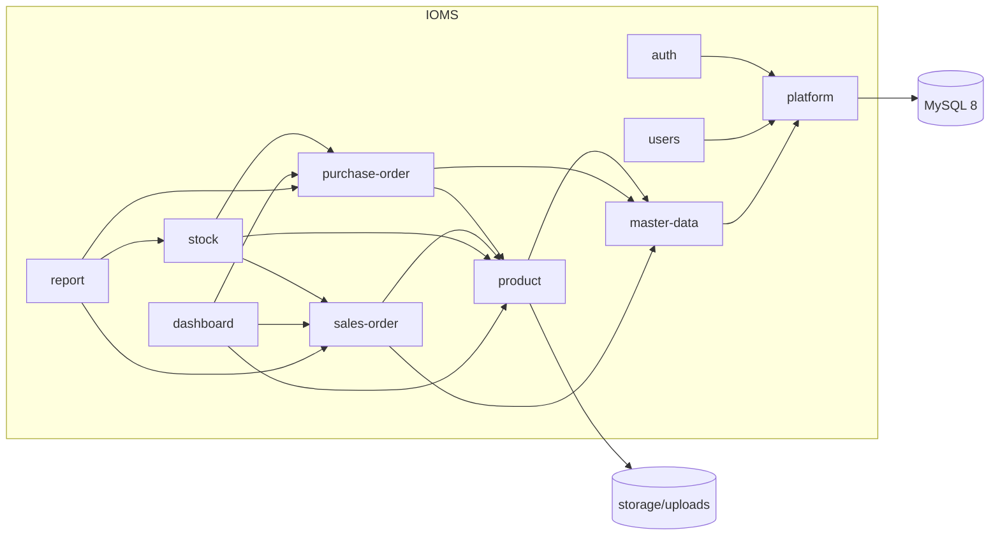

# Business Requirements Document: Inventory & Order Management System (IOMS)

**Scope**: Whole system
**Source**: Reverse-engineered from existing codebase by `/rudis.brd`
**Created**: 2026-10-03
**Last Updated**: 2026-10-03
**Status**: Draft

> **Catatan pemetaan modul.** Kode disusun **per lapisan** (`app/Controller`, `app/Service`,
> `app/Repository`, `app/Entity`, `app/Support`), bukan per folder domain. Karena itu modul di
> bawah adalah **modul domain**. Setiap file modul memetakan class-nya lintas lapisan, dengan
> pola nama yang sama: `<X>Controller` → `<X>Service` → `<X>RepositoryInterface` →
> `Mysql<X>Repository`.

## Executive Summary & Business Context

- Aplikasi web untuk mencatat product, mengelola stock di beberapa warehouse, memproses
  pembelian (Purchase Order → goods receipt) dan penjualan (Sales Order → approval → goods
  issue).
- Melayani tiga role dengan tanggung jawab yang sengaja dipisah: **Sales tidak pernah dapat
  approve**, dan approver tidak boleh pembuat order.
- Setiap perubahan stock tercatat di `stock_ledger` yang append-only, dan berlaku invariant
  `SUM(ledger) = product_stock` per (product, warehouse).
- Final project *Intermediate Programmer* (PT Neuronworks Indonesia). Acuannya brief
  (`specs/001-inventory-order-management/inputs/project-brief-resource-model.md`) dan
  `specs/001-inventory-order-management/spec.md`.

## Business Objectives

- **Stock yang dapat dipertanggungjawabkan**: setiap angka stock dapat ditelusuri ke satu baris
  ledger, termasuk saat dua goods issue berjalan bersamaan (tanpa oversell).
- **Segregation of duties**: tidak ada satu role yang dapat membuat sekaligus menyetujui
  transaksi yang sama, dan aturan ini ditegakkan di server.
- **Visibilitas per role**: dashboard dan report CSV dihitung dari data, bukan angka statis.
- **Bukti kualitas engineering** (konteks pelatihan): layered architecture yang dapat diuji, ADR,
  class diagram, dan refactor log.

## Stakeholders & Business Actors

| Actor | Role | Key Interactions |
| ----- | ---- | ---------------- |
| Admin | Pengelola sistem dan approver | User, master data, product, PO, approve/reject SO (bukan buatannya sendiri), seluruh report |
| Sales | Penjual | Membuat dan mengajukan SO miliknya, melihat katalog dan customer, export order miliknya |
| Warehouse Staff | Operator gudang | Membuat dan mengajukan PO, goods receipt, goods issue, report stock |
| CLI (operator) | Proses terjadwal manual | `scripts/check-low-stock.php` (JOB-01) |
| Container entrypoint | Otomasi | `docker/entrypoint.sh` → `database/migrate.php` setiap container `app` naik |

## Module Index

| Module | Slug | Description | Map |
| ------ | ---- | ------------ | --- |
| Authentication | `auth` | Login/logout, session, rate limit, validasi ulang session, profil sendiri | [modules/auth.md](modules/auth.md) |
| User Management | `users` | CRUD terbatas akun oleh Admin | [modules/users.md](modules/users.md) |
| Master Data | `master-data` | Category, Warehouse, Supplier, Customer | [modules/master-data.md](modules/master-data.md) |
| Product Catalog | `product` | Product, image, stock per warehouse, low-stock, JSON availability, JOB-01 | [modules/product.md](modules/product.md) |
| Purchase Order | `purchase-order` | PO Draft → Ordered → (Partially)Received / Cancelled | [modules/purchase-order.md](modules/purchase-order.md) |
| Sales Order | `sales-order` | SO Draft → PendingApproval → Approved → Fulfilled / Cancelled | [modules/sales-order.md](modules/sales-order.md) |
| Stock & Ledger | `stock` | Satu-satunya jalur perubahan stock: goods receipt dan goods issue | [modules/stock.md](modules/stock.md) |
| Dashboard | `dashboard` | Tiga dashboard per role dan API low-stock | [modules/dashboard.md](modules/dashboard.md) |
| Report | `report` | Export CSV stock movement, status SO, dan status PO | [modules/report.md](modules/report.md) |
| Platform | `platform` | Router, guard, session, CSRF, DB/transaction, view, migration, Docker | [modules/platform.md](modules/platform.md) |

## System Architecture

Modular monolith PHP 8.4 native yang server-rendered (tanpa framework/ORM/DI container). Satu
container `app` (Apache + PHP) dan satu container `db` (MySQL 8) dijalankan lewat Docker
Compose. Request mengalir `public/index.php → Router → Authorization guard → Controller →
Service → RepositoryInterface → Mysql*Repository (PDO)`. Dependency dirangkai manual di
`config/container.php`. Frontend memakai vanilla JS (ES module) sebagai progressive
enhancement.

## Technology & Dependency Inventory

| Dependency | Version (as pinned) | Note |
| ---------- | -------------------- | ---- |
| PHP | `~8.4.0` (`composer.json`), image `php:8.4-apache` | Dipatok tepat 8.4; runtime guard di `public/index.php` |
| MySQL | image `mysql:8.0` | InnoDB, `utf8mb4_unicode_ci` |
| Composer runtime packages | — (tidak ada) | Composer hanya untuk autoload dan dev tool |
| `phpunit/phpunit` | `11.5.56` (lock) | Unit + integration |
| `phpstan/phpstan` | `2.2.13` (lock) | Level 6 |
| `squizlabs/php_codesniffer` | `3.13.6` (lock) | PSR-12 + strict_types |
| Node (dev, via Docker) | `node:22-alpine` | Hanya untuk `node --test` (`tests/js/`); tanpa `package.json` |
| Lucide icons | sprite SVG lokal | Lisensi ISC, `public/assets/icons/lucide-sprite.svg` |

## Constraints & Non-Functional Notes

- **Deny by default**: route tanpa role eksplisit tidak dapat diakses (`config/routes.php`). Resource
  di luar scope pemanggil menghasilkan **404**, bukan 403.
- **Stock hanya berubah lewat `StockService`**, di dalam transaction dengan `SELECT … FOR UPDATE`.
  Urutan lock: baris order → `product_stock` (urut product_id, warehouse_id).
- **Status order compare-and-set** (`UPDATE … WHERE status = :expected`) di seluruh transisi.
- Prepared statement di semua query (`ATTR_EMULATE_PREPARES = false`). Output HTML lewat `View::e()`.
- Acting user di-pass sebagai argument ke Service, dan tidak pernah dibaca dari session di dalam
  Service.
- Uang `DECIMAL(15,2)`, IDR, ditampilkan `Rp 1.250.000`. String UI bahasa Inggris; comment dan
  dokumentasi bahasa Indonesia.
- Tidak boleh ada framework, ORM, DI container, CSS framework, maupun JS framework (brief §4,
  spec C-003). Over-engineering dinilai negatif.
- Migration otomatis saat container start, bersifat idempotent (`schema_migration`).

## Out of Scope / Known Gaps

- Di luar scope (brief §4.3): microservices, queue, CI/CD, cron otomatis, real-time notification,
  E2E test, password reset, dan registrasi publik.
- **Koreksi stock manual (`Adjustment`) tertunda** — schema dan enum siap, alurnya belum ada
  ([stock](modules/stock.md) STOCK-CAP-005).
- Daftar tech debt lengkap ada di `docs/quality/tech-debt.md`, dan bug yang diketahui di
  `docs/testing/known-bugs.md`.

## Glossary

- **Goods receipt**: penerimaan barang dari PO. Menambah stock dan menulis ledger `Receipt`.
  Boleh sebagian (partial).
- **Goods issue**: pengeluaran barang untuk SO yang `Approved`. Mengurangi stock dan menulis
  ledger `Issue`. All-or-nothing.
- **Stock ledger**: riwayat pergerakan stock yang append-only. Menjadi sumber kebenaran angka
  stock.
- **Reorder point**: ambang per product. Product berstatus *low stock* bila total stock ≤ reorder point.
- **Segregation of duties**: approver Sales Order ≠ pembuatnya, dan Sales tidak pernah approve.
- **Compare-and-set**: perubahan status hanya berlaku bila status tersimpan masih sama dengan yang
  dibaca.

## Assumptions & Open Questions

- **Q1 (terjawab 2026-10-03, kini terpenuhi)**: Halaman "profil sendiri" (brief §1.2)
  **diharapkan**. Sudah dibuat lewat spec 002 — [auth](modules/auth.md) AUTH-CAP-006.
- **Q2 (terjawab 2026-10-03)**: Koreksi stock manual (`Adjustment`) adalah **fitur yang tertunda**,
  bukan di luar scope — [stock](modules/stock.md) STOCK-CAP-005.
- Asumsi (sudah diputuskan, `docs/planning/decisions.md`): D-01 Admin juga tidak boleh approve SO
  miliknya; D-02 Warehouse Staff boleh mengajukan PO sampai Ordered; D-03 export status order
  mencakup SO dan PO.

## Change Log

- **2026-10-03**: Modul `auth` diperbarui setelah 002-user-profile-page: profil sendiri dan ganti
  password sendiri (AUTH-CAP-006/007), serta validasi ulang session pada setiap request
  (AUTH-CAP-008). Celah "profil sendiri" dihapus dari Known Gaps.
- **2026-10-03**: Initial version generated from codebase survey (10 modul domain, dipetakan lintas
  lapisan). 2 clarification diajukan dan terjawab: Q1 profil sendiri = celah, Q2 Adjustment = tertunda.
