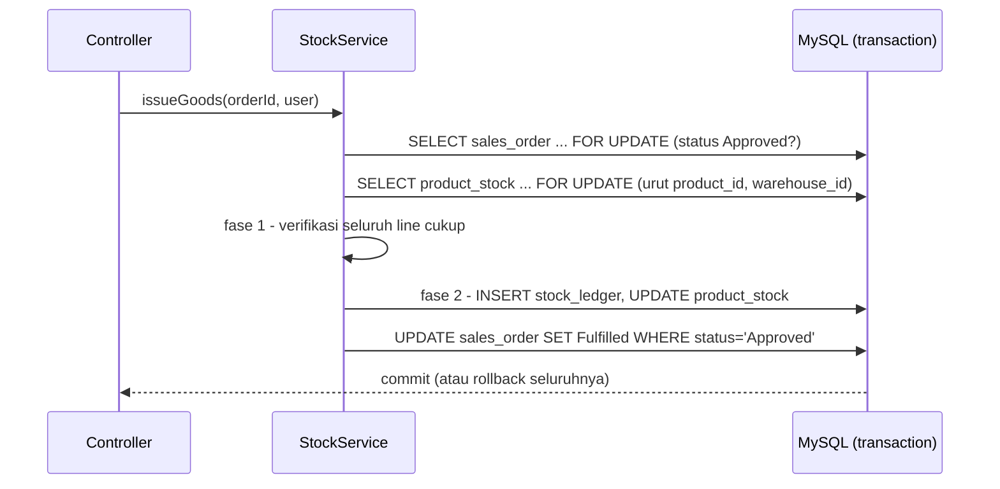

# Module: Stock & Ledger (`stock`)

**Back to**: [00-overview.md](../00-overview.md) · **Last Updated**: 2026-10-03

## Summary

Satu-satunya jalan quantity stock boleh berubah. Goods receipt dan goods issue menulis
`stock_ledger` dan `product_stock` dalam satu transaction yang aman dari race condition (ARCH-02).

## Capabilities

- **STOCK-CAP-001** — Mengeluarkan barang untuk SO Approved secara all-or-nothing; ditolak bila stock tidak cukup
- **STOCK-CAP-002** — Menerima barang untuk PO Ordered/PartiallyReceived, boleh sebagian, tidak boleh melebihi yang dipesan
- **STOCK-CAP-003** — Menjamin tidak ada oversell maupun pemrosesan ganda saat dua request bersamaan
- **STOCK-CAP-004** — Menampilkan riwayat pergerakan per order dan stock tersedia per (product, warehouse)
- **STOCK-CAP-005** — Koreksi stock manual / stock opname (`Adjustment`, reference `Manual`) — **TERTUNDA** (diputuskan 2026-10-03: fitur yang direncanakan; schema dan enum sudah siap, alurnya belum ada)

## Key Entities & Rules

- **STOCK-ENT-001 ProductStock** — product, warehouse, quantity (CHECK ≥ 0), updated_at; UNIQUE
  (product, warehouse) (`product_stock`)
- **STOCK-ENT-002 StockLedger** — product, warehouse, movement_type `Receipt|Issue|Adjustment`,
  quantity (+receipt / −issue), reference_type `PurchaseOrder|SalesOrder|Manual`, reference_id,
  performed_by, created_at (`stock_ledger`, `app/Entity/StockLedger.php`)
- Invariant: `SUM(stock_ledger.quantity) = product_stock.quantity` per (product, warehouse)
- Rule: ledger append-only, tidak pernah di-UPDATE/DELETE (dijaga konvensi, bukan DB — TD-9)
- Rule: urutan lock baris order → `product_stock` urut (product_id, warehouse_id); verifikasi seluruh line sebelum menulis apa pun (dua fase)

## API Surface

**Exposes** (tanpa route sendiri; dipanggil controller order)

| Kind | Name / Route | Role | Entry file |
| ---- | ------------ | ---- | ---------- |
| PHP | `StockService::issueGoods(int orderId, User): void` | dari `POST /sales-orders/{id}/issue` | [`app/Service/StockService.php`](../../../app/Service/StockService.php) |
| PHP | `StockService::receiveGoods(int orderId, array qtyByItem, User): void` | dari `POST /purchase-orders/{id}/receive` | idem |
| PHP | `availableFor`, `movementsForSalesOrder`, `movementsForPurchaseOrder`, `lockOrderFor` | baca / aturan urutan lock | idem |

**Consumes**

- `sales-order` / `purchase-order` — `lockForUpdate(id)`, `updateStatus(id, expected, new): bool`, `addReceivedQuantity`
- `product` — label product untuk pesan penolakan
- `platform` — `TransactionRunner` (`Database::transaction`, SAVEPOINT untuk nested)

## Data Flow

- Receipt: lock PO beserta item → validasi outstanding → lock `product_stock` (urutan sama) → ledger `Receipt` → tambah stock → `received_quantity` → status PartiallyReceived/Received (compare-and-set)

## Dependencies

- **Other modules**: sales-order, purchase-order, product, platform

## Test Coverage

- `StockService` — unit (`StockServiceTest`; `ImmediateTransactionRunner`)
- Oversell, lock wait, issue ganda, receipt basi — integration (`ConcurrentGoodsIssueTest`, dua connection)
- Invariant ledger — integration (`LedgerReconciliationTest`); `adjust()` — `StockAdjustmentTest`
- Rollback di tengah operasi — integration (`GoodsReceiptTest`, `NestedTransactionTest`)

## Known Gaps / Risks

- **Area paling kritikal**: melepas transaction, `FOR UPDATE`, atau compare-and-set membuat oversell atau pemrosesan ganda dapat direproduksi (critical failure brief §8.2).
- Append-only belum dijaga di level database (TD-9).
- **Alur `Adjustment` tertunda** (Q2, terkonfirmasi fitur yang direncanakan). Bila dibangun, wajib lewat `StockService` di dalam transaction yang sama dengan penulisan ledger (`movement_type = Adjustment`, `reference_type = Manual`, `reference_id = NULL`), dengan lock `product_stock` yang sama, dan hanya untuk role yang ditetapkan (kemungkinan Admin dan Warehouse Staff). Invariant ledger tetap berlaku.

## Change Log

- **2026-10-03**: Initial version generated from codebase survey.
