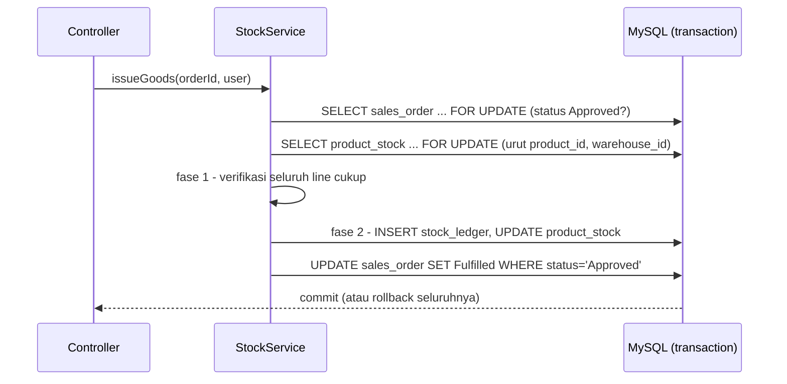

# Module: Stock & Ledger (`stock`)

**Back to**: [00-overview.md](../00-overview.md) · **Last Updated**: 2026-10-03

## Summary

Satu-satunya jalan quantity stock boleh berubah. Goods receipt, goods issue, dan koreksi stock
(Adjustment) menulis `stock_ledger` dan `product_stock` dalam satu transaction yang aman dari race
condition (ARCH-02).

## Capabilities

- **STOCK-CAP-001** — Mengeluarkan barang untuk SO Approved secara all-or-nothing; ditolak bila stock tidak cukup
- **STOCK-CAP-002** — Menerima barang untuk PO Ordered/PartiallyReceived, boleh sebagian, tidak boleh melebihi yang dipesan
- **STOCK-CAP-003** — Menjamin tidak ada oversell maupun pemrosesan ganda saat dua request bersamaan
- **STOCK-CAP-004** — Menampilkan riwayat pergerakan per order dan stock tersedia per (product, warehouse)
- **STOCK-CAP-005** — Koreksi stock manual / stock opname dari hasil hitung fisik (`Adjustment`, reference `Manual`, alasan wajib) oleh Admin dan Warehouse Staff (spec 003)
- **STOCK-CAP-006** — Menampilkan 10 koreksi terakhir per product (dengan saldo setelahnya) untuk Admin dan Warehouse Staff; riwayat penuh lewat export CSV (spec 003)

## Key Entities & Rules

- **STOCK-ENT-001 ProductStock** — product, warehouse, quantity (CHECK ≥ 0), updated_at; UNIQUE
  (product, warehouse) (`product_stock`)
- **STOCK-ENT-002 StockLedger** — product, warehouse, movement_type `Receipt|Issue|Adjustment`,
  quantity (+receipt / −issue / ±adjustment), reference_type `PurchaseOrder|SalesOrder|Manual`,
  reference_id, note (alasan; wajib tepat untuk Adjustment — deviasi D-1 spec 003), performed_by,
  created_at (`stock_ledger`, `app/Entity/StockLedger.php`)
- Invariant: `SUM(stock_ledger.quantity) = product_stock.quantity` per (product, warehouse)
- Rule: ledger append-only, tidak pernah di-UPDATE/DELETE — dijaga konvensi service **dan** trigger MySQL `database/005_ledger_append_only.sql` (TD-9)
- Rule: urutan lock baris order → `product_stock` urut (product_id, warehouse_id); verifikasi seluruh line sebelum menulis apa pun (dua fase)
- Rule: koreksi = quantity hasil hitung − quantity sistem; selisih nol ditolak; ditolak bila quantity berubah setelah user melihatnya; baris `product_stock` dipastikan ada sebelum dikunci (`ensureRow`, ADR-002 addendum)
- Rule (DB): `ck_ledger_note_adjustment`, `ck_ledger_adjustment_manual` (migration `004_ledger_note.sql`)

## API Surface

**Exposes** (route koreksi stock lewat `StockAdjustmentController`; lainnya dipanggil controller order)

| Kind | Name / Route | Role | Entry file |
| ---- | ------------ | ---- | ---------- |
| PHP | `StockService::issueGoods(int orderId, User): void` | dari `POST /sales-orders/{id}/issue` | [`app/Service/StockService.php`](../../../app/Service/StockService.php) |
| PHP | `StockService::receiveGoods(int orderId, array qtyByItem, User): void` | dari `POST /purchase-orders/{id}/receive` | idem |
| HTTP | `GET`/`POST /products/{id}/adjust-stock` | Admin, Warehouse Staff | [`app/Controller/StockAdjustmentController.php`](../../../app/Controller/StockAdjustmentController.php) |
| PHP | `StockService::adjustStock(int productId, array input, User): array{before, after, delta}` | dari `POST /products/{id}/adjust-stock` | [`app/Service/StockService.php`](../../../app/Service/StockService.php) |
| PHP | `StockService::recentAdjustments(int productId)` | detail product (Admin, WS) | idem |
| PHP | `availableFor`, `movementsForSalesOrder`, `movementsForPurchaseOrder`, `lockOrderFor` | baca / aturan urutan lock | idem |

**Consumes**

- `sales-order` / `purchase-order` — `lockForUpdate(id)`, `updateStatus(id, expected, new): bool`, `addReceivedQuantity`
- `product` — label product untuk pesan penolakan; keberadaan product untuk koreksi
- `master-data` — `WarehouseRepositoryInterface` (warehouse koreksi harus aktif)
- `platform` — `TransactionRunner` (`Database::transaction`, SAVEPOINT untuk nested)

## Data Flow

- Koreksi: validasi input mentah → product ada, warehouse aktif → transaction: `ensureRow` → `FOR UPDATE` → tolak bila quantity ≠ yang dilihat user atau selisih nol → ledger `Adjustment` (+alasan) → stock
- Receipt: lock PO beserta item → validasi outstanding → lock `product_stock` (urutan sama) → ledger `Receipt` → tambah stock → `received_quantity` → status PartiallyReceived/Received (compare-and-set)

## Dependencies

- **Other modules**: sales-order, purchase-order, product, platform
- **Consumed by**: dashboard — `dailyMovementTotals()` untuk grafik stock movement (spec 005)

## Test Coverage

- `StockService` — unit (`StockServiceTest`; `ImmediateTransactionRunner`)
- Oversell, lock wait, issue ganda, receipt basi — integration (`ConcurrentGoodsIssueTest`, dua connection)
- Invariant ledger — integration (`LedgerReconciliationTest`); `adjust()` — `StockAdjustmentTest`
- Koreksi stock — unit (`StockServiceAdjustmentTest`), integration (`StockAdjustmentFlowTest`: CHECK, invariant, riwayat, CSV, route roles), konkurensi (`ConcurrentStockAdjustmentTest`, dua connection)
- Rollback di tengah operasi — integration (`GoodsReceiptTest`, `NestedTransactionTest`)

## Known Gaps / Risks

- **Area paling kritikal**: melepas transaction, `FOR UPDATE`, atau compare-and-set membuat oversell atau pemrosesan ganda dapat direproduksi (critical failure brief §8.2).

## Change Log

- **2026-10-04**: Append-only kini dijaga trigger MySQL (TD-9). Goods issue dan goods receipt dilayani `GoodsIssueController` dan `GoodsReceiptController` (TD-11); URL tidak berubah.
- **2026-10-03**: 003-stock-adjustment diimplementasikan — STOCK-CAP-005 terpenuhi, STOCK-CAP-006
  ditambahkan; kolom `note` + dua CHECK; celah Adjustment dihapus dari Known Gaps.
- **2026-10-03**: Initial version generated from codebase survey.
