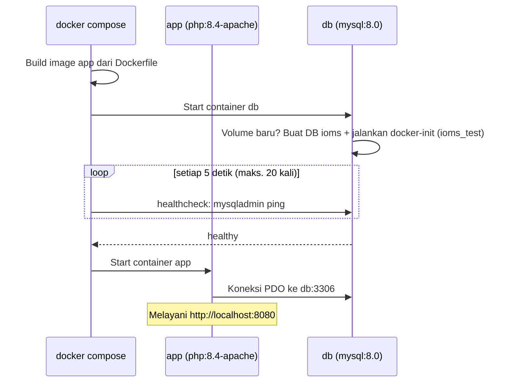

# Review Docker & DevOps

Dokumen ini merangkum kondisi containerization project **Inventory & Order Management
System**: apa yang sudah diterapkan, alasan di balik setiap konfigurasi, risiko yang masih
ada, dan bagian yang dapat diperbaiki.

Dibuat 2026-10-02. Acuan: *Training Programmer – DevOps (V2)* dan ekspektasi Docker untuk
level Intermediate Programmer.

---

## Daftar Isi

1. [Ringkasan](#1-ringkasan)
2. [Pemenuhan ekspektasi Docker (8 poin)](#2-pemenuhan-ekspektasi-docker-8-poin)
3. [Cakupan terhadap modul Training DevOps](#3-cakupan-terhadap-modul-training-devops)
4. [Penjelasan Dockerfile](#4-penjelasan-dockerfile)
5. [Penjelasan compose.yaml](#5-penjelasan-composeyaml)
6. [Alur startup](#6-alur-startup)
7. [Alasan di balik konfigurasi](#7-alasan-di-balik-konfigurasi)
8. [Risiko implementasi saat ini](#8-risiko-implementasi-saat-ini)
9. [Rencana perbaikan](#9-rencana-perbaikan)

---

## 1. Ringkasan

| Aspek | Kondisi |
| --- | --- |
| Ekspektasi Docker (8 poin) | **7 terpenuhi, 1 sebagian** (healthcheck belum ada di service `app`) |
| Modul DevOps Bab 7–8 (Docker) | Sebagian besar terpenuhi |
| Modul DevOps Bab 2–6 (Observability) | Belum diterapkan |
| Modul DevOps Bab 9–12 (Kubernetes/Helm) | **Di luar scope** secara sengaja |

> **Kenapa Kubernetes, CI/CD, dan microservices tidak ada?**
> Spec C-004, `plan.md`, dan constitution menyatakan semuanya di luar scope. Spec C-003 juga
> melarang over-engineering, sehingga aplikasi sengaja dibuat sebagai modular monolith
> dengan dua service saja: `app` dan `db`.

---

## 2. Pemenuhan ekspektasi Docker (8 poin)

| # | Ekspektasi | Status | Bukti |
| --- | --- | :---: | --- |
| 1 | Base image dengan tag versi jelas | ✅ | `php:8.4-apache`, `mysql:8.0`, `composer:2`. Tidak ada `latest` |
| 2 | Urutan layer Dockerfile efisien | ✅ | Package sistem → extension → config Apache/PHP → `composer.json/lock` → `composer install` → baru `COPY . .` |
| 3 | Menggunakan `.dockerignore` | ✅ | Mengecualikan `.git`, `vendor`, `.env*` (kecuali `.env.example`), `storage/uploads`, `specs`, `.claude`, log |
| 4 | Konfigurasi lewat environment variable | ✅ | `APP_*`, `DB_*`, `SESSION_SECURE`, `UPLOAD_PATH` dari `.env` → `compose.yaml` |
| 5 | Secret tidak ada di image/repository | ✅ * | `.env` di-ignore oleh git dan Docker, diverifikasi di [secret-scan.md](../quality/secret-scan.md) |
| 6 | App dan database via Docker Compose | ✅ | Service `app` + `db` pada network `ioms_net` |
| 7 | Volume untuk data persisten | ✅ | `db_data` (MySQL), `uploads_data` (image product), `vendor_data` |
| 8 | Healthcheck pada service relevan | ⚠️ | `db` punya healthcheck dan `app` menunggu `service_healthy`, tetapi **`app` sendiri belum punya healthcheck** walau endpoint `/_health` sudah tersedia |

\* `compose.yaml` masih memuat password fallback (`ioms_secret`, `root_secret`). Nilai ini
password demo, bukan credential aktif, tetapi tetap dicatat sebagai risiko (lihat
[bagian 8](#8-risiko-implementasi-saat-ini)).

---

## 3. Cakupan terhadap modul Training DevOps

### Sudah diterapkan

**Bab 7 — Docker image & container lifecycle**

- Base image di-pin ke PHP 8.4, dan layer dependency dipisah dari source code.
- `.dockerignore` mencegah `.env` dan secret ikut masuk image.
- Konfigurasi dibaca dari environment variable.
- Error log diarahkan ke stderr; `display_errors` dan `expose_php` dimatikan.
- Data tidak disimpan di writable layer container karena memakai named volume.
- Health endpoint `GET /_health` tersedia tanpa membocorkan versi atau environment.
- Startup `app` digantungkan pada healthcheck `db`.
- Script CLI `scripts/check-low-stock.php` punya exit code yang jelas (0/1) dan memakai
  stdout/stderr dengan benar.

**Bab 1 — Operability contract (dalam bentuk dokumen)**

- Peta arsitektur dan dependency ada di `plan.md`, ADR-001/002, dan `erd.md`.
- Failure mode didokumentasikan di `docs/testing/failure-paths.md`.

### Belum diterapkan

| Bab | Topik | Status |
| --- | --- | --- |
| 1 | SLI/SLO, owner, runbook, rollback formal | ❌ |
| 2–3 | Prometheus metrics, PromQL, Grafana dashboard | ❌ |
| 4 | Structured (JSON) logging dan correlation ID | ❌ Log masih teks bebas `error_log('...')` |
| 5 | OpenTelemetry / distributed tracing | ❌ |
| 6 | Alert rule, Alertmanager, on-call | ❌ |
| 7 | Healthcheck container `app` | ⚠️ Endpoint ada, healthcheck belum |
| 7 | Readiness vs liveness | ⚠️ `/_health` tidak memeriksa DB, sehingga hanya berfungsi sebagai liveness |
| 7 | Uji graceful shutdown (SIGTERM) | ⚠️ Belum ada evidence |
| 8 | Multi-stage build | ❌ Image satu stage; dev dependency dan composer ikut ke runtime |
| 8 | Non-root runtime | ❌ Master process Apache berjalan sebagai root |
| 8 | Image digest pinning, scan/SBOM | ❌ |
| 9–12 | Kubernetes, Helm, RBAC, HPA | ⛔ Di luar scope (C-004) |
| — | CI/CD | ⛔ Di luar scope (C-004) |

---

## 4. Penjelasan Dockerfile

**Fungsi utama:** resep untuk membangun image service `app`, berisi OS, PHP 8.4, Apache,
extension, dan kode aplikasi. Image ini dipanggil oleh `compose.yaml` lewat blok `build`.

### 4.1 Base image

```dockerfile
FROM php:8.4-apache
```

PHP sudah termasuk Apache sebagai web server. Tag `8.4` dikunci karena spec C-001
mewajibkan PHP **tepat** 8.4. Varian `-apache` dipilih supaya tidak perlu container
nginx atau PHP-FPM terpisah.

### 4.2 Extension dan package sistem

```dockerfile
RUN apt-get update \
    && apt-get install -y --no-install-recommends unzip libzip-dev \
    && docker-php-ext-install pdo_mysql \
    && apt-get clean \
    && rm -rf /var/lib/apt/lists/*
```

| Bagian | Fungsi |
| --- | --- |
| `pdo_mysql` | Satu-satunya extension tambahan, karena aplikasi memakai PDO tanpa ORM |
| `unzip` | Dibutuhkan composer untuk mengekstrak package |
| `libzip-dev` | Library pengembangan zip. Saat ini **tidak terpakai**, karena extension `zip` tidak di-install; kandidat untuk dihapus |
| `--no-install-recommends` | Tidak memasang package rekomendasi, sehingga image lebih kecil |
| `apt-get clean` + hapus `lists` | Cache apt tidak tertinggal di layer. Semuanya ditulis dalam satu `RUN` agar efeknya benar |

### 4.3 Modul Apache

```dockerfile
RUN a2enmod rewrite headers
```

- `rewrite` mengarahkan semua URL ke front controller `public/index.php`.
- `headers` diperlukan supaya security header di `public/.htaccess` benar-benar terkirim.

### 4.4 DocumentRoot ke `public/`

```dockerfile
ENV APACHE_DOCUMENT_ROOT=/var/www/html/public
RUN sed -ri -e 's!/var/www/html!${APACHE_DOCUMENT_ROOT}!g' /etc/apache2/sites-available/*.conf \
    && sed -ri -e 's!/var/www/!${APACHE_DOCUMENT_ROOT}!g' /etc/apache2/apache2.conf /etc/apache2/conf-available/*.conf
```

Hanya folder `public/` yang dapat diakses dari browser. `app/`, `config/`, `.env`, dan
`storage/uploads/` berada di luar web root, sehingga tidak bisa dibuka lewat URL
(research R-006).

### 4.5 Konfigurasi PHP production

Pertama, `php.ini-production` bawaan image di-rename menjadi `php.ini`, sehingga default
PHP mengikuti setelan production yang lebih aman. Setelah itu file
`conf.d/99-app.ini` ditulis untuk menimpa beberapa nilai. Awalan `99-` memastikan file ini
dibaca paling akhir, jadi nilainya yang berlaku.

```ini
display_errors=Off          ; stack trace tidak tampil ke user (ERR-01)
display_startup_errors=Off
log_errors=On
error_log=/dev/stderr       ; log terbaca lewat `docker compose logs app`
upload_max_filesize=4M      ; batas upload image product
post_max_size=8M
expose_php=Off              ; header X-Powered-By tidak membocorkan versi PHP
```

### 4.6 Composer

```dockerfile
COPY --from=composer:2 /usr/bin/composer /usr/bin/composer
```

Hanya binary composer yang disalin dari image resmi `composer:2`, tanpa instalasi manual.

### 4.7 Dependency dan kode aplikasi

```dockerfile
WORKDIR /var/www/html

COPY composer.json composer.lock* ./
RUN composer install --no-interaction --no-scripts --no-autoloader --prefer-dist || true

COPY . .
RUN composer dump-autoload --optimize \
    && mkdir -p storage/uploads \
    && chown -R www-data:www-data storage \
    && chmod -R 755 storage

EXPOSE 80
```

| Langkah | Fungsi |
| --- | --- |
| `WORKDIR /var/www/html` | Direktori kerja untuk semua instruksi berikutnya dan saat container berjalan |
| Copy `composer.json/lock` lebih dulu | Kalau yang berubah hanya kode PHP, layer `composer install` (paling lama) diambil dari cache |
| `composer.lock*` | Wildcard agar build tidak gagal bila lockfile belum ada |
| `--no-scripts --no-autoloader` | Script composer dan autoloader dilewati, karena source code belum di-copy pada tahap ini. Autoloader dibuat belakangan dengan `dump-autoload` |
| `--prefer-dist` | Mengunduh arsip package, bukan clone git, sehingga lebih cepat |
| `\|\| true` | Kegagalan install diabaikan. Ini risiko, lihat R2 di [bagian 8](#8-risiko-implementasi-saat-ini) |
| `COPY . .` | Menyalin seluruh kode, disaring oleh `.dockerignore` |
| `dump-autoload --optimize` | Membuat classmap agar autoload lebih cepat |
| `chown` ke `www-data` | Apache bisa menulis file upload ke `storage/` |
| `EXPOSE 80` | Menandai bahwa Apache listen di port 80 |

### 4.8 Tanpa `CMD`

Dockerfile ini tidak menulis `CMD` sendiri. Perintah start diwarisi dari base image, yaitu
`apache2-foreground`, yang menjalankan Apache di foreground sebagai proses utama
container.

---

## 5. Penjelasan compose.yaml

**Fungsi utama:** menjalankan image `app` bersama MySQL, sekaligus mengatur port,
environment variable, volume, network, dan urutan startup.

Hubungan dengan Dockerfile:

```yaml
build:
  context: .            # seluruh folder project dikirim ke builder (disaring .dockerignore)
  dockerfile: Dockerfile
```

Service `db` tidak punya Dockerfile karena langsung memakai image resmi `mysql:8.0`.

### 5.1 Service `app`

| Konfigurasi | Fungsi |
| --- | --- |
| `container_name: ioms_app` | Nama container tetap, mudah dipanggil dengan `docker compose exec app` |
| `restart: unless-stopped` | Otomatis restart bila crash, kecuali dihentikan manual |
| `ports: "${APP_PORT:-8080}:80"` | Port 80 di container dibuka ke `localhost:8080` di host |
| `environment` | Konfigurasi aplikasi dari `.env` |
| `DB_HOST: db`, `DB_PORT: "3306"` | Sengaja hardcoded: di dalam network Docker, MySQL selalu ada di `db:3306`. `DB_HOST`/`DB_PORT` di `.env` hanya dipakai saat menjalankan dari host |
| `.:/var/www/html` | Bind mount source code, jadi perubahan kode langsung terlihat tanpa build ulang (mode dev) |
| `vendor_data:/var/www/html/vendor` | Menjaga `vendor/` hasil build agar tidak tertimpa bind mount di atas |
| `uploads_data:/var/www/html/storage/uploads` | Image product tetap ada walau container dihapus |
| `depends_on: condition: service_healthy` | `app` baru start setelah healthcheck `db` lulus |
| `networks: ioms_net` | Terhubung ke network privat bersama `db` |

### 5.2 Service `db`

| Konfigurasi | Fungsi |
| --- | --- |
| `image: mysql:8.0` | Image resmi dengan versi jelas |
| `ports: "${DB_HOST_PORT:-3307}:3306"` | DB dapat diakses dari host di port 3307, supaya tidak bentrok dengan MySQL Laragon/XAMPP |
| `MYSQL_ROOT_PASSWORD`, `MYSQL_DATABASE`, `MYSQL_USER`, `MYSQL_PASSWORD` | Saat pertama kali jalan, image MySQL membuat database `ioms`, user aplikasi, dan root password |
| `DB_DATABASE_TEST` | Dibaca script init agar nama database test tidak hardcoded |
| `command: --character-set-server=utf8mb4 ...` | Charset `utf8mb4` supaya teks apa pun tersimpan dengan benar |
| `db_data:/var/lib/mysql` | Data bertahan setelah restart. Baru terhapus bila `docker compose down -v` |
| `./database/docker-init:/docker-entrypoint-initdb.d:ro` | Script dijalankan **sekali** saat volume baru dibuat, untuk membuat database `ioms_test`. `:ro` berarti read-only |
| `healthcheck` | Menjalankan `mysqladmin ping` tiap 5 detik, timeout 5 detik, maksimal 20 kali, dengan masa tenggang startup 30 detik |

### 5.3 Volumes dan networks

| Nama | Jenis | Fungsi |
| --- | --- | --- |
| `db_data` | Named volume | Data MySQL |
| `uploads_data` | Named volume | File image product |
| `vendor_data` | Named volume | Dependency composer |
| `ioms_net` | Bridge network | Network privat; `app` dan `db` saling memanggil dengan nama service |

---

## 6. Alur startup

Saat menjalankan `docker compose up --build`:



1. Image `app` di-build dari Dockerfile.
2. Container `db` start. Pada volume yang masih baru, MySQL membuat database dan
   menjalankan script init.
3. Healthcheck `db` diulang sampai `mysqladmin ping` berhasil.
4. Container `app` start. Apache melayani `http://localhost:8080` dan konek ke `db:3306`.

---

## 7. Alasan di balik konfigurasi

| Keputusan | Alasan |
| --- | --- |
| `php:8.4-apache` | PHP wajib tepat 8.4 (C-001). Tag `8.4-*` tidak akan naik ke 8.5. Varian Apache tidak butuh container web server terpisah |
| Hanya dua service | Tidak ada requirement untuk load balancer, cache, atau queue. Menambahkannya termasuk over-engineering (C-003) |
| Layer composer dipisah dari source | Install dependency adalah langkah paling lama, dan dengan urutan ini hanya diulang bila lockfile berubah |
| DocumentRoot = `public/` | Hanya front controller dan asset yang terekspos |
| Error ke stderr, `display_errors=Off` | Stack trace tidak sampai ke user; log terkumpul di `docker compose logs` |
| `depends_on: service_healthy` | Mencegah `app` konek sebelum MySQL siap. Tanpa ini, demo dari folder bersih paling sering gagal di titik ini (SC-001) |
| Port DB host default 3307 | Tidak bentrok dengan MySQL Laragon/XAMPP di host |
| Init script `.sh`, bukan `.sql` | File `.sql` di `docker-entrypoint-initdb.d` tidak dapat membaca environment variable |
| Volume `vendor_data` | Bind mount `.:/var/www/html` menimpa `vendor/` hasil build; volume ini menjaga `vendor/` tetap ada |
| Bind mount source code | Memudahkan development, karena perubahan kode langsung terlihat tanpa build ulang |

---

## 8. Risiko implementasi saat ini

| # | Risiko | Dampak | Tingkat |
| --- | --- | --- | :---: |
| R1 | Service `app` tidak punya healthcheck | Jika Apache hidup tetapi PHP error, Docker tetap menganggap container sehat | Sedang |
| R2 | `composer install ... \|\| true` | Build tetap "sukses" walau install dependency gagal; error baru muncul saat runtime | Sedang |
| R3 | Password fallback di `compose.yaml` | Bila `.env` lupa dibuat, stack tetap jalan dengan password yang diketahui publik | Sedang |
| R4 | Port DB dipublikasikan ke host | MySQL dapat diakses dari luar container dengan password lemah | Sedang |
| R5 | Root password di command healthcheck | Password terlihat lewat `docker inspect` | Rendah |
| R6 | Dev dependency dan composer ikut di image | Image lebih besar dan attack surface lebih luas | Rendah |
| R7 | Bind mount `.:/var/www/html` | Isi container bergantung pada folder host, bukan pada image yang immutable | Rendah (dev) |
| R8 | Master process Apache berjalan sebagai root | Bila ada celah, penyerang mendapat hak lebih besar. Worker sudah memakai `www-data` | Rendah |
| R9 | `/_health` tidak memeriksa DB | Tidak bisa membedakan "aplikasi hidup" dari "aplikasi siap melayani" | Rendah |

---

## 9. Rencana perbaikan

Diurutkan dari dampak terbesar dengan usaha paling kecil.

### Prioritas tinggi (perubahan kecil, langsung menutup gap)

**1. Tambah healthcheck pada service `app`** (menutup R1 dan poin 8)

```yaml
app:
  healthcheck:
    test: ["CMD", "curl", "-fsS", "http://localhost/_health"]
    interval: 10s
    timeout: 5s
    retries: 3
    start_period: 20s
```

> Image `php:8.4-apache` sudah berisi `curl`.

**2. Hapus `|| true` pada `composer install`** (menutup R2)

```dockerfile
RUN composer install --no-interaction --no-scripts --no-autoloader --prefer-dist
```

**3. Wajibkan `.env`, hapus password fallback** (menutup R3)

```yaml
DB_PASSWORD: "${DB_PASSWORD:?Set DB_PASSWORD di .env}"
MYSQL_ROOT_PASSWORD: "${DB_ROOT_PASSWORD:?Set DB_ROOT_PASSWORD di .env}"
```

**4. Healthcheck DB tanpa password di command line** (menutup R5)

```yaml
healthcheck:
  test: ["CMD-SHELL", "MYSQL_PWD=\"$$MYSQL_ROOT_PASSWORD\" mysqladmin ping -h localhost -uroot"]
```

### Prioritas menengah

**5. Batasi port DB hanya ke localhost** (menutup R4)

```yaml
ports:
  - "127.0.0.1:${DB_HOST_PORT:-3307}:3306"
```

**6. Multi-stage build untuk image production** (menutup R6 dan R7)

- Stage `vendor` menjalankan `composer install --no-dev --optimize-autoloader`.
- Stage runtime hanya menyalin `vendor/` dan source, tanpa binary composer.
- Bind mount dipindahkan ke `compose.override.yaml` khusus development.

### Prioritas rendah (opsional untuk demo)

- **7.** Apache non-root: listen di port > 1024 dan jalankan dengan `USER www-data`
  (menutup R8).
- **8.** Pisahkan `/_health/live` dan `/_health/ready`; endpoint ready ikut memeriksa
  koneksi DB (menutup R9).
- **9.** Structured JSON logging dengan `request_id` sebagai pengganti `error_log` teks bebas
  (modul DevOps Bab 4).
- **10.** Hapus `libzip-dev` dari `apt-get install`, karena tidak dipakai oleh extension
  apa pun.
- **11.** Pin base image ke digest dan jalankan image scan (Trivy) serta SBOM (modul DevOps
  Bab 8).

> Poin 1–5 hanya mengubah beberapa baris di `compose.yaml` dan `Dockerfile`, tanpa menambah
> layer atau dependency baru, sehingga tetap sejalan dengan C-003.
