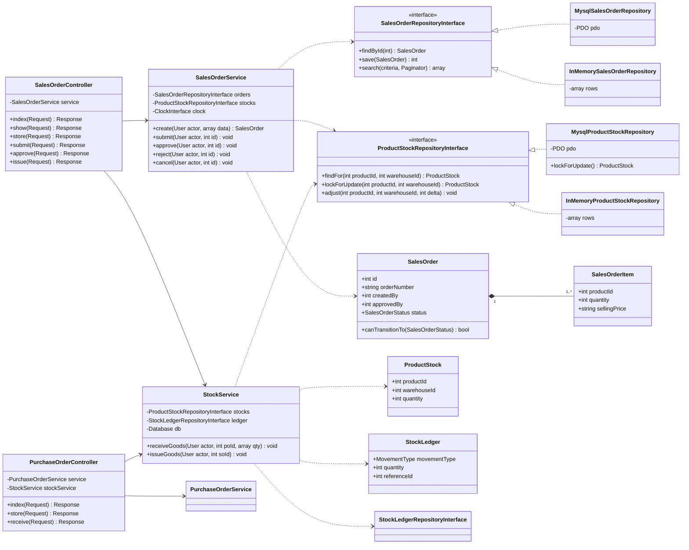

# Class Diagram — Initial (sebelum implementasi)

**Feature**: Inventory & Order Management System
**Tanggal**: 2026-09-10
**Status**: Dibuat **sebelum** penulisan application code, sesuai DESIGN-01.

Diagram ini adalah rancangan awal. Diagram *as-built* dibuat terpisah di
`docs/architecture/class-diagram-as-built.md` setelah implementasi selesai, beserta
penjelasan apa yang berubah dan alasannya.

## Arah dependency

```
Controller  ──▶  Service  ──▶  RepositoryInterface  ◀── Mysql*Repository
                                       ▲
                                       └── InMemory*Repository (dipakai unit test)
```

Dependency hanya mengalir ke satu arah. Repository tidak pernah mengenal Service maupun
Controller. Service bergantung pada **interface**, bukan pada implementasi konkret — inilah
Dependency Inversion pada boundary repository (ARCH-01).

## Diagram



Garis putus-putus (`..>`) menandakan dependency ke **interface**. Garis segitiga kosong
(`<|..`) menandakan implementasi. Inilah yang membuat setiap use case dapat di-unit-test
tanpa database.

## Rencana yang paling mungkin berubah

Tiga hal berikut sengaja dicatat sekarang agar perbandingan dengan diagram as-built jujur:

1. `StockService` mungkin perlu dipecah bila method `receiveGoods` dan `issueGoods` tumbuh
   melewati batas kompleksitas — kandidat pemisahan menjadi `GoodsReceiptService` dan
   `GoodsIssueService`.
2. Signature `ProductStockRepositoryInterface::adjust()` mungkin berubah setelah mekanisme
   `SELECT ... FOR UPDATE` diimplementasikan, karena lock dan update perlu berada di dalam
   satu transaction yang sama.
3. Pembuatan `orderNumber` masih ditempatkan di Service; bila ternyata butuh penanganan
   collision, kemungkinan pindah ke repository atau ke sebuah generator tersendiri.
