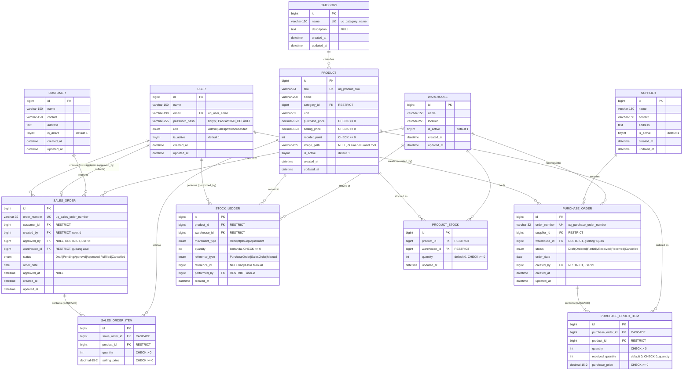
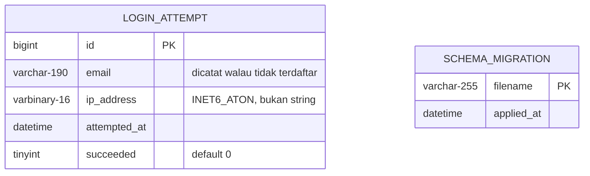

# ERD — As-built (diturunkan dari DDL)

**Sumber**: [`../../database/001_schema.sql`](../../database/001_schema.sql) ·
**Pasangannya**: [`../../specs/001-inventory-order-management/data-model.md`](../../specs/001-inventory-order-management/data-model.md)

Diagram ini menggambarkan schema yang **benar-benar dibuat** MySQL, bukan rancangannya. ERD
pada `data-model.md` adalah dokumen spec: ia sengaja meninggalkan tabel operasional dan detail
fisik agar tetap terbaca sebagai model domain. Dokumen ini melengkapinya dengan yang
ditinggalkan itu — tabel operasional, index, nullability, dan perilaku `ON DELETE`.

Bila keduanya berbeda, **DDL yang benar** dan diagram inilah yang harus diperbaiki.

DBMS: MySQL 8.0, InnoDB, `utf8mb4_unicode_ci`. Seluruh PK `BIGINT UNSIGNED AUTO_INCREMENT`.

---

## 1. Diagram



### Tabel operasional (tanpa relasi FK)

Dua tabel berikut sengaja berdiri sendiri: keduanya **bukan resource sumber** dan tidak memuat
data domain, sehingga tidak digambar di ERD utama agar model domain tetap terbaca.



`login_attempt` sengaja **tanpa FK ke `user`**: percobaan login dengan email yang tidak
terdaftar pun harus tercatat, kalau tidak perilaku throttling sendiri akan membocorkan email
mana yang ada.

---

## 2. Relasi dan kardinalitas

| Dari | Ke | Kardinalitas | Catatan |
| --- | --- | --- | --- |
| `category` | `product` | 1 : 0..* | Kategori tanpa product diperbolehkan |
| `product` + `warehouse` | `product_stock` | 1 : 0..1 per pasangan | **UNIQUE (product_id, warehouse_id)** |
| `supplier` | `purchase_order` | 1 : 0..* | |
| `warehouse` | `purchase_order` | 1 : 0..* | Gudang tujuan penerimaan |
| `purchase_order` | `purchase_order_item` | 1 : 1..* | Order wajib punya minimal satu item (ditegakkan Service) |
| `customer` | `sales_order` | 1 : 0..* | |
| `warehouse` | `sales_order` | 1 : 0..* | Gudang asal pengiriman |
| `sales_order` | `sales_order_item` | 1 : 1..* | Sama, ditegakkan Service |
| `user` | `sales_order` | 1 : 0..* **dua kali** | `created_by` (wajib) dan `approved_by` (nullable) |
| `product` + `warehouse` | `stock_ledger` | 1 : 0..* | Append-only |

**Dua FK dari `sales_order` ke `user`** adalah dasar segregation of duties. Database hanya
menjamin keduanya menunjuk user yang sah; aturan **`approved_by <> created_by` DAN role
approver harus Admin** ditegakkan `SalesOrderService::approve()`, bukan schema. Itu disengaja —
aturan tersebut membutuhkan role lookup yang tidak dapat diekspresikan sebagai constraint.

`stock_ledger.reference_id` adalah **polymorphic reference** dan karena itu tidak punya FK:
satu kolom nullable tidak dapat menunjuk dua tabel sekaligus. `reference_type` berperan sebagai
discriminator, dan pasangan keduanya dijaga CHECK:

```sql
CONSTRAINT ck_ledger_reference_id CHECK (
    (reference_type = 'Manual'  AND reference_id IS NULL)
    OR (reference_type <> 'Manual' AND reference_id IS NOT NULL)
)
```

---

## 3. Perilaku ON DELETE

| Perilaku | FK | Alasan |
| --- | --- | --- |
| `CASCADE` | `purchase_order_item` → `purchase_order`, `sales_order_item` → `sales_order` | Item adalah bagian dari order, tidak punya arti sendiri |
| `RESTRICT` | **seluruh FK lainnya** | Master data yang sudah dipakai tidak boleh hilang dan membuat riwayat menjadi yatim |

Konsekuensinya: master data **tidak pernah dihapus**, hanya dinonaktifkan lewat `is_active`.
`ProductRepository::isReferencedByOrder()` ada justru agar UI dapat menjelaskan *mengapa* hanya
deaktivasi yang ditawarkan, bukan penghapusan.

---

## 4. Index

| Tabel | Index | Jenis | Untuk apa |
| --- | --- | --- | --- |
| `user` | `uq_user_email (email)` | UNIQUE | Login dan keunikan akun |
| `user` | `ix_user_role_active (role, is_active)` | Composite | Filter daftar user |
| `warehouse` | `ix_warehouse_active (is_active)` | — | Dropdown warehouse aktif |
| `category` | `uq_category_name (name)` | UNIQUE | Keunikan nama kategori |
| `product` | `uq_product_sku (sku)` | UNIQUE | Keunikan SKU |
| `product` | `ix_product_category (category_id)` | FK | Join dan filter kategori |
| `product` | `ix_product_active_name (is_active, name)` | Composite | List katalog: filter aktif, sort nama |
| **`product_stock`** | **`uq_product_stock_product_warehouse (product_id, warehouse_id)`** | **UNIQUE** | **Inilah yang membuat lock goods issue mengunci satu baris, bukan range** |
| `product_stock` | `ix_product_stock_warehouse (warehouse_id)` | FK | Query per warehouse |
| `supplier`, `customer` | `ix_*_active_name (is_active, name)` | Composite | Pola sama dengan product |
| `purchase_order` | `uq_purchase_order_number (order_number)` | UNIQUE | Pencarian nomor (FIND-01) |
| `purchase_order` | `ix_purchase_order_status_date (status, order_date)` | Composite | List: filter status, sort tanggal |
| `purchase_order` | `ix_purchase_order_date (order_date, id)` | Composite | List tanpa filter status dan rentang tanggal report — `003_date_indexes.sql` |
| `sales_order` | `uq_sales_order_number (order_number)` | UNIQUE | Sama |
| `sales_order` | `ix_sales_order_status_date (status, order_date)` | Composite | Sama |
| `sales_order` | `ix_sales_order_date (order_date, id)` | Composite | Sama dengan `ix_purchase_order_date` |
| `sales_order` | `ix_sales_order_created_by (created_by)` | FK | Scoping kepemilikan role Sales |
| `stock_ledger` | `ix_ledger_product_warehouse_date (product_id, warehouse_id, created_at)` | Composite | Stock card per product dan warehouse |
| `stock_ledger` | `ix_ledger_created_at (created_at, id)` | Composite | Rentang tanggal report stock movement — `003_date_indexes.sql` |
| `stock_ledger` | `ix_ledger_reference (reference_type, reference_id)` | Composite | Riwayat pergerakan per order |
| `login_attempt` | `ix_login_attempt_email_time (email, attempted_at)` | Composite | Rate limit 5 kegagalan / 15 menit |

Urutan kolom pada composite index mengikuti predicate equality lebih dulu, baru kolom ordering
— left-prefix. Belum ada bukti `EXPLAIN` untuk keputusan ini; lihat
[`../quality/sql-training-coverage.md`](../quality/sql-training-coverage.md) §3.3.

---

## 5. Invariant yang tidak terlihat di diagram

Dua aturan berikut mengikat dan **tidak** dapat dibaca dari ERD:

**INV-1 — Rekonsiliasi ledger.** Untuk setiap pasangan (product, warehouse):

```
SUM(stock_ledger.quantity) = product_stock.quantity
```

Ditegakkan `StockService`, yang menulis baris ledger dan mengubah stock di dalam **satu
transaction yang sama**. Diverifikasi `tests/Integration/LedgerReconciliationTest.php`.

**INV-2 — Ledger append-only.** Baris `stock_ledger` tidak pernah di-`UPDATE` atau `DELETE`.
Saat ini dijaga konvensi service saja — **tidak** oleh trigger maupun privilege database,
sehingga satu `UPDATE` manual lewat SQL client tetap dapat merusaknya. Kelemahan ini tercatat
di [`../quality/sql-training-coverage.md`](../quality/sql-training-coverage.md) C-2.

---

## 6. Cara melihat diagram

Blok `mermaid` di atas ter-render otomatis di GitHub, GitLab, dan VS Code (extension *Markdown
Preview Mermaid Support*). Untuk gambar statis, tempel isi blok ke <https://mermaid.live> lalu
export PNG/SVG.

Untuk memverifikasi diagram ini masih cocok dengan database yang berjalan:

```bash
docker compose exec db mysql -uroot -p"$DB_ROOT_PASSWORD" ioms -e "SHOW CREATE TABLE product_stock\G"
```
