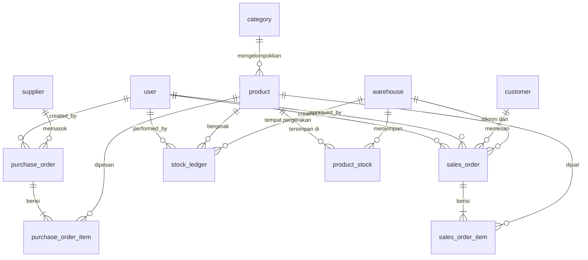

# User story, scope, dan backlog

Diturunkan dari [`spec.md`](../../specs/001-inventory-order-management/spec.md) — **bukan
ditulis ulang**. Bila ada perbedaan, spec.md yang berlaku.

## User story dan urutan pengerjaan

Diurutkan menurut prioritas. Tiap story diselesaikan sebagai satu bolt yang dapat
didemonstrasikan sendiri, bukan sebagai lapisan horizontal.

| # | Story | Prioritas | Phase | Status |
| --- | --- | --- | --- | --- |
| US1 | Sign in dan mendarat di workspace sesuai role | P1 | 3 | Selesai |
| US2 | Administrasi user dan master data | P1 | 4 | Selesai |
| US3 | Membeli dari supplier dan menerima barang ke stock | P1 | 5 | Selesai |
| US4 | Menjual ke customer dengan approval dan goods issue terkendali | P1 | 6 | Selesai |
| US5 | Menemukan record pada list yang besar | P2 | 7 | Selesai |
| US6 | Dashboard per role dan export report | P2 | 8 | Selesai |
| US7 | Menanyakan ketersediaan stock sebagai data | P3 | 9 | Selesai |
| US8 | Menjalankan low-stock check di luar alur web | P3 | 10 | Selesai |

**Mengapa US1 lebih dulu.** Secara teknis tidak ada story yang bergantung padanya, tetapi
setiap story lain didemonstrasikan lewat session yang sudah login — sehingga US1 adalah bolt
pertama yang wajar.

**Ketergantungan yang sesungguhnya**: US3 dan US4 menunggu US2 menghasilkan product, warehouse,
supplier, dan customer. US6 menunggu US3 dan US4 menghasilkan data yang layak diagregasi. US7
dan US8 hanya bergantung pada fondasi, sehingga dapat dikerjakan paralel.

## Scope

### Termasuk

Autentikasi berbasis session; manajemen user oleh Admin; master data (category, warehouse,
supplier, customer); katalog product beserta upload image; stock per warehouse dengan ledger
append-only; Purchase Order sampai goods receipt bertahap; Sales Order dengan approval dan
goods issue; pencarian, filter, sort, dan pagination; dashboard per role; export CSV; satu
JSON API; dan satu routine di luar request cycle.

### Tidak termasuk

Dinyatakan eksplisit agar tidak menjadi harapan yang tidak pernah disepakati:

| Di luar scope | Alasan |
| --- | --- |
| Registrasi publik | Brief menetapkan akun dibuat Admin |
| Password reset | Tidak ada alur publik yang memerlukannya (A-012) |
| Penjadwalan otomatis (cron) | §4.3 menempatkannya di luar scope; routine dijalankan manual |
| Multi-currency | IDR satu-satunya mata uang (A-011) |
| Transfer stock antar-warehouse | Tidak disebut brief |
| Retur pembelian maupun penjualan | Tidak disebut brief |
| REST surface penuh | API-01 hanya mewajibkan minimal satu endpoint; menambah tanpa consumer adalah over-engineering (C-003) |
| Hard delete | §1.3 menetapkan deaktivasi, bukan penghapusan |

## Entity dan relasinya

Schema **mirror** dari resource model sumber. Tidak ada resource yang di-merge, di-rename, atau
disederhanakan — daftar lengkap beserta kolomnya ada di
[`data-model.md`](../../specs/001-inventory-order-management/data-model.md), dan ERD yang
diturunkan dari DDL ada di [`erd.md`](./erd.md).

Tafsiran atas bagian brief yang ambigu dicatat di [`decisions.md`](./decisions.md).

**Dua hal yang menentukan bentuk di atas.**

`supplier` dan `customer` adalah **entity terpisah** dengan repository terpisah, walaupun
field-nya identik. Relasinya berbeda — Supplier ke Purchase Order, Customer ke Sales Order —
dan tidak ada endpoint yang memperlakukan keduanya sebagai satu collection. Brief menuliskannya
pada satu baris tabel karena bentuk field-nya sama, bukan karena keduanya satu resource.

`stock_ledger` bersifat **append-only** dan menjadi sumber kebenaran pergerakan stock.
Invariant yang wajib selalu berlaku: `SUM(stock_ledger.quantity) = product_stock.quantity`
untuk setiap pasangan (product, warehouse).

## Backlog bila pekerjaan dilanjutkan

Berurutan menurut manfaat, bukan menurut kemudahan. Diambil dari
[`docs/quality/critique.md`](../quality/critique.md) dan
[`tech-debt.md`](../quality/tech-debt.md).

| # | Item | Alasan |
| --- | --- | --- |
| 1 | Menjalankan kedua suite di CI | Satu-satunya perbaikan yang mencegah terulangnya kesalahan terbesar project ini — suite yang ada tetapi tidak pernah dijalankan |
| 2 | Pemeriksaan visual 360px dan desktop di browser sungguhan | Satu-satunya bagian NFR-006 yang belum benar-benar dilihat |
| 3 | Transaction bersarang memakai SAVEPOINT, atau gagal keras | Kebenaran rollback saat ini bergantung pada penulis test yang ingat meng-override `wrapsInTransaction()` |
| 4 | Integration test untuk jalur filesystem upload | Upload adalah permukaan serangan; bagian yang menyentuh disk belum teruji |
| 5 | Menarik state query string ke satu helper | Tiga controller sudah menyalinnya; salinan keempat melewati ambang |
| 6 | Index untuk kolom sort | Belum terasa pada volume brief — ukur dulu, jangan menebak |
