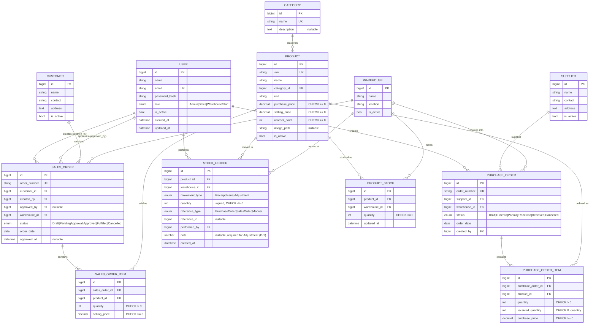

# Phase 1 Data Model: Inventory & Order Management System

**Feature**: `001-inventory-order-management`
**Date**: 2026-09-10
**Source of truth**: [`inputs/project-brief-resource-model.md`](./inputs/project-brief-resource-model.md)
(verbatim digest of §1.3 of the Project Brief). The original PDF was consulted only to
spot-check.

**Mirroring statement**: this schema **mirrors the source resource model**. One table per
resource, one table per sub-resource, one column per source attribute, enumerations carried
per resource with exactly the source's values. Nothing is merged, renamed, invented, or
simplified. **One owner-approved deviation is recorded: D-1, `stock_ledger.note`** (spec
003-stock-adjustment, migration `004_ledger_note.sql`) — see the `stock_ledger` table below.

Naming: source attribute names are Indonesian in the brief; they map to English `snake_case`
columns per constitution v1.1.0 (identifiers are English). The mapping is stated explicitly
for every column below so the correspondence stays checkable.

---

## Data Design Decisions

| Source resource / sub-resource | Table(s) | Mapping | Rationale |
| --- | --- | --- | --- |
| User | `user` | mirror | 1:1 with source resource |
| Warehouse | `warehouse` | mirror | 1:1 with source resource |
| Category | `category` | mirror | 1:1 with source resource |
| Product | `product` | mirror | 1:1 with source resource |
| ProductStock | `product_stock` | mirror | 1:1; unique on (product, warehouse) per "setiap produk memiliki baris stok per gudang" |
| Supplier | `supplier` | mirror | Source lists Supplier and Customer on one row for brevity; they are **kept as two distinct tables** — they hold different relationships (PO vs SO) and are separate resources |
| Customer | `customer` | mirror | As above — not merged |
| PurchaseOrder | `purchase_order` | mirror | 1:1, with its own status enum |
| PurchaseOrder → Item `[1..*]` | `purchase_order_item` (FK `purchase_order_id`) | mirror (child) | Sub-resource → child table |
| SalesOrder | `sales_order` | mirror | 1:1, with its own status enum, distinct from PO's |
| SalesOrder → Item `[1..*]` | `sales_order_item` (FK `sales_order_id`) | mirror (child) | Sub-resource → child table |
| StockLedger | `stock_ledger` | mirror | 1:1, append-only |
| — | `login_attempt` | **operational addition** | Not a source resource. Supports the sign-in rate limit decided in research R-005 (security standard §7). Holds no domain data. |
| — | `schema_migration` | **operational addition** | Not a source resource. Records which SQL files the runner applied (research R-007). |

**On not merging Supplier and Customer**: the brief's §1.3 table places them on a shared row
with identical fields, which is presentation shorthand, not a polymorphic collection. There is
no shared endpoint operating on them as one type, and their relationships differ. Per the
mirroring rules, a look-alike pair is kept distinct unless the source's API operations expose
them as one collection. They are separate tables.

**On the two status enumerations**: `purchase_order.status` and `sales_order.status` are
separate enums with exactly their own source values. They are not unified into a shared
"order status" type — their state machines genuinely differ.

---

## Entity Reference

Legend — **Src**: the source attribute name from §1.3. `—` means the column is an operational
addition (primary key, audit timestamp) permitted by the constitution beyond source attributes.

### `user`

| Column | Type | Null | Src | Notes |
| --- | --- | --- | --- | --- |
| `id` | `BIGINT UNSIGNED AUTO_INCREMENT` | no | — | PK |
| `name` | `VARCHAR(150)` | no | Nama | |
| `email` | `VARCHAR(190)` | no | email | **UNIQUE** (USR-01) |
| `password_hash` | `VARCHAR(255)` | no | password | `password_hash()` output; never the plaintext |
| `role` | `ENUM('Admin','Sales','WarehouseStaff')` | no | role | Exactly the source's three values |
| `is_active` | `TINYINT(1)` | no | status aktif | Default `1`; inactive cannot sign in (AUTH-01) |
| `created_at` | `DATETIME` | no | timestamps | |
| `updated_at` | `DATETIME` | no | timestamps | |

Indexes: `UNIQUE (email)`, `INDEX (role, is_active)`.
Lifecycle: active ↔ inactive. Never hard-deleted.

### `warehouse`

| Column | Type | Null | Src |
| --- | --- | --- | --- |
| `id` | `BIGINT UNSIGNED AUTO_INCREMENT` | no | — |
| `name` | `VARCHAR(150)` | no | Nama |
| `location` | `VARCHAR(255)` | no | lokasi |
| `is_active` | `TINYINT(1)` | no | status aktif |
| `created_at` / `updated_at` | `DATETIME` | no | — |

Indexes: `INDEX (is_active)`.

### `category`

| Column | Type | Null | Src | Notes |
| --- | --- | --- | --- | --- |
| `id` | `BIGINT UNSIGNED AUTO_INCREMENT` | no | — | PK |
| `name` | `VARCHAR(150)` | no | Nama | |
| `description` | `TEXT` | **yes** | deskripsi | Source does not state mandatory — nullable |
| `created_at` / `updated_at` | `DATETIME` | no | — | |

Indexes: `UNIQUE (name)`.

### `product`

| Column | Type | Null | Src | Notes |
| --- | --- | --- | --- | --- |
| `id` | `BIGINT UNSIGNED AUTO_INCREMENT` | no | — | PK |
| `sku` | `VARCHAR(64)` | no | SKU (unik) | **UNIQUE** |
| `name` | `VARCHAR(200)` | no | nama | |
| `category_id` | `BIGINT UNSIGNED` | no | kategori | FK → `category.id`, `RESTRICT` |
| `unit` | `VARCHAR(32)` | no | unit | e.g. pcs, box |
| `purchase_price` | `DECIMAL(15,2)` | no | harga beli | `CHECK (purchase_price >= 0)` (PRD-01) |
| `selling_price` | `DECIMAL(15,2)` | no | harga jual | `CHECK (selling_price >= 0)` |
| `reorder_point` | `INT` | no | reorder point | `CHECK (reorder_point >= 0)` |
| `image_path` | `VARCHAR(255)` | **yes** | gambar (opsional) | Random filename per R-006; source marks it optional |
| `is_active` | `TINYINT(1)` | no | status aktif | |
| `created_at` / `updated_at` | `DATETIME` | no | — | |

Indexes: `UNIQUE (sku)`, `INDEX (category_id)`, `INDEX (is_active, name)`.
Lifecycle: active ↔ inactive. A product referenced by any order line may only be deactivated
(PRD-01, §1.3) — enforced in the Service layer, with FK `RESTRICT` as the backstop.

### `product_stock`

| Column | Type | Null | Src | Notes |
| --- | --- | --- | --- | --- |
| `id` | `BIGINT UNSIGNED AUTO_INCREMENT` | no | — | PK |
| `product_id` | `BIGINT UNSIGNED` | no | Produk | FK → `product.id`, `RESTRICT` |
| `warehouse_id` | `BIGINT UNSIGNED` | no | gudang | FK → `warehouse.id`, `RESTRICT` |
| `quantity` | `INT` | no | quantity | **`CHECK (quantity >= 0)`** — the source states this constraint explicitly |
| `updated_at` | `DATETIME` | no | updated_at | |

Indexes: **`UNIQUE (product_id, warehouse_id)`** — this is the row locked by
`SELECT ... FOR UPDATE` in R-002; the unique index is what makes it a single-row lock;
`INDEX (warehouse_id)` for per-warehouse queries. `quantity` defaults to `0`.

No `version` column: the chosen concurrency mechanism is pessimistic locking, so none is
needed and none is invented (R-002).

### `supplier`

| Column | Type | Null | Src |
| --- | --- | --- | --- |
| `id` | `BIGINT UNSIGNED AUTO_INCREMENT` | no | — |
| `name` | `VARCHAR(150)` | no | Nama |
| `contact` | `VARCHAR(150)` | no | kontak |
| `address` | `TEXT` | no | alamat |
| `is_active` | `TINYINT(1)` | no | status aktif |
| `created_at` / `updated_at` | `DATETIME` | no | — |

Indexes: `INDEX (is_active, name)`.

### `customer`

Identical column set to `supplier`, same source row, kept as a separate table.

| Column | Type | Null | Src |
| --- | --- | --- | --- |
| `id` | `BIGINT UNSIGNED AUTO_INCREMENT` | no | — |
| `name` | `VARCHAR(150)` | no | Nama |
| `contact` | `VARCHAR(150)` | no | kontak |
| `address` | `TEXT` | no | alamat |
| `is_active` | `TINYINT(1)` | no | status aktif |
| `created_at` / `updated_at` | `DATETIME` | no | — |

Indexes: `INDEX (is_active, name)`.

### `purchase_order`

| Column | Type | Null | Src | Notes |
| --- | --- | --- | --- | --- |
| `id` | `BIGINT UNSIGNED AUTO_INCREMENT` | no | — | PK |
| `order_number` | `VARCHAR(32)` | no | — | Generated, human-readable, searchable (spec A-002). **UNIQUE** |
| `supplier_id` | `BIGINT UNSIGNED` | no | Supplier | FK → `supplier.id`, `RESTRICT` |
| `warehouse_id` | `BIGINT UNSIGNED` | no | gudang tujuan | FK → `warehouse.id`, `RESTRICT` |
| `status` | `ENUM('Draft','Ordered','PartiallyReceived','Received','Cancelled')` | no | status | Exactly the source's five values |
| `order_date` | `DATE` | no | tanggal order | |
| `created_by` | `BIGINT UNSIGNED` | no | — | FK → `user.id`; audit, not a source attribute |
| `created_at` / `updated_at` | `DATETIME` | no | — | |

Indexes: `UNIQUE (order_number)`, `INDEX (status, order_date)`, `INDEX (supplier_id)`,
`INDEX (warehouse_id)`, `INDEX (order_date, id)` (`003_date_indexes.sql`). `status` defaults to `'Draft'`.

**State lifecycle** — `Draft → Ordered → PartiallyReceived → Received`, with `Cancelled`
reachable from `Draft`, `Ordered` and `PartiallyReceived` (spec A-004, confirmed).
`Received` and `Cancelled` are terminal.

```
Draft ──submit──▶ Ordered ──partial receipt──▶ PartiallyReceived ──final receipt──▶ Received
  │                  │                              │
  └──cancel──────────┴──────────────────────────────┴──▶ Cancelled
```

A receipt covering everything outstanding moves `Ordered` straight to `Received`.

### `purchase_order_item`

| Column | Type | Null | Src | Notes |
| --- | --- | --- | --- | --- |
| `id` | `BIGINT UNSIGNED AUTO_INCREMENT` | no | — | PK |
| `purchase_order_id` | `BIGINT UNSIGNED` | no | — | FK → `purchase_order.id`, `CASCADE` |
| `product_id` | `BIGINT UNSIGNED` | no | produk | FK → `product.id`, `RESTRICT` |
| `quantity` | `INT` | no | qty | `CHECK (quantity > 0)` |
| `received_quantity` | `INT` | no | — | Default `0`. Carries the outstanding amount the source requires PO-01 to track: outstanding = `quantity - received_quantity`. `CHECK (received_quantity >= 0 AND received_quantity <= quantity)` — the constraint that enforces spec A-005 (no over-receipt) |
| `purchase_price` | `DECIMAL(15,2)` | no | harga beli | `CHECK (purchase_price >= 0)` |

Indexes: `INDEX (purchase_order_id)`, `INDEX (product_id)`.

`received_quantity` is not a source attribute but is **required** to satisfy PO-01's "sisa qty
yang belum diterima tetap tercatat" — the source states the behavior without naming the field.
Recorded here as a derived-requirement column, not an invention.

### `sales_order`

| Column | Type | Null | Src | Notes |
| --- | --- | --- | --- | --- |
| `id` | `BIGINT UNSIGNED AUTO_INCREMENT` | no | — | PK |
| `order_number` | `VARCHAR(32)` | no | — | Generated, searchable (A-002). **UNIQUE** |
| `customer_id` | `BIGINT UNSIGNED` | no | Customer | FK → `customer.id`, `RESTRICT` |
| `created_by` | `BIGINT UNSIGNED` | no | dibuat oleh | FK → `user.id`. Basis of the ownership rule |
| `approved_by` | `BIGINT UNSIGNED` | **yes** | disetujui oleh | FK → `user.id`. Null until approved |
| `warehouse_id` | `BIGINT UNSIGNED` | no | gudang asal | FK → `warehouse.id`, `RESTRICT` |
| `status` | `ENUM('Draft','PendingApproval','Approved','Fulfilled','Cancelled')` | no | status | Exactly the source's five values |
| `order_date` | `DATE` | no | — | Not in the source's SO row; needed for the date sort FIND-01 requires |
| `approved_at` | `DATETIME` | **yes** | — | Audit companion to `approved_by` |
| `created_at` / `updated_at` | `DATETIME` | no | — | |

Indexes: `UNIQUE (order_number)`, `INDEX (status, order_date)`, `INDEX (created_by)`,
`INDEX (customer_id)`, `INDEX (warehouse_id)`, `INDEX (order_date, id)` (`003_date_indexes.sql`). `status`
defaults to `'Draft'`.

**State lifecycle** — exactly the source's flow: `Draft → PendingApproval → Approved →
Fulfilled`, or `Cancelled` from any stage before `Fulfilled`.

```
Draft ──submit──▶ PendingApproval ──approve──▶ Approved ──goods issue──▶ Fulfilled
  │                   │    │                      │
  │                   │    └──reject──┐           │
  └──cancel───────────┴───────────────┴───────────┴──▶ Cancelled
```

`Fulfilled` and `Cancelled` are terminal. Rejection from `PendingApproval` results in
`Cancelled` — the source names reject as an Admin action and provides no separate Rejected
state, so it lands in the state the source does define.

**Invariant enforced in the Service layer**: `approved_by` must never equal `created_by`, and
the approving user's role must be `Admin`. This is the segregation-of-duties rule (§1.2,
SO-01, FR-018) and the single highest-value unit test in the suite.

### `sales_order_item`

| Column | Type | Null | Src | Notes |
| --- | --- | --- | --- | --- |
| `id` | `BIGINT UNSIGNED AUTO_INCREMENT` | no | — | PK |
| `sales_order_id` | `BIGINT UNSIGNED` | no | — | FK → `sales_order.id`, `CASCADE` |
| `product_id` | `BIGINT UNSIGNED` | no | produk | FK → `product.id`, `RESTRICT` |
| `quantity` | `INT` | no | qty | `CHECK (quantity > 0)` |
| `selling_price` | `DECIMAL(15,2)` | no | harga jual | `CHECK (selling_price >= 0)` |

Indexes: `INDEX (sales_order_id)`, `INDEX (product_id)`.

Goods issue is all-or-nothing for the whole order (SO-01 describes no partial issue), so no
`issued_quantity` column is added — the brief does not describe partial fulfilment, and adding
it would be inventing scope.

### `stock_ledger`

Append-only. Never updated, never deleted — enforced in the database by the triggers
`trg_stock_ledger_no_update` and `trg_stock_ledger_no_delete` (`005_ledger_append_only.sql`); only test fixture
cleanup may delete, after an explicit `SET @ioms_allow_ledger_cleanup = 1`.

| Column | Type | Null | Src | Notes |
| --- | --- | --- | --- | --- |
| `id` | `BIGINT UNSIGNED AUTO_INCREMENT` | no | — | PK |
| `product_id` | `BIGINT UNSIGNED` | no | Produk | FK → `product.id`, `RESTRICT` |
| `warehouse_id` | `BIGINT UNSIGNED` | no | gudang | FK → `warehouse.id`, `RESTRICT` |
| `movement_type` | `ENUM('Receipt','Issue','Adjustment')` | no | tipe pergerakan | Exactly the source's three values |
| `quantity` | `INT` | no | quantity | Signed by convention: positive for `Receipt`, negative for `Issue`. `CHECK (quantity <> 0)` |
| `reference_type` | `ENUM('PurchaseOrder','SalesOrder','Manual')` | no | referensi (PO/SO id) | Discriminates which order the reference points at |
| `reference_id` | `BIGINT UNSIGNED` | **yes** | referensi (PO/SO id) | `ck_ledger_reference_id`: NULL exactly when `reference_type = 'Manual'` (Manual requires NULL; PO/SO require a value) |
| `note` | `VARCHAR(255)` | **yes** | — | **Added by 003 (deviation D-1, owner-approved)**: the reason of a stock adjustment. `CHECK ((movement_type = 'Adjustment') = (note IS NOT NULL))`. Migration `004_ledger_note.sql` |
| `performed_by` | `BIGINT UNSIGNED` | no | dilakukan oleh | FK → `user.id` |
| `created_at` | `DATETIME` | no | timestamp | |

Indexes: `INDEX (product_id, warehouse_id, created_at)` — serves the ledger view, the stock
reconciliation check, and the CSV movement report; `INDEX (reference_type, reference_id)` for
an order's own movement history; `INDEX (performed_by)`; `INDEX (created_at, id)` for date ranges — the stock
movement report and the dashboard chart (`003_date_indexes.sql`). `004_ledger_note.sql` also adds
`ck_ledger_adjustment_manual`: `movement_type = 'Adjustment'` exactly when `reference_type = 'Manual'`.

`reference_type` is a derived-requirement column: the source says the reference is a "PO/SO
id" without saying how the two are told apart. A single nullable FK to two different tables is
not expressible, so the discriminator makes the source's stated intent representable. It is
not a merge of resources.

Since 003, `CHECK ((movement_type = 'Adjustment') = (reference_type = 'Manual'))` pins the pairing:
an adjustment never references an order, and `Manual` is used only by adjustments. See
[`../003-stock-adjustment/data-model.md`](../003-stock-adjustment/data-model.md).

**Invariant (NFR-002)**: for every (product, warehouse),
`SUM(stock_ledger.quantity) = product_stock.quantity`. This is checkable by a single query and
is asserted by an integration test.

### `login_attempt` *(operational, not a source resource)*

| Column | Type | Null | Notes |
| --- | --- | --- | --- |
| `id` | `BIGINT UNSIGNED AUTO_INCREMENT` | no | PK |
| `email` | `VARCHAR(190)` | no | Recorded even when no such user exists, so timing does not leak |
| `ip_address` | `VARBINARY(16)` | no | Packed form, IPv4 and IPv6 |
| `attempted_at` | `DATETIME` | no | |
| `succeeded` | `TINYINT(1)` | no | |

Indexes: `INDEX (email, attempted_at)`, `INDEX (ip_address, attempted_at)`.
Supports the R-005 rate limit. Holds no domain data and appears in no domain diagram.

### `schema_migration` *(operational, not a source resource)*

| Column | Type | Null |
| --- | --- | --- |
| `filename` | `VARCHAR(255)` PK | no |
| `applied_at` | `DATETIME` | no |

---

## Conformance Checklist

Verified against `inputs/project-brief-resource-model.md` before finalizing.

| Source element | Represented as | ✓ |
| --- | --- | --- |
| User + 6 attributes + role enum (3 values) | `user` | ✓ |
| Warehouse + 3 attributes | `warehouse` | ✓ |
| Category + 2 attributes | `category` | ✓ |
| Product + 9 attributes (image optional) | `product` | ✓ |
| ProductStock + 4 attributes + `quantity >= 0` | `product_stock` + CHECK | ✓ |
| Supplier + 4 attributes | `supplier` (distinct) | ✓ |
| Customer + 4 attributes | `customer` (distinct) | ✓ |
| PurchaseOrder + 4 attributes + 5-value status enum | `purchase_order` | ✓ |
| PurchaseOrderItem (produk, qty, harga beli) `[1..*]` | `purchase_order_item` child | ✓ |
| SalesOrder + 5 attributes + 5-value status enum | `sales_order` | ✓ |
| SalesOrderItem (produk, qty, harga jual) `[1..*]` | `sales_order_item` child | ✓ |
| StockLedger + 7 attributes + 3-value movement enum | `stock_ledger` | ✓ |
| SO lifecycle Draft→PendingApproval→Approved→Fulfilled, Cancelled before Fulfilled | `sales_order.status` + Service guards | ✓ |
| PO lifecycle Draft→Ordered→PartiallyReceived/Received/Cancelled | `purchase_order.status` + Service guards | ✓ |
| Soft deactivation for Product / Supplier / Customer | `is_active` + FK `RESTRICT` | ✓ |
| Stock changes only via service writing ledger + stock in one transaction | Service layer + R-002 | ✓ |
| Sales cannot approve own order | `created_by` vs `approved_by` + role check | ✓ |

Nothing in the source is missing, renamed, invented, or simplified. Five columns beyond the
source attributes exist and are each justified above: `purchase_order_item.received_quantity`
(PO-01's outstanding quantity), `stock_ledger.reference_type` (makes the stated PO/SO
reference representable), `sales_order.order_date` (FIND-01's date sort), `order_number`
on both orders (FIND-01's number search), and `stock_ledger.note` (deviation D-1, the reason of a
stock adjustment). Plus conventional `id` / audit timestamps and the
two operational tables.

---

## Entity Relationship Diagram



---

## Validation Rules by Entity

Enforced in the Service layer (source of truth per FR-029) and backed by database constraints.

| Entity | Rule | Source |
| --- | --- | --- |
| User | Email unique and well-formed; role one of three; inactive cannot sign in | USR-01, AUTH-01 |
| User | Admin changing another user's password must re-enter their own | R-005 (§7) |
| Product | SKU unique; prices and reorder point `>= 0`; image type and size validated | PRD-01 |
| Product | Cannot be deleted once referenced by an order line — deactivate only | PRD-01, §1.3 |
| ProductStock | Quantity never negative | §1.3 constraint |
| PurchaseOrder | At least one item; cancel allowed before fully Received | PO-01, A-004 |
| PurchaseOrderItem | Receipt quantity `<= quantity - received_quantity` | A-005 |
| SalesOrder | At least one item; transitions follow the lifecycle exactly | SO-01 |
| SalesOrder | Approver role must be Admin **and** `approved_by <> created_by` | §1.2, SO-01 |
| SalesOrder | Goods issue only from `Approved`; refused when stock insufficient | SO-01 |
| StockLedger | Written in the same transaction as the stock update, always | §1.3, ARCH-02 |
| All | Every write query parameterized; every output escaped | §4.2, DB-01 |
