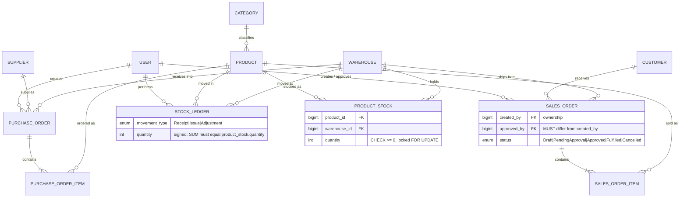
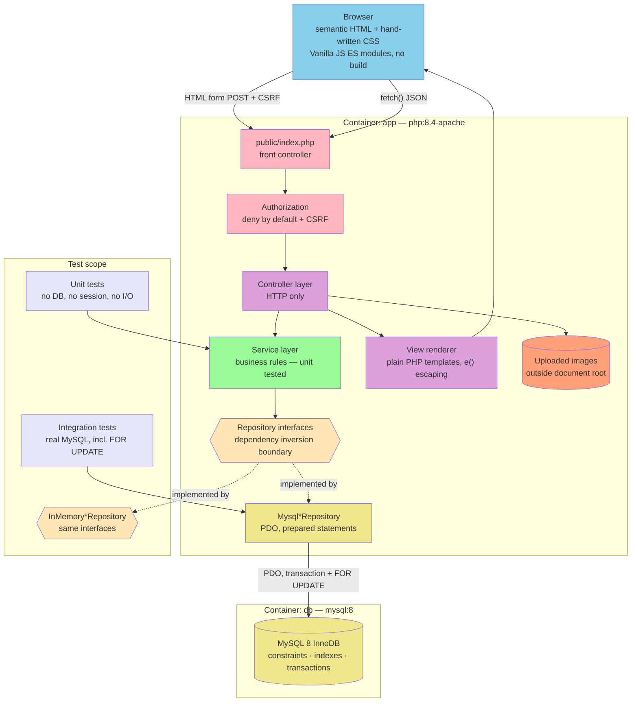
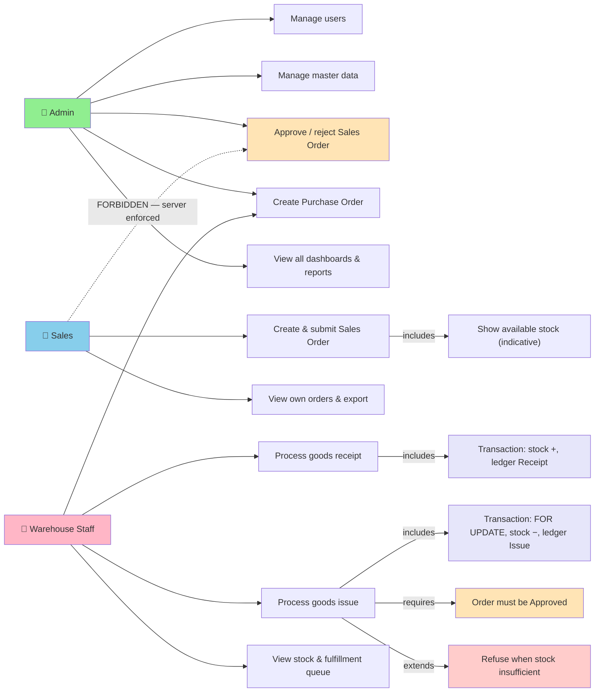
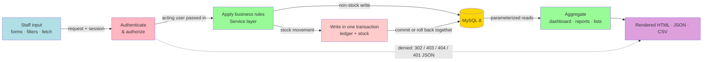
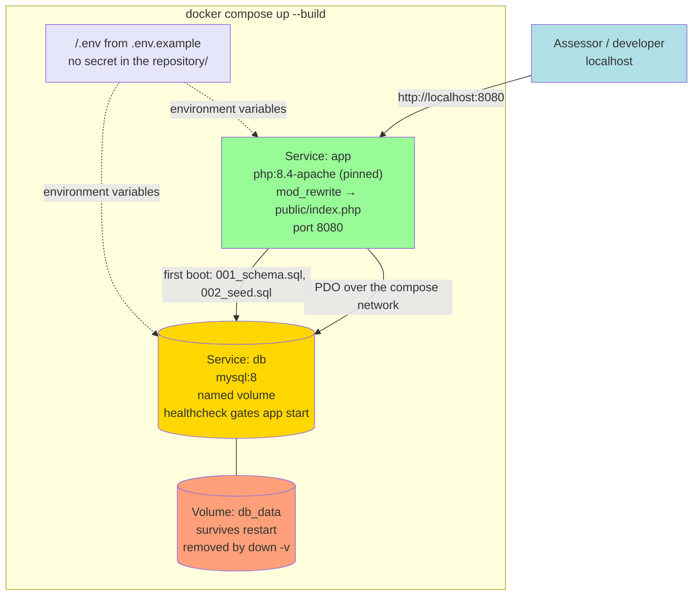

# Implementation Plan: Inventory & Order Management System

**Branch**: `001-inventory-order-management` (spec directory; no git branch was created)
**Date**: 2026-09-10 | **Spec**: [spec.md](./spec.md)
**Input**: Feature specification from `/specs/001-inventory-order-management/spec.md`

**Phase 0**: [research.md](./research.md) · **Phase 1**: [data-model.md](./data-model.md),
[contracts/](./contracts/), [quickstart.md](./quickstart.md)

## Summary

Build a server-rendered inventory and order management web application for three roles
(Admin, Sales, Warehouse Staff) covering master data, purchase orders with goods receipt,
sales orders with approval and goods issue, role-scoped dashboards, CSV reporting and a small
JSON API — with two guarantees carrying the weight: stock can never oversell under concurrent
goods issue, and a Sales user can never approve an order, enforced on the server.

Technical approach: PHP 8.4 native OOP in three layers (Controller → Service → Repository)
with dependency inversion at the repository boundary, hand-wired by constructor injection.
Vanilla JS with no build step. MySQL 8 accessed through PDO with real prepared statements.
Concurrency is handled by pessimistic row locking (`SELECT ... FOR UPDATE`) inside an explicit
transaction that writes the ledger row and the stock update together. Everything runs from
`docker compose up --build` with two services. Every use case carries a unit test against
in-memory repository fakes; integration tests exercise real MySQL including the lock.

The governing non-goal is spec **C-003**: build no more than the brief describes. Every
design decision in [research.md](./research.md) records the simpler alternative and why the
chosen option is not larger than the requirement.

## Technical Context

**Language/Version**: PHP **8.4** exactly — not lower, not higher (spec C-001). Enforced by a
pinned `php:8.4-apache` image tag and a runtime guard in the front controller.
**Primary Dependencies**: None at runtime. Composer is used for PSR-4 autoloading and dev
dependencies only: PHPUnit 11.x, PHPStan (level 6), PHP_CodeSniffer (PSR-12). No framework, no
ORM, no DI container, no template engine, no JS build tooling.
**Storage**: MySQL 8 (InnoDB, `utf8mb4`), PDO with `ERRMODE_EXCEPTION` and
`ATTR_EMULATE_PREPARES = false`. Schema and seed are ordered plain-SQL files applied by a
small PHP runner.
**Testing**: PHPUnit 11.x, two suites — `Unit` (in-memory repository fakes, no I/O) and
`Integration` (real MySQL in Docker, each test in a rolled-back transaction).
**Target Platform**: Linux container, Apache + `mod_rewrite`, served over HTTP on port 8080.
Browser target is current evergreen desktop and mobile at 360px minimum width.
**Project Type**: Web application — server-rendered HTML with a small JSON API and
progressive-enhancement JavaScript. Single deployable unit.
**Architecture Type**: **Standalone modular monolith.** Verified, not assumed: the repository
contains no `composer.json`, no `package.json`, no module-federation or `single-spa` config, no
`docs/architecture*` or `docs/adr/`, and no existing application code. Greenfield.
**Integration Target**: N/A — no host shell, no gateway, no message bus. The application is
self-contained and consumed directly by a browser.
**Existing Design System**: **None found — greenfield frontend.** No component library, no
theme or token source, no icon set exists in the repository, and no domain profile supplies a
reference design system. A minimal but real token system is therefore established up front in
research [R-013](./research.md) — blue accent `#2563eb`, blue-biased neutral ramp, semantic
status colors kept separate from the accent, an 8-point spacing scale, two radius steps, one
soft elevation level, a six-step type scale with tabular numerals for money and quantity
columns, and Lucide icons vendored locally as an SVG sprite. Defined once in
`public/assets/css/tokens.css` and used by every page.
**Performance Goals**: Not a graded dimension at this scale, and no figure is invented. The
operative targets are the spec's user-facing ones: a user locates a specific product or order
in under 15 seconds with 30 products and 25 orders present (SC-008), and lists paginate at ten
rows server-side so response time stays flat as seed data grows.
**Constraints**: PHP exactly 8.4 (C-001); no framework/ORM/DI container (C-002); no
over-engineering (C-003); microservices, queues, cloud deploy, CI/CD, Kubernetes, real-time
notification, mobile app, automatic cron and automated E2E tests are out of scope (C-004);
UI in English, docs and comments in Indonesian with English technical terms (C-007); IDR is
the only currency; stock is mutated only by a service that writes the ledger in the same
transaction.
**Scale/Scope**: Roughly 18 screens, 12 domain tables plus 2 operational tables, 3 roles,
about 20 use cases each requiring a unit test, and 3+ integration tests. Seed data: 5 users,
2 warehouses, 30 products, 25+ orders.

## UI/UX & Screens (carried from spec)

Full detail is in the spec's [UI/UX & Screens](./spec.md#uiux--screens-mandatory-when-the-feature-has-a-user-interface)
section — screen inventory, per-screen states and interactions are carried forward here in
summary. This is the design intent `/rudis.implement` builds toward; the **Existing Design
System** field above says which tokens to build it with.

- **Design reference**: none supplied. Plain, functional, data-dense business application;
  restrained color reserved for status meaning; light theme; hand-written CSS only.
- **Screens** (18): Sign in · Dashboard ×3 (Admin, Sales, Warehouse) · User list & form ·
  Product list, detail & form · Category / Warehouse / Supplier / Customer lists & forms ·
  Purchase Order list, detail & goods receipt form · Sales Order list, detail & form · Goods
  issue form · Reports.
- **Per-screen states**: every list carries four distinct states — loading (placeholder rows),
  empty-because-no-data (heading + helper + create action), empty-because-filters-match-nothing
  (heading + clear-filters action), and populated with a count summary above the table. Every
  form carries loading, field-level plus summary error with entered values retained, and
  populated. Detail screens carry loading, not-found, and populated.
- **Primary interactions/flows**: filters and sort live in the query string so a filtered page
  is linkable and survives paging; changing a filter returns to page one. Order actions render
  only when the viewer's role and the order's status permit — an action a role may never
  perform is absent, not disabled, and the server refuses it regardless. Status advances
  (submit, approve, reject, cancel) and stock movements (receipt, issue) each require an
  explicit confirmation naming the effect. Deactivation is confirmed and states that history
  is kept. The Sales Order form shows live available stock beside each line as guidance, with
  the binding check at goods issue. Money renders as `Rp 1.250.000` everywhere — `Rp` prefix,
  dot thousand separators, no decimals.

## Constitution Check

*GATE: Must pass before Phase 0 research. Re-check after Phase 1 design.*

Evaluated against [constitution v1.1.0](../../.rudis/memory/constitution.md).

| # | Principle | Gate | Initial | Post-design |
| --- | --- | --- | --- | --- |
| I | Clean Architecture Through Layered Boundaries | Controller → Service → Repository, one direction; every repository behind an interface with a real and a fake implementation; constructor injection; no superglobals or `new PDO()` in Services or Entities; no extra layers, DI container or ORM | ✅ R-003 | ✅ Route table → Controller → Service → Repository confirmed in `contracts/http-routes.md`; acting user passed into Services as an argument (R-005), which is what makes the approval rule testable without a session |
| II | PHP Strict Mode & Explicit Typing | `declare(strict_types=1);` in every PHP file; typed params, returns and properties; PHPStan level ≥ 5, zero critical errors | ✅ R-011 (level 6) | ✅ No design element requires `mixed`; enums modelled as PHP `enum` types backed by the source's exact string values |
| III | Every Use Case Has a Unit Test | One unit test minimum per public Service method executing a business rule, against fakes, no I/O; FIRST; separate integration suite ≥ 3 | ✅ R-010 | ✅ Clock injected so date rules are deterministic; roughly 20 use cases enumerated, each mapping to a Service method |
| IV | Transactional Integrity & Concurrency Safety | Multi-table stock operations in one explicit transaction; stock never mutated outside the ledger-writing service; no oversell or lost update; all SQL parameterized | ✅ R-002, R-007 | ✅ `SELECT ... FOR UPDATE` with deterministic lock ordering by `product_id` then `warehouse_id`; `ATTR_EMULATE_PREPARES = false` so prepared statements are genuinely server-side; ledger-vs-stock reconciliation asserted by integration test |
| V | Server-Side Authorization & Segregation of Duties | Every route authorized on the server; Sales cannot approve any order; hashed passwords; session regenerated on sign-in; no secrets in repo; output escaped; no stack traces to users | ✅ R-005 | ✅ Every route in `contracts/http-routes.md` carries an explicit role annotation; deny by default; 404-not-403 for out-of-scope resources; CSRF on all non-GET; login rate limit and step-up re-auth recorded |
| VI | Design Evidence & Refactoring Discipline | Initial and as-built class diagrams, ≥ 2 ADRs, refactor log with 3 entries and an SRP note, tech-debt register, one `refactor:` commit | ✅ planned | ✅ ADR subjects fixed: the repository abstraction, and the `FOR UPDATE` concurrency choice (R-002) whose alternatives are already written up and can be lifted directly |
| VII | Reproducible Environment (Docker-First) | Starts from clean checkout with `docker compose up --build`; env-var configuration with `.env.example`; schema and seed from empty; demo data sufficient for pagination and all roles | ✅ R-001 | ✅ Two services only; seed meets NFR-011 exactly; verified end-to-end by [quickstart.md](./quickstart.md) |

**Technology Constraints table**: compliant. Semantic HTML, hand-written CSS, Vanilla JS, no
CSS or JS framework. PHP 8.4 native OOP, Composer for autoload and dev dependencies only, no
prohibited backend framework, ORM or DI container. MySQL 8 with relations, constraints,
indexes, prepared statements and explicit transactions. Dockerfile, Docker Compose,
`.env.example`. PHPUnit unit and integration suites plus static analysis reports.

**Language conventions (v1.1.0)**: applied throughout Phase 1 — `contracts/http-routes.md`,
`quickstart.md` and the OpenAPI comments are written in Indonesian with English technical
terms; all identifiers, route paths, JSON field names and UI strings are English. See R-014.

**Out-of-scope confirmed**: no microservices, message queue, cloud deployment, CI/CD,
Kubernetes, real-time notification, mobile application, automatic cron, or automated E2E tests
appear anywhere in this plan.

**Result: PASS at both gates. No violations, so Complexity Tracking is empty.**

## Project Structure

### Documentation (this feature)

```text
specs/001-inventory-order-management/
├── plan.md                              # This file
├── spec.md                              # Feature specification
├── research.md                          # Phase 0 — 14 decisions with alternatives
├── data-model.md                        # Phase 1 — schema mirroring the source model
├── quickstart.md                        # Phase 1 — run, test and verification procedure
├── contracts/
│   ├── openapi.yaml                     # JSON API surface (3 endpoints)
│   └── http-routes.md                   # Server-rendered routes + authorization matrix
├── checklists/
│   └── requirements.md                  # Spec quality checklist (16/16 pass)
├── inputs/
│   ├── Project Brief - Programmer.pdf   # Source document, preserved
│   └── project-brief-resource-model.md  # Verbatim domain-model digest (authoritative)
└── tasks.md                             # Phase 2 — created by /rudis.tasks, NOT by /rudis.plan
```

### Source Code (repository root)

```text
public/                          # Document root — the only web-exposed directory
├── index.php                    # Front controller: bootstrap, route dispatch, error handling
├── .htaccess                    # mod_rewrite → index.php
└── assets/
    ├── css/
    │   ├── tokens.css           # Design tokens from R-013 — single source of palette
    │   └── app.css              # Layout, tables, forms, badges, empty states
    ├── js/
    │   ├── main.js              # Entry ES module
    │   ├── stock-lookup.js      # Sales Order form: live availability via JSON API
    │   ├── filters.js           # Query-string filter/sort/pagination behavior
    │   └── confirm.js           # Confirmation before status changes and stock movements
    └── icons/
        └── lucide-sprite.svg    # Vendored icon sprite (ISC, cited in README)

app/
├── Controller/                  # HTTP only: read request, call Service, choose view
│   ├── AuthController.php
│   ├── DashboardController.php
│   ├── UserController.php
│   ├── ProductController.php
│   ├── CategoryController.php
│   ├── WarehouseController.php
│   ├── SupplierController.php
│   ├── CustomerController.php
│   ├── PurchaseOrderController.php
│   ├── SalesOrderController.php
│   ├── ReportController.php
│   └── Api/
│       ├── StockApiController.php
│       └── DashboardApiController.php
├── Service/                     # Business rules — the unit-tested core
│   ├── AuthService.php
│   ├── UserService.php
│   ├── ProductService.php
│   ├── MasterDataService.php
│   ├── PurchaseOrderService.php
│   ├── SalesOrderService.php    # Approval + segregation of duties
│   ├── StockService.php         # Goods receipt / issue, transaction + FOR UPDATE
│   ├── DashboardService.php
│   └── ReportService.php
├── Repository/                  # Interface + two implementations each
│   ├── UserRepositoryInterface.php
│   ├── ProductRepositoryInterface.php
│   ├── ProductStockRepositoryInterface.php
│   ├── PurchaseOrderRepositoryInterface.php
│   ├── SalesOrderRepositoryInterface.php
│   ├── StockLedgerRepositoryInterface.php
│   ├── ...                      # Category, Warehouse, Supplier, Customer, LoginAttempt
│   └── Mysql/
│       ├── MysqlUserRepository.php
│       └── ...                  # One per interface
├── Entity/                      # Domain state and domain rules only
│   ├── User.php
│   ├── Product.php
│   ├── ProductStock.php
│   ├── PurchaseOrder.php
│   ├── PurchaseOrderItem.php
│   ├── SalesOrder.php
│   ├── SalesOrderItem.php
│   ├── StockLedger.php
│   ├── Category.php · Warehouse.php · Supplier.php · Customer.php
│   └── Enum/
│       ├── Role.php
│       ├── PurchaseOrderStatus.php
│       ├── SalesOrderStatus.php
│       └── MovementType.php
└── Support/                     # Small shared plumbing, no business rules
    ├── Router.php               # Route table + dispatch
    ├── Request.php · Response.php
    ├── View.php                 # Template renderer + e() escaping helper
    ├── Database.php             # PDO factory + transaction helper
    ├── Session.php              # Session lifecycle, regeneration
    ├── Csrf.php
    ├── Authorization.php        # Deny-by-default route guard
    ├── Validator.php
    ├── Paginator.php
    ├── Money.php                # IDR formatting
    ├── Clock.php + ClockInterface.php
    └── Exception/               # ValidationException, NotFoundException, ForbiddenException, …

views/                           # Plain PHP templates — all output through e()
├── layout/                      # app.php, auth.php, partials (nav, flash, pagination, empty-state)
├── auth/ · dashboard/ · users/ · products/ · categories/ · warehouses/
├── suppliers/ · customers/ · purchase-orders/ · sales-orders/ · reports/
└── error/                       # 403.php, 404.php, 500.php

config/
├── app.php                      # Environment loader
├── routes.php                   # Route table: path → controller + allowed roles
└── container.php                # Hand-wired constructor injection — the whole object graph

database/
├── 001_schema.sql               # Tables, constraints, indexes
├── 002_seed.sql                 # Demo data per NFR-011
└── migrate.php                  # Applies pending SQL files, records them

scripts/
└── check-low-stock.php          # JOB-01 — standalone, reuses ProductService

storage/
└── uploads/                     # Product images — OUTSIDE the document root (R-006),
                                 # random filenames, served only via ProductController::image()

tests/
├── Unit/                        # Mirrors app/Service — one file per Service
│   ├── Service/
│   └── Fake/                    # InMemory*Repository implementations
├── Integration/                 # Real MySQL
│   ├── GoodsReceiptTest.php
│   ├── GoodsIssueTest.php
│   ├── ConcurrentGoodsIssueTest.php     # Two connections, proves the lock
│   └── LedgerReconciliationTest.php
└── bootstrap.php

docs/
├── planning/                    # User stories, scope, ERD, initial class diagram, backlog
├── architecture/                # As-built class diagram, adr-001-repository.md, adr-002-concurrency.md
├── quality/                     # refactor-log.md, tech-debt.md, critique.md, static analysis reports
└── testing/                     # Test scenarios, results, screenshots, known bugs

Dockerfile · compose.yaml · .env.example · .gitignore
composer.json · phpunit.xml · phpstan.neon · phpcs.xml
README.md · ai-usage-log.md
```

**Structure Decision**: Single deployable web application using the four responsibilities
ARCH-01 requires as top-level directories under `app/` — `Controller`, `Service`,
`Repository`, `Entity` — with `Support/` holding framework-shaped plumbing that carries no
business rules. This is the brief's §4.1 layout followed literally rather than reinterpreted.
`public/` is the only web-exposed directory; uploaded product images live outside it and are
served through a controller (R-006). Tests mirror the service layer one-to-one so the
per-use-case coverage required by Principle III is visible by inspection rather than by
counting.

## Complexity Tracking

> **Fill ONLY if Constitution Check has violations that must be justified**

No violations at the planning gates. One abstraction was added during implementation and is
recorded here for review.

| Addition | Why it is needed | Simpler alternative rejected because |
| --- | --- | --- |
| `App\Support\TransactionRunner` interface (Phase 6, T101) | `StockService` must run goods issue inside one real transaction (ARCH-02) **and** be unit-testable with no database (constitution Principle III). Depending on the concrete `Database` class satisfies the first and makes the second impossible — every unit test would open a PDO connection. | Injecting `Database` directly: `Database` is `final`, so no test double is possible, and unit tests for `issueGoods()` (T096, T097) could not run without MySQL. Making `Database` non-final purely for tests is worse than one interface. |

Cost is deliberately minimal: **one interface, no new class.** `Database` itself implements it —
there is no wrapper, no factory, no registry. The callback signature was narrowed from
`callable(PDO)` to `callable()` at the same time, which also removes the only path by which a
Service could have touched PDO directly (ARCH-01). The test double
(`Tests\Unit\Fake\ImmediateTransactionRunner`) lives with the other fakes from T024 and follows
the same pattern.

For the record, the three additions beyond a literal reading of the brief were each weighed
against C-003 and kept because they close a real defect rather than add structure: CSRF
protection (cookie sessions plus an approval endpoint make its absence a design flaw), login
rate limiting (security standard §7 names unlimited attempts explicitly), and serving uploaded
images from outside the document root (a random filename alone does not stop execution). Each
is one small helper, not a layer. They are recorded in research R-005 and R-006.

---

## Technical Diagrams

### Data Design Decisions

Full table with per-column source mapping and the conformance checklist is in
[data-model.md](./data-model.md#data-design-decisions). Summary:

| Source resource / sub-resource | Table(s) | Mapping | Rationale |
| --- | --- | --- | --- |
| User · Warehouse · Category · Product · ProductStock | `user` · `warehouse` · `category` · `product` · `product_stock` | mirror | 1:1 with source resources |
| Supplier / Customer (one shared row in the source table) | `supplier`, `customer` | mirror — **kept distinct** | Presentation shorthand in the brief, not a polymorphic collection; different relationships, no shared endpoint |
| PurchaseOrder | `purchase_order` | mirror | Own 5-value status enum |
| PurchaseOrder → Item `[1..*]` | `purchase_order_item` (FK) | mirror (child) | Sub-resource → child table |
| SalesOrder | `sales_order` | mirror | Own 5-value status enum, not unified with PO's |
| SalesOrder → Item `[1..*]` | `sales_order_item` (FK) | mirror (child) | Sub-resource → child table |
| StockLedger | `stock_ledger` | mirror | Append-only, 3-value movement enum |
| — | `login_attempt`, `schema_migration` | operational addition | Not source resources; carry no domain data |

**No deviations.** Nothing merged, flattened, renamed or simplified. Four columns exist beyond
the source attributes, each justified in data-model.md: `purchase_order_item.received_quantity`
(PO-01 requires outstanding quantity to be tracked but names no field),
`stock_ledger.reference_type` (makes the source's stated "PO/SO id" reference representable),
`sales_order.order_date` (FIND-01's date sort), and `order_number` on both orders (FIND-01's
number search).

### Data Model (Entity Relationship Diagram)

The full ERD with every column, type and constraint is in
[data-model.md](./data-model.md#entity-relationship-diagram). Core relationships:



### System Architecture



The dashed lines are the point of ARCH-01: Services depend on the interface, and either the
MySQL implementation or the in-memory fake satisfies it. That is what lets every use case be
unit-tested with no database.

### Use Case Diagram



The dotted line is the segregation-of-duties rule (§1.2, FR-018) — the one edge in this
diagram that exists specifically to be refused.

### Data Flow Diagram (Level 0)



### API Contract Overview

JSON surface only — server-rendered HTML routes are **not** duplicated as REST resources
(research R-009). The complete route table with role annotations is in
[contracts/http-routes.md](./contracts/http-routes.md); the JSON schema is in
[contracts/openapi.yaml](./contracts/openapi.yaml).

| Operation | Endpoint | Method | Auth | Roles | Purpose |
| --- | --- | --- | --- | --- | --- |
| Product availability | `/api/products/{sku}/availability` | GET | session cookie | A · S · W | Stock per warehouse + total + low-stock flag. The required API-01 endpoint |
| Available quantity | `/api/products/{productId}/warehouses/{warehouseId}/available` | GET | session cookie | A · S · W | Live guidance on the Sales Order form; binding check stays at goods issue |
| Low-stock summary | `/api/dashboard/low-stock` | GET | session cookie | **A · W only** | Dashboard figure; Sales receives 403 per §1.2 |

All three are read-only, so no CSRF token is required; any future non-GET JSON endpoint must
validate one. Unauthenticated calls return **401 as JSON**, never an HTML login page — the
behavior API-01 is specifically checking.

Representative HTML routes and their guards (full table in the contract):

| Operation | Route | Method | Roles | Authorization note |
| --- | --- | --- | --- | --- |
| Sign in | `/login` | POST | public | Uniform error message; 5 failures / 15 min per (email, IP); session regenerated on success |
| Approve Sales Order | `/sales-orders/{id}/approve` | POST | **Admin only** | Sales receives 403 always, including for their own order. Service asserts Admin role **and** `approved_by <> created_by` |
| View Sales Order | `/sales-orders/{id}` | GET | A · S · W | Sales viewing another user's order receives **404, not 403** — 403 would confirm it exists |
| Goods issue | `/sales-orders/{id}/issue` | POST | A · W | Requires `Approved`; transaction + `SELECT ... FOR UPDATE`, lock order `product_id` then `warehouse_id` |
| Goods receipt | `/purchase-orders/{id}/receive` | POST | A · W | Transaction; refused above outstanding quantity |
| Manage users | `/users*` | GET/POST | **Admin only** | Password change requires Admin's own password (step-up re-auth) |
| Export orders CSV | `/reports/orders.csv` | GET | A · S · W | Sales scoped to own orders in the `WHERE` clause; range capped at 366 days |

### Deployment Architecture

Deliberately two services. There is no load balancer, CDN, replica or cache — none is required
by the brief and §4.3 places cloud deployment and orchestration out of scope entirely (C-004).



Startup order is enforced by the database healthcheck so the application never races an
uninitialized MySQL — the failure mode most likely to make a clean-folder demonstration look
broken (SC-001).

---

## Phase 2 Preview (not created by this command)

`/rudis.tasks` will generate `tasks.md`. Expected shape, following the brief's vertical-slice
order: environment and skeleton → authentication → master data → purchase order and goods
receipt → sales order, approval and goods issue → lists, search and pagination → dashboards
and reports → JSON API, image upload and the scheduled script → design evidence and quality
artifacts. Each slice carries its unit tests in the same task rather than deferring them,
since Principle III makes a use case without a test unfinished by definition.
