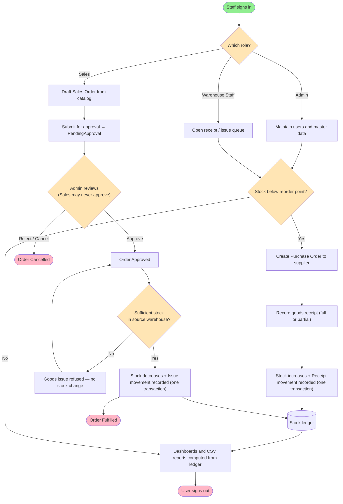
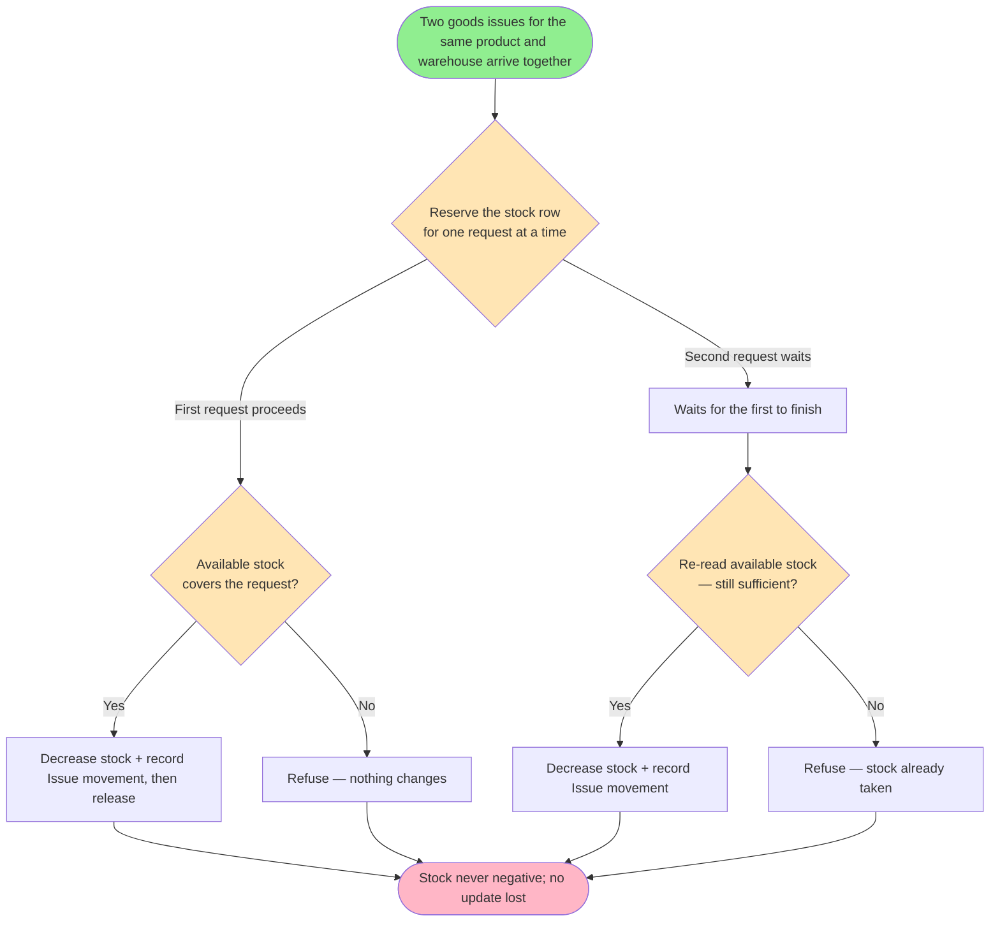

# Feature Specification: Inventory & Order Management System

**Feature Branch**: `001-inventory-order-management`
**Created**: 2026-09-10
**Status**: Draft
**Input**: User description: "Bangun aplikasi inventory and order management system berdasarkan dokument ini @'Project Brief - Programmer.pdf', versi php yang digunakan nya 8.4 saja jangan dibawah ataupun diatas itu versinya, aplikasi yang dibangun jangan sampai over-engineering ikuti saja berdasarkan dokumen ini"

**Source documents**:

- `inputs/Project Brief - Programmer.pdf` — the authoritative requirement document.
- `inputs/project-brief-resource-model.md` — verbatim domain-model digest extracted from
  the brief. **This digest is the authoritative data model for `/rudis.plan`**; open the
  PDF only to spot-check.

## User Scenarios & Testing *(mandatory)*

The warehouse and sales teams need one application to record products, track stock across
several warehouses, process purchases from suppliers and sales to customers, and keep every
stock figure accountable — including when two processes run at the same time. Three roles
use it, with responsibilities deliberately separated so that no single person can both
create and approve the same transaction.

Stories are ordered as the vertical slices the brief prescribes: login → master data →
purchase order → sales order → dashboard/reporting, with API, image upload and the
scheduled script added after the core transaction flow is stable.

### User Story 1 - Sign in and reach a role-appropriate workspace (Priority: P1)

A staff member opens the application, signs in with the email and password their
administrator issued, and lands on a workspace that shows only what their role is allowed
to see and do. When they finish, they sign out and protected pages are closed to them
again.

**Why this priority**: Every other story depends on knowing who the actor is and what they
may do. Without it there is no role scoping, no ownership, and no segregation of duties.

**Independent Test**: Sign in as each of the three roles, confirm each lands on a different
role-appropriate view, confirm a wrong password and a deactivated account are both refused,
confirm a protected page cannot be opened without signing in, and confirm signing out
closes access again.

**Acceptance Scenarios**:

1. **Given** an active Admin account, **When** they sign in with correct credentials,
   **Then** they reach the Admin dashboard.
2. **Given** any account, **When** the password is wrong, **Then** a message appears that
   does not reveal whether the email or the password was the incorrect part.
3. **Given** a deactivated account with correct credentials, **When** they attempt to sign
   in, **Then** access is refused.
4. **Given** no active session, **When** someone opens a protected page directly by URL,
   **Then** they are sent to the sign-in page.
5. **Given** a signed-in user, **When** they sign out and then reopen a protected URL,
   **Then** they cannot see it and are sent to sign-in.

---

### User Story 2 - Administer users and master data (Priority: P1)

An Admin creates and maintains the Sales and Warehouse Staff accounts, and maintains the
catalog the whole business runs on: categories, products with their reorder points,
warehouses, suppliers and customers. Records that transactions already reference are
deactivated rather than erased, so history stays intact.

**Why this priority**: Purchase and sales orders cannot exist without products, warehouses
and trading partners to reference.

**Independent Test**: As Admin, create and edit a user, a category, a product, a warehouse,
a supplier and a customer; confirm a duplicate email and a duplicate SKU are refused;
confirm a product used on an order can only be deactivated; confirm a Sales user and a
Warehouse Staff user are both refused access to user administration.

**Acceptance Scenarios**:

1. **Given** an Admin on the user list, **When** they create a user with an email that
   already exists, **Then** the record is refused with a message naming the duplicate.
2. **Given** an Admin, **When** they deactivate a user, **Then** that user can no longer
   sign in, and their historical records remain visible.
3. **Given** a Sales or Warehouse Staff user, **When** they open the user administration
   page or call its endpoint directly, **Then** access is refused by the server.
4. **Given** a product already referenced by an order, **When** an Admin attempts to remove
   it, **Then** only deactivation is offered and the record is preserved.
5. **Given** a product form, **When** a negative purchase price, sale price, or reorder
   point is submitted, **Then** the record is refused and nothing is saved.
6. **Given** a product with stock in two warehouses, **When** its stock is viewed,
   **Then** both the total and the per-warehouse breakdown are shown.
7. **Given** a product image upload, **When** a file of a disallowed type or an oversized
   file is chosen, **Then** it is refused; an accepted image is stored under an
   unguessable name.

---

### User Story 3 - Purchase from a supplier and receive goods into stock (Priority: P1)

When stock runs low, an Admin or Warehouse Staff member raises a Purchase Order to a
supplier for a destination warehouse. When the goods arrive, Warehouse Staff record the
receipt — in full or in part — and stock rises by exactly what was received, with a ledger
entry recording the movement.

**Why this priority**: This is the only way stock enters the system, so every outbound flow
depends on it.

**Independent Test**: Create a Purchase Order, record a partial receipt, confirm stock rose
by the received quantity and the outstanding quantity is still tracked, then record the
remainder and confirm the order reaches Received. Inspect the ledger entries produced.

**Acceptance Scenarios**:

1. **Given** an Admin or Warehouse Staff member, **When** they create a Purchase Order with
   a supplier, a destination warehouse and at least one line, **Then** it is saved as Draft.
2. **Given** an ordered Purchase Order, **When** a partial receipt is recorded, **Then**
   stock for that product and warehouse increases by the received quantity, the order
   becomes PartiallyReceived, and the outstanding quantity remains recorded.
3. **Given** a partially received Purchase Order, **When** the remaining quantity is
   received, **Then** the order becomes Received.
4. **Given** any goods receipt, **When** it completes, **Then** exactly one Receipt movement
   is recorded per received line, naming the product, warehouse, quantity, source order and
   the person who performed it.
5. **Given** a goods receipt that fails partway, **When** the failure occurs, **Then**
   neither the stock figure nor the movement record is left changed.

---

### User Story 4 - Sell to a customer with approval and controlled stock issue (Priority: P1)

A Sales user drafts a Sales Order from the catalog and submits it for approval. An Admin
reviews and approves or rejects it — a Sales user can never approve an order, not even
their own. Warehouse Staff then issue the goods for approved orders, stock falls, and the
order is fulfilled. Two issues racing for the last units cannot both succeed.

**Why this priority**: This is the core revenue flow and the story that carries the
system's two hardest guarantees — segregation of duties and stock integrity under
concurrency.

**Independent Test**: Drive one order Draft → PendingApproval → Approved → Fulfilled;
attempt approval as the Sales user who created it and confirm the server refuses; attempt a
goods issue exceeding available stock and confirm refusal; run two issues for the same
product and warehouse in a controlled scenario and confirm stock never goes negative.

**Acceptance Scenarios**:

1. **Given** a Sales user, **When** they create a Sales Order, **Then** it is saved as Draft
   and recorded as created by them.
2. **Given** a Draft order, **When** the Sales user submits it, **Then** it becomes
   PendingApproval.
3. **Given** a PendingApproval order created by a Sales user, **When** that same Sales user
   attempts to approve it — through the interface or by calling the endpoint directly —
   **Then** the server refuses the action.
4. **Given** a PendingApproval order, **When** an Admin approves it, **Then** it becomes
   Approved and records who approved it.
5. **Given** an order that is not Approved, **When** a goods issue is attempted, **Then**
   it is refused.
6. **Given** an Approved order whose requested quantity exceeds available stock in the
   source warehouse, **When** a goods issue is attempted, **Then** it is refused and no
   stock changes.
7. **Given** an Approved order with sufficient stock, **When** Warehouse Staff issue the
   goods, **Then** stock decreases, one Issue movement is recorded per line, and the order
   becomes Fulfilled.
8. **Given** two goods issues for the same product and warehouse processed near
   simultaneously with only enough stock for one, **When** both are attempted, **Then** one
   succeeds and the other is refused or made to wait; stock never becomes negative and
   neither update overwrites the other.
9. **Given** an order at any stage before Fulfilled, **When** it is cancelled, **Then** it
   becomes Cancelled and no further transitions are possible.

---

### User Story 5 - Find records across large lists (Priority: P2)

Any signed-in user can locate the record they need in lists that hold hundreds of rows, by
searching, filtering and sorting, moving between pages without losing the filters they set.

**Why this priority**: The core flows work without it, but the application is unusable at
realistic data volumes without it.

**Independent Test**: With at least 30 products and 25 orders seeded, search a product by
name and by SKU, filter by category and by low-stock status, filter and sort orders, then
page forward twice and confirm the filters still apply.

**Acceptance Scenarios**:

1. **Given** the product list, **When** a user searches by partial name or by SKU, **Then**
   only matching products are shown.
2. **Given** the product list, **When** a user filters by category and by stock status
   (low stock / normal), **Then** only matching products are shown.
3. **Given** an order list, **When** a user searches by order number or trading party and
   filters by status, **Then** only matching orders are shown.
4. **Given** an order list, **When** a user sorts by date ascending then descending,
   **Then** the order of rows reverses accordingly.
5. **Given** a filtered list spanning several pages, **When** the user moves to page two and
   then page three, **Then** ten records show per page and the filters remain applied.

---

### User Story 6 - See role-scoped dashboards and export reports (Priority: P2)

Each role opens a dashboard whose figures are computed from actual recorded data, scoped to
what that role is entitled to see, and can export the underlying movement and order data as
a spreadsheet file for a chosen date range.

**Why this priority**: This is what turns recorded transactions into a management view; it
depends on the transaction stories being complete first.

**Independent Test**: Sign in as each role and confirm each dashboard shows the figures
defined for that role and nothing more; change underlying data and confirm the figures move;
export for two different date ranges and confirm the contents differ accordingly.

**Acceptance Scenarios**:

1. **Given** an Admin, **When** they open the dashboard, **Then** they see total inventory
   value, products below reorder point, and pending orders grouped by status.
2. **Given** a Sales user, **When** they open the dashboard, **Then** they see a summary of
   their own orders by status and no other user's orders.
3. **Given** a Warehouse Staff user, **When** they open the dashboard, **Then** they see the
   goods receipt and goods issue queues and the low-stock products.
4. **Given** any dashboard figure, **When** a transaction changes the underlying data,
   **Then** the figure changes on next view — no figure is a fixed value.
5. **Given** a chosen date range, **When** a user exports the stock movement report or the
   order status report, **Then** a spreadsheet file is produced covering that range and
   agreeing with the dashboard figures.
6. **Given** a Sales user exporting, **When** the export runs, **Then** it contains only
   their own orders; a Warehouse Staff export contains the stock report.

---

### User Story 7 - Query stock availability as data (Priority: P3)

A signed-in consumer requests a product's stock availability and receives it as structured
data rather than a web page, so the figure can be used by another tool or screen.

**Why this priority**: A required capability, but the brief places it after the core
transaction flow is stable.

**Independent Test**: Request availability for a known product while signed in, while not
signed in, and for a product that does not exist; confirm three distinct, correctly typed
responses.

**Acceptance Scenarios**:

1. **Given** a signed-in user, **When** they request availability for an existing product,
   **Then** structured data listing stock per warehouse is returned with a success status.
2. **Given** no session, **When** the same request is made, **Then** an unauthorized status
   is returned as structured data — not a web page.
3. **Given** a product identifier that does not exist, **When** availability is requested,
   **Then** a not-found status is returned as structured data.

---

### User Story 8 - Run the low-stock check outside the web flow (Priority: P3)

An operator runs a standalone routine, separate from any web request, that reports which
products have fallen below their reorder point.

**Why this priority**: It demonstrates separating background work from the request cycle;
it adds no capability the dashboard does not already surface.

**Independent Test**: Run the routine manually and confirm its summary lists exactly the
products currently below reorder point.

**Acceptance Scenarios**:

1. **Given** several products below their reorder point, **When** the routine is run
   manually, **Then** it outputs a summary listing those products.
2. **Given** the routine, **When** it runs, **Then** it completes without going through a
   web request and requires no automatic scheduling on the assessment server.

---

### Edge Cases

- Two goods issues for the same product and warehouse arrive near-simultaneously with only
  enough stock for one — one must succeed, the other must be refused or deferred; stock must
  never go negative and neither update may overwrite the other.
- A goods receipt or issue fails partway through — stock and the movement record must both
  be left untouched, never one without the other.
- A Sales user calls the approval endpoint directly for their own order, bypassing the
  interface — the server must refuse.
- A Sales user requests another Sales user's order or export — only their own records are
  returned.
- An order is cancelled while it is PendingApproval or Approved — it must become Cancelled
  and accept no further transitions; an already Fulfilled order cannot be cancelled.
- A goods receipt is recorded for more than the outstanding quantity on a Purchase Order.
- A product is deactivated while it still appears on an open order — existing orders remain
  intact and viewable; the product is unavailable for new order lines.
- A list has no records at all, or a filter matches nothing — an informative empty state
  appears rather than a blank table.
- A user's session expires mid-form — they are returned to sign-in and no partial record is
  saved.
- A database error occurs — the user sees a safe message; no exception text or stack trace
  is ever displayed.
- A product image upload is an executable renamed with an image extension, or is far larger
  than the size limit — both are refused.
- A report is exported for a date range containing no movements — a file is still produced,
  with headers and no data rows.

## Requirements *(mandatory)*

### Functional Requirements

**Authentication & users**

- **FR-001**: System MUST authenticate users by email and password, and MUST refuse
  accounts that are deactivated.
- **FR-002**: System MUST show a failure message on bad credentials that does not disclose
  which of the email or password was wrong.
- **FR-003**: System MUST deny access to every protected page and endpoint when no valid
  session exists, redirecting to sign-in, and MUST issue a new session identifier upon
  successful sign-in.
- **FR-004**: System MUST allow a user to sign out, after which no protected resource is
  reachable without signing in again.
- **FR-005**: Admin MUST be able to create, view, edit, activate and deactivate Sales and
  Warehouse Staff accounts; email MUST be unique; roles MUST be limited to Admin, Sales and
  Warehouse Staff; there MUST be no public self-registration.
- **FR-006**: System MUST refuse access to user administration for Sales and Warehouse
  Staff at the server, independently of what the interface displays.

**Master data**

- **FR-007**: Admin MUST be able to manage categories, products, warehouses, suppliers and
  customers.
- **FR-008**: System MUST enforce unique product SKU and MUST reject negative values for
  purchase price, sale price, and reorder point.
- **FR-009**: System MUST allow products, suppliers and customers to be deactivated but
  MUST NOT permanently delete a record already referenced by a transaction.
- **FR-010**: System MUST accept an optional product image, validating its file type and
  size, and MUST store it under a randomly generated name that cannot be guessed.
- **FR-011**: System MUST maintain a stock quantity per product per warehouse, and MUST
  display both the total across warehouses and the per-warehouse breakdown.

**Purchasing & receiving**

- **FR-012**: Admin and Warehouse Staff MUST be able to create a Purchase Order carrying a
  supplier, a destination warehouse, and one or more lines of product, quantity and purchase
  price.
- **FR-013**: Purchase Order status MUST follow Draft → Ordered → PartiallyReceived /
  Received, with Cancelled available as a terminal status.
- **FR-014**: System MUST support partial goods receipt and MUST keep the outstanding
  quantity recorded until it is received or the order is closed.
- **FR-015**: A goods receipt MUST increase the stock of the destination warehouse and
  record a Receipt movement, both within a single all-or-nothing operation.

**Selling & issuing**

- **FR-016**: Sales users MUST be able to create and submit Sales Orders carrying a
  customer, a source warehouse, and one or more lines of product, quantity and sale price;
  the creating user MUST be recorded.
- **FR-017**: Sales Order status MUST follow Draft → PendingApproval → Approved →
  Fulfilled, with Cancelled reachable from any stage before Fulfilled.
- **FR-018**: System MUST enforce at the server that a Sales user cannot approve any Sales
  Order, including one they created; approval MUST be available to Admin and MUST record the
  approving user.
- **FR-019**: System MUST permit goods issue only for orders in Approved status, and MUST
  refuse it when available stock in the source warehouse is insufficient.
- **FR-020**: A goods issue MUST decrease stock and record an Issue movement, both within a
  single all-or-nothing operation, and MUST mark the order Fulfilled on completion.
- **FR-021**: System MUST prevent overselling and lost updates when two goods issues for the
  same product and warehouse are processed near-simultaneously.
- **FR-022**: System MUST NOT allow stock to change by any path other than the service that
  also records the corresponding movement; the movement history and the stock figures MUST
  always reconcile.

**Lists, search, dashboards, reporting**

- **FR-023**: System MUST present products, Purchase Orders and Sales Orders as lists with
  detail views, scoped to the viewer's role, and MUST show an informative empty state when
  there is nothing to display.
- **FR-024**: System MUST let users search products by name and SKU and filter by category
  and stock status; and search orders by number and trading party, filter by status, and
  sort by date in both directions.
- **FR-025**: Main lists MUST paginate at ten records per page, and active filters MUST
  persist across page changes.
- **FR-026**: System MUST present a dashboard per role — Admin sees inventory value,
  products below reorder point and pending orders by status; Sales sees a summary of their
  own orders by status; Warehouse Staff sees receipt and issue queues plus low-stock
  products — with every figure derived from recorded data rather than fixed values.
- **FR-027**: System MUST export stock movement and order status data as a spreadsheet file
  for a user-chosen date range, scoped to the exporter's role, agreeing with the dashboard
  figures.

**Interfaces & handling**

- **FR-028**: System MUST expose at least one endpoint returning structured data rather
  than a page — product stock availability per warehouse — applying the same authentication
  rules as pages and returning distinct success, unauthorized and not-found responses in
  structured form.
- **FR-029**: System MUST validate required fields, status values, dates, references and
  numeric values (quantity, price, stock at or above zero) on both the client and the
  server, with the server as the source of truth; nothing MUST be saved when validation
  fails, and already-entered input SHOULD be preserved where meaningful.
- **FR-030**: System MUST return the appropriate outcome for each failure — sign-in
  redirect when unauthenticated, refusal when unauthorized, not-found for missing data — and
  MUST NEVER display exception text or stack traces to a user.
- **FR-031**: System MUST provide a standalone routine, runnable manually outside the web
  request cycle, that summarizes products below their reorder point.

### Non-Functional Requirements

- **NFR-001**: Stock figures MUST remain correct under concurrent goods issues: in a
  controlled two-issue scenario against the last available units, stock never goes negative
  and no update is lost. Verifiable by a repeatable test scenario.
- **NFR-002**: Movement history and stock figures MUST reconcile exactly at all times —
  every stock change traces to exactly one recorded movement.
- **NFR-003**: Authorization MUST be enforced on the server for every page and endpoint,
  including the segregation-of-duties rule; interface-level hiding MUST NOT be the only
  control. Verifiable by direct endpoint calls as each role.
- **NFR-004**: Passwords MUST be stored irreversibly hashed; no secret, credential or
  personal client data may appear in the delivered repository or its history.
- **NFR-005**: All stored data queries MUST be parameterized, and all user-supplied content
  MUST be escaped before display.
- **NFR-006**: Sign-in, dashboards, the product and order lists, detail views and forms MUST
  be usable at 360px width and on desktop, with no clipped navigation or tables; forms MUST
  have labels, and focus state and basic contrast MUST be visible.
- **NFR-007**: Every use case MUST carry at least one unit test that runs without a real
  database, session, network or filesystem, per constitution Principle III; at minimum six
  unit tests across at least three areas of logic.
- **NFR-008**: At least three integration tests MUST run against a real database, covering
  goods receipt increasing stock end-to-end and a second goods issue being refused when the
  first exhausted stock.
- **NFR-009**: Static analysis MUST report zero critical errors; remaining warnings MUST be
  documented rather than suppressed.
- **NFR-010**: The application and its database MUST start from a clean checkout with a
  single documented command, configured entirely by environment variables, with no
  machine-specific paths or setup.
- **NFR-011**: Seed data MUST support demonstration and pagination testing: one Admin, two
  or more Sales, two or more Warehouse Staff, two or more warehouses, 30 products with
  varied reorder points including some below reorder point, and 25 or more combined
  Purchase and Sales Orders across varied statuses including PendingApproval and Cancelled.

### Key Entities *(include if feature involves data)*

The complete domain model — every attribute, enumeration, state lifecycle and relationship,
transcribed verbatim from the brief — is in **`inputs/project-brief-resource-model.md`**.
That digest is authoritative for `/rudis.plan`. Summary:

- **User**: a person who signs in. Roles Admin / Sales / WarehouseStaff; active or inactive.
  Creates and approves Sales Orders; performs stock movements.
- **Warehouse**: a stock-holding location; active or inactive. Destination of Purchase
  Orders, source of Sales Orders.
- **Category**: classifies products.
- **Product**: a catalog item with unique SKU, prices, unit, reorder point and optional
  image; active or inactive, never hard-deleted once transacted.
- **ProductStock**: the quantity of one product in one warehouse; never below zero; changed
  only alongside a recorded movement.
- **Supplier** / **Customer**: trading parties; active or inactive, never hard-deleted.
- **PurchaseOrder** (owns **PurchaseOrderItem**): a purchase from a supplier into a
  warehouse. Draft → Ordered → PartiallyReceived / Received, plus Cancelled.
- **SalesOrder** (owns **SalesOrderItem**): a sale to a customer from a warehouse, recording
  creator and approver. Draft → PendingApproval → Approved → Fulfilled, or Cancelled before
  Fulfilled.
- **StockLedger**: the append-only history of stock movements, typed Receipt / Issue /
  Adjustment, referencing product, warehouse, source order and acting user.

## Success Criteria *(mandatory)*

### Measurable Outcomes

- **SC-001**: A new evaluator can bring the application and its data up from a clean copy of
  the delivered package, using only the written instructions, in under 15 minutes without
  asking a question.
- **SC-002**: All three roles can be demonstrated end-to-end — sign in, purchase order to
  goods receipt, sales order through approval to fulfilment, dashboard and report — inside a
  12–15 minute demonstration.
- **SC-003**: In a controlled test against the last available units, two concurrent goods
  issues never produce a negative stock figure and never lose an update — reproducible on
  demand, 100% of attempts.
- **SC-004**: Stock movement history reconciles with stock figures for 100% of products and
  warehouses at any point in time.
- **SC-005**: A Sales user cannot approve any sales order by any route, including direct
  endpoint calls — 100% of such attempts are refused by the server.
- **SC-006**: Every use case has at least one passing unit test; the unit and integration
  suites each run with a single command and pass completely on the delivered version.
- **SC-007**: Static analysis on the delivered version reports zero critical findings, with
  every remaining warning explained in writing.
- **SC-008**: With 30 products and 25 orders present, a user finds a specific product by
  name or SKU, and a specific order by status and date, in under 15 seconds each.
- **SC-009**: Sign-in, dashboard, list, detail and form screens are all usable at 360px
  width with nothing clipped or unreachable.
- **SC-010**: No user-facing screen ever exposes exception text or a stack trace, across all
  deliberately exercised failure paths.

## UI/UX & Screens *(mandatory when the feature has a user interface)*

### Design Reference

- **Design source**: none — no mockup or design file is supplied with the brief. Screens
  follow the inventory list/detail/form conventions described below.
- **Look & feel / brand**: plain, functional, data-dense business application. Clear
  typographic hierarchy, generous table legibility, restrained use of color reserved for
  status and warning meaning (for example low stock and pending approval). Light theme.
  Hand-written styling only — no prebuilt admin template.
- **Existing UI to match**: greenfield.

### Screen Inventory

| Screen | Purpose | Serves story | Key data shown | Primary actions |
| ------ | ------- | ------------ | -------------- | --------------- |
| Sign in | Authenticate and enter the workspace | US1 | Email, password | Sign in |
| Dashboard (Admin) | Whole-business overview | US6 | Inventory value, products below reorder point, pending orders by status | Open a listed order or product |
| Dashboard (Sales) | Own-order overview | US6 | Own orders grouped by status | Open own order, create order |
| Dashboard (Warehouse) | Work queue overview | US6 | Receipt queue, issue queue, low-stock products | Open a queued order |
| User list | Manage accounts | US2 | Name, email, role, active state | Create, edit, activate/deactivate |
| User form | Create or edit an account | US2 | Name, email, password, role, active state | Save, cancel |
| Product list | Browse and find catalog items | US2, US5 | SKU, name, category, prices, reorder point, total stock, stock status | Search, filter by category and stock status, create, open detail |
| Product detail | Inspect one item and its stock | US2 | All product fields, image, per-warehouse stock breakdown, total | Edit, deactivate |
| Product form | Create or edit an item | US2 | Fields plus optional image upload | Save, cancel, upload image |
| Category / Warehouse / Supplier / Customer lists and forms | Maintain supporting master data | US2 | Name and the record's own fields, active state | Create, edit, deactivate |
| Purchase Order list | Track purchases | US3, US5 | Number, supplier, destination warehouse, order date, status | Search, filter by status, sort by date, create, open detail |
| Purchase Order detail | Inspect and progress one purchase | US3 | Header, lines with ordered / received / outstanding quantity, status, movement history | Submit, cancel, record goods receipt |
| Goods receipt form | Record what physically arrived | US3 | Order lines with outstanding quantity and a quantity-received input per line | Confirm receipt, cancel |
| Sales Order list | Track sales | US4, US5 | Number, customer, source warehouse, status, creator | Search, filter by status, sort by date, create, open detail |
| Sales Order detail | Inspect and progress one sale | US4 | Header, lines, status, creator, approver, movement history | Submit, approve, reject, cancel, issue goods |
| Sales Order form | Draft a sale | US4 | Customer, source warehouse, product lines with available stock visible | Add/remove line, save draft, submit |
| Goods issue form | Record what physically left | US4 | Order lines with requested quantity and current available stock | Confirm issue, cancel |
| Reports | Export data for a period | US6 | Report type, date range, preview of the matching total | Choose range, export file |

### Per-Screen Key States

- **Sign in**: loading = submit control shows progress and is disabled; empty = the neutral
  first view; error = a single message above the form saying the credentials are not valid,
  without naming which field, with the email retained; populated = n/a.
- **Dashboard (all roles)**: loading = placeholder blocks where each figure will appear;
  empty = each figure reads zero with a short line explaining nothing has been recorded yet;
  error = a message that figures could not be loaded, with a retry; populated = the role's
  figures, with counts below reorder point and pending approvals visually marked as needing
  attention.
- **Product list**: loading = placeholder rows; empty (no products at all) = heading "No
  products yet", helper text explaining the catalog drives every order, and a "Create
  product" action; empty (filters match nothing) = heading "No products match these
  filters", helper text, and a "Clear filters" action; error = a message with retry;
  populated = paged table with total count and a low-stock count shown above it.
- **Product detail**: loading = placeholder; empty = n/a; error = not-found message with a
  link back to the list; populated = fields, image if present, and per-warehouse stock with
  the total, with any warehouse below reorder point marked.
- **Purchase Order list / Sales Order list**: loading = placeholder rows; empty (none) =
  heading naming the absence and a create action where the role is allowed to create; empty
  (filters match nothing) = "No orders match these filters" with clear-filters; error =
  message with retry; populated = paged table with the total count and a per-status count
  summary above it.
- **Purchase Order detail / Sales Order detail**: loading = placeholder; error = not-found
  or refusal message with a link back; populated = header, line table, current status shown
  prominently, the movement history for the order, and only those actions the viewer's role
  and the current status permit.
- **Goods receipt form / Goods issue form**: loading = placeholder; error = a message naming
  what prevented it — insufficient stock, wrong status, or quantity above outstanding — with
  entered quantities retained; populated = one row per line showing outstanding or available
  quantity beside the input.
- **All forms (user, product, master data, sales order)**: loading = save control disabled
  and showing progress; error = a summary message at the top plus a message on each offending
  field, with all entered values retained; populated = the record's current values.
- **Reports**: loading = progress on the export action; empty = a note that no records fall
  in the chosen range, with the export still available and producing a headers-only file;
  error = message with retry; populated = the chosen range and the matching record count.

### Primary Interactions & Flows

- Every list follows the same shape: filter and search controls above, a paged table of ten
  rows, and pagination below; changing a filter returns to page one, and moving between pages
  keeps every active filter and the current sort.
- Selecting a row opens that record's detail screen; the detail screen offers a clear route
  back to the list with the previous filters intact.
- Order detail screens show only the actions permitted by the viewer's role and the order's
  current status. An action the role may never perform is absent, not merely disabled — and
  the server refuses it regardless.
- Advancing an order's status (submit, approve, reject, cancel) and recording a receipt or
  issue each require an explicit confirmation naming the effect, since each one moves stock or
  is irreversible.
- Deactivating a product, supplier, customer or user requires confirmation and states that the
  record will be kept for history rather than removed.
- The Sales Order form shows currently available stock in the chosen source warehouse beside
  each line as it is entered, so a Sales user drafts against reality; this is guidance only,
  and the binding stock check happens at goods issue.
- Money is displayed consistently everywhere as Indonesian Rupiah — an `Rp` prefix, dot
  thousand separators, and no decimal places (for example `Rp 1.250.000`) — on lists, detail
  screens, dashboard figures and CSV exports alike. Amount inputs accept whole numbers only.
- Validation appears on the field as well as summarized at the top of the form; the server's
  decision is final, and a client-side pass never implies the record was accepted.
- Failure paths are explicit: signed-out users reach the sign-in screen, unauthorized actions
  produce a plain refusal screen, missing records produce a not-found screen, and no screen
  ever shows technical error text.

## Business Process Flow *(visual aid)*

### Primary User Journey Flow

### Alternative/Secondary Flows

Concurrent goods issue — the integrity guarantee behind FR-021 and NFR-001:

## Business Actors & Interactions

| Actor | Role | Key Interactions |
| ----- | ---- | ---------------- |
| Admin | Full authority over accounts, master data and approvals | Manages users; maintains products, categories, warehouses, suppliers and customers; creates Purchase Orders; approves or rejects Sales Orders; may record receipts and issues; sees all dashboards and exports all reports |
| Sales | Creates demand, never approves it | Views the catalog and stock; creates and submits their own Sales Orders; may never approve any order, including their own; sees a summary of their own orders; exports only their own orders |
| Warehouse Staff | Moves physical goods and records it | Views products and stock; may propose a Purchase Order; records goods receipts and goods issues; sees receipt and issue queues plus low-stock products; exports the stock report |
| Supplier | External party goods are purchased from | Referenced by Purchase Orders; does not use the application |
| Customer | External party goods are sold to | Referenced by Sales Orders; does not use the application |
| System | Enforcement and record-keeping | Enforces authorization and segregation of duties on the server; records every stock change as a movement within one all-or-nothing operation; prevents overselling under concurrency; computes dashboard and report figures from recorded data; runs the low-stock summary routine on demand |

## Constraints

These are hard boundaries stated by the user or the brief. They are recorded here because
they constrain what may be built, not merely how.

- **C-001**: The runtime language version MUST be exactly PHP 8.4 — not lower, not higher.
  Stated explicitly by the user; it narrows the brief's "PHP 8.2+" and satisfies the
  constitution's Technology Constraints.
- **C-002**: No backend or frontend framework, no ORM, and no framework dependency-injection
  container. Their use is a critical failure in the brief and prohibited by the constitution.
- **C-003**: Build no more than the brief describes. Extra layers, patterns or abstractions
  that solve no demonstrated problem are scored negatively as over-engineering, exactly as
  disorganized code is. Stated by the user and by the brief's §0 warning.
- **C-004**: Out of scope entirely — microservices, real message queues, cloud deployment,
  CI/CD, Kubernetes, real-time notification, mobile application, automatic server-side
  scheduling, and automated end-to-end tests.
- **C-005**: Bonus work (simulated email notification, master-data audit trail, hand-built
  chart dashboards, extra integration tests) may only begin after every mandatory
  requirement is stable, and never substitutes for one.
- **C-006**: The delivered package MUST include the design and quality evidence the brief
  requires — initial and as-built class diagrams, at least two decision records, a
  refactoring log with an SRP audit note, a tech-debt register, a written critique, static
  analysis output, and an AI usage log.
- **C-007**: Language split, confirmed by the project owner and binding per constitution
  v1.1.0 "Language conventions":
  - Every string a user sees — labels, buttons, headings, validation messages, error text,
    empty states, exported report headers — is in **English**.
  - Documentation and code comments are in **Indonesian** — README, ADRs, refactoring log,
    SRP audit note, tech-debt register, critique, test notes, planning documents, AI usage
    log, and every comment and docblock in code.
  - **Technical terms stay in English** inside Indonesian prose, untranslated, so meaning
    stays unambiguous — Controller, Service, Repository, Entity, interface, dependency
    injection, transaction, race condition, goods receipt, goods issue, reorder point,
    StockLedger, unit test, integration test, static analysis, prepared statement.
  - Code identifiers (class, method, variable, table, column) are in English, as are commit
    messages.

## Assumptions

Reasonable defaults filled where the brief is silent.

**Status: all confirmed by the project owner on 2026-09-10.** Every default below has been
reviewed and accepted, so each is now an authoritative requirement rather than a standing
guess. A-011's language half was promoted to constraint C-007.

- **A-001**: Sessions are server-side and cookie-based, the conventional choice for a
  server-rendered application; the brief specifies session handling but not its mechanism.
- **A-002**: Order numbers are system-generated and human-readable, and are the value users
  search on. The brief refers to searching by "order number" without defining its format.
- **A-003**: A Purchase Order moves from Draft to Ordered by an explicit user action
  (submitting it to the supplier). The brief names the states but not the trigger.
- **A-004** *(confirmed)*: Cancelling a Purchase Order is permitted at any stage before it
  is fully Received; the brief specifies this rule only for Sales Orders.
- **A-005** *(confirmed)*: A goods receipt may not exceed the outstanding quantity on a
  line; the brief requires outstanding quantity to be tracked but does not state whether
  over-receipt is allowed. A receipt above the outstanding quantity is refused.
- **A-006**: The Adjustment movement type exists in the data model per the brief, but no
  screen creates one — no requirement in the brief calls for manual stock adjustment. It is
  reserved for correction outside the normal flow.
  *(Superseded 2026-10-03: the owner decided this is a planned feature (BRD Q2); it is specified
  and built in [`specs/003-stock-adjustment/`](../003-stock-adjustment/spec.md).)*
- **A-007** *(confirmed)*: Inventory value on the Admin dashboard is the sum across all
  warehouses of quantity multiplied by the product's **purchase** price. The brief requires
  the figure but does not define its basis.
- **A-008**: "Low stock" means the total quantity across warehouses is at or below the
  product's reorder point.
- **A-009**: Sales users see the whole active catalog including stock levels, since the
  brief grants them "view catalog only" and drafting an order requires seeing availability.
- **A-010**: Reports are exported as CSV, as the brief names CSV explicitly (REPORT-01).
- **A-011** *(resolved 2026-09-10)*: The language split is confirmed and recorded as
  constraint **C-007**. The currency is confirmed as **Indonesian Rupiah (IDR)**, used
  throughout — purchase price, sale price, order line values, inventory value, and CSV
  exports. There is no multi-currency handling and no conversion.
- **A-012**: There is no password reset flow — the brief provides no public registration and
  no reset requirement; an Admin sets a user's password.
