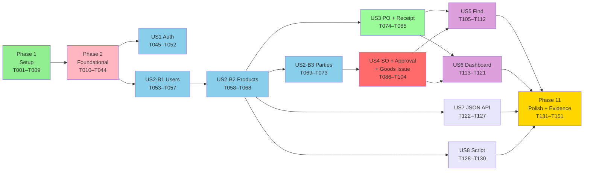
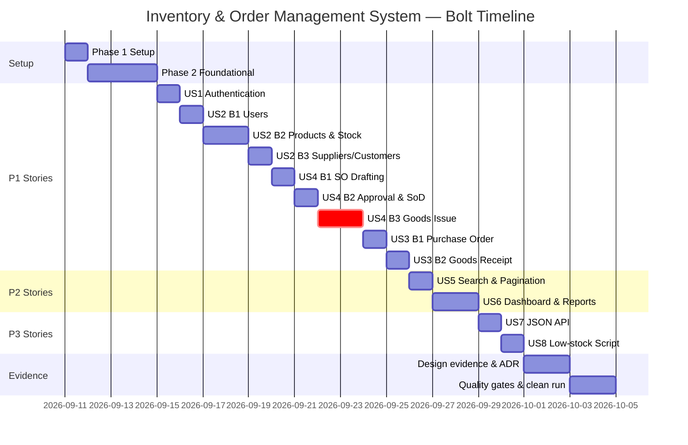
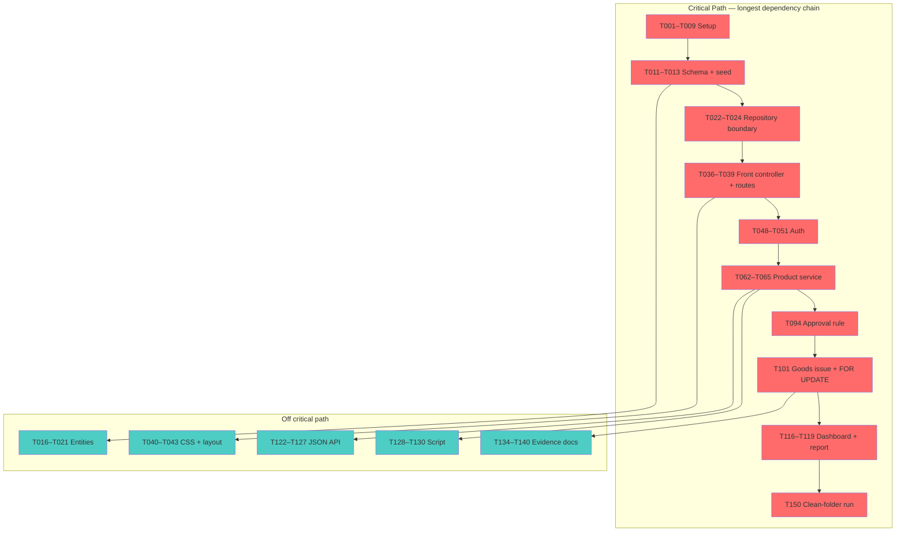

# Tasks: Inventory & Order Management System

**Input**: Design documents from `/specs/001-inventory-order-management/`
**Prerequisites**: [plan.md](./plan.md), [spec.md](./spec.md), [research.md](./research.md),
[data-model.md](./data-model.md), [contracts/](./contracts/)

**Tests**: **REQUIRED, not optional.** Constitution Principle III makes a use case without a
unit test unfinished by definition, and spec NFR-007 / NFR-008 set the floor (≥ 6 unit tests
across ≥ 3 areas, ≥ 3 integration tests against real MySQL). Test tasks therefore appear in
every story phase and are not skippable.

**Organization**: Tasks are grouped by user story so each can be implemented, tested and
demonstrated independently.

**Bolts**: Each user-story phase is a Bolt — a short iteration ending at a checkpoint where
you validate independently and commit. Large stories (US2, US3, US4) are split into ordered
sub-Bolts so no phase is too big to finish and validate in one sitting.

## Format: `[ID] [P?] [Story] [FR-###?] Description`

- **[P]**: Can run in parallel (different files, no dependency on incomplete work)
- **[Story]**: US1–US8, mapping to spec.md user stories
- **[FR-###]**: Functional requirement(s) satisfied. Every FR-001…FR-031 appears on ≥ 1 task
- Exact file paths are given in every task

## Path Conventions

Per plan.md **Structure Decision** — a single deployable web application, paths relative to
repository root: `public/`, `app/{Controller,Service,Repository,Entity,Support}`, `views/`,
`config/`, `database/`, `scripts/`, `tests/{Unit,Integration}`, `docs/`.

## Language Convention (applies to every task)

Per spec **C-007** and constitution v1.1.0: **UI strings in English**, **comments and
documentation in Indonesian**, **technical terms left in English**, identifiers and commit
messages in English. Every file created below follows this without further reminder.

---

## Phase 1: Setup (Shared Infrastructure)

**Purpose**: Project skeleton, container, tooling. No business logic.

- [X] T001 Create the directory tree from plan.md Structure Decision: `public/assets/{css,js,icons}`, `app/{Controller/Api,Service,Repository/Mysql,Entity/Enum,Support/Exception}`, `views/{layout,auth,dashboard,users,products,categories,warehouses,suppliers,customers,purchase-orders,sales-orders,reports,error}`, `config/`, `database/`, `scripts/`, `storage/uploads/` (outside the document root, for product images per research R-006), `tests/{Unit/Service,Unit/Support,Unit/Fake,Integration}`, `docs/{planning,architecture,quality,testing}`
- [X] T002 Create `composer.json` with PSR-4 autoload `App\` → `app/`, `Tests\` → `tests/`, `"php": "~8.4.0"` platform requirement, dev dependencies phpunit/phpunit ^11, phpstan/phpstan ^2, squizlabs/php_codesniffer ^3, and scripts `test`, `test:unit`, `test:integration`, `analyse`, `cs`, `db:reset`
- [X] T003 [P] Create `Dockerfile` from a pinned `php:8.4-apache` digest, enabling `mod_rewrite`, installing `pdo_mysql`, setting `DocumentRoot` to `/var/www/html/public`, `display_errors=Off`, and installing Composer
- [X] T004 [P] Create `compose.yaml` with exactly two services — `app` (build from Dockerfile, port `${APP_PORT}:80`) and `db` (`mysql:8`, named volume `db_data`, healthcheck) — with `app` gated on the db healthcheck per research R-001
- [X] T005 [P] Create `.env.example` with `APP_PORT`, `APP_ENV`, `APP_URL`, `SESSION_SECURE`, `DB_HOST`, `DB_PORT`, `DB_DATABASE`, `DB_USERNAME`, `DB_PASSWORD`, `DB_ROOT_PASSWORD`, `UPLOAD_PATH` — example values only, never real credentials
- [X] T006 [P] Create `.gitignore` excluding `/vendor`, `.env`, `/storage/uploads/*`, `docs/quality/*.txt` build output, and IDE files
- [X] T007 [P] Create `phpunit.xml` declaring two testsuites, `Unit` (`tests/Unit`) and `Integration` (`tests/Integration`), with `bootstrap="tests/bootstrap.php"` and `failOnWarning="true"`
- [X] T008 [P] Create `phpstan.neon` at level 6 scanning `app/`, `config/`, `scripts/`, `tests/`, writing its report to `docs/quality/phpstan-report.txt` per research R-011
- [X] T009 [P] Create `phpcs.xml` with the PSR-12 standard over `app/`, `config/`, `scripts/`, `tests/`

**Checkpoint**: `docker compose up --build` starts both containers and `php -v` reports 8.4.x.

---

## Phase 2: Foundational (Blocking Prerequisites)

**Purpose**: Schema, plumbing, and the dependency-inversion boundary every story depends on.

**⚠️ CRITICAL**: No user story work can begin until this phase is complete.

### Database

- [X] T010 [P] Create the initial class diagram in `docs/planning/class-diagram-initial.md` (Mermaid) showing Controller/Service/Repository/Entity and their relationships. **Produce this before any application code** — DESIGN-01 requires the initial diagram to predate the implementation, so writing it later would be dishonest evidence
- [X] T011 [FR-011][FR-022] Write `database/001_schema.sql` creating all 12 domain tables plus `login_attempt` and `schema_migration`, mirroring [data-model.md](./data-model.md) exactly — every column, type, nullability, `CHECK` constraint (`quantity >= 0`, prices `>= 0`, `received_quantity <= quantity`), FK with `RESTRICT`/`CASCADE` as specified, and every index including `UNIQUE (product_id, warehouse_id)` on `product_stock`
- [X] T012 Write `database/migrate.php` — applies pending `.sql` files in filename order inside a transaction and records each in `schema_migration`
- [X] T013 [FR-011] Write `database/002_seed.sql` meeting NFR-011: 1 Admin, 2 Sales, 2 Warehouse Staff (hashed passwords), 2 warehouses, 8 categories, 30 products with varied reorder points (several below), stock rows per product per warehouse, 15 suppliers/customers, and 25+ combined PO/SO across all statuses including `PendingApproval` and `Cancelled`, each with consistent `stock_ledger` rows

### Configuration and database access

- [X] T014 Create `config/app.php` — reads environment variables, validates required keys are present, and fails loudly at boot when one is missing
- [X] T015 [FR-022] Create `app/Support/Database.php` — PDO factory with `ERRMODE_EXCEPTION`, `FETCH_ASSOC`, **`ATTR_EMULATE_PREPARES = false`**, `utf8mb4`, plus a `transaction(callable): mixed` helper that commits or rolls back (research R-007)

### Domain enums and entities

- [X] T016 [P] Create backed enums in `app/Entity/Enum/`: `Role.php` (Admin, Sales, WarehouseStaff), `PurchaseOrderStatus.php` (5 values), `SalesOrderStatus.php` (5 values), `MovementType.php` (Receipt, Issue, Adjustment) — values exactly as in data-model.md
- [X] T017 [P] Create `app/Entity/User.php`, `Category.php`, `Warehouse.php`, `Supplier.php`, `Customer.php` — typed readonly-where-possible properties, no SQL, no HTTP
- [X] T018 [P] Create `app/Entity/Product.php` and `app/Entity/ProductStock.php` including an `isLowStock(int $total): bool` domain rule
- [X] T019 [P] Create `app/Entity/PurchaseOrder.php` and `app/Entity/PurchaseOrderItem.php` with `outstandingQuantity()` and a `canTransitionTo(PurchaseOrderStatus): bool` guard
- [X] T020 [P] Create `app/Entity/SalesOrder.php` and `app/Entity/SalesOrderItem.php` with a `canTransitionTo(SalesOrderStatus): bool` guard reflecting the lifecycle in data-model.md
- [X] T021 [P] Create `app/Entity/StockLedger.php` with the signed-quantity convention (positive Receipt, negative Issue)

### Repository boundary (dependency inversion — ARCH-01)

- [X] T022 Create every repository interface in `app/Repository/`: `UserRepositoryInterface`, `CategoryRepositoryInterface`, `WarehouseRepositoryInterface`, `ProductRepositoryInterface`, `ProductStockRepositoryInterface`, `SupplierRepositoryInterface`, `CustomerRepositoryInterface`, `PurchaseOrderRepositoryInterface`, `SalesOrderRepositoryInterface`, `StockLedgerRepositoryInterface`, `LoginAttemptRepositoryInterface`
- [X] T023 [P] Implement the MySQL side in `app/Repository/Mysql/` — one class per interface, all queries parameterized, including `ProductStockRepository::lockForUpdate()` issuing `SELECT ... FOR UPDATE`
- [X] T024 [P] Implement the in-memory fakes in `tests/Unit/Fake/` — one `InMemory*Repository` per interface, satisfying the same contracts so every Service is unit-testable without a database

### HTTP plumbing

- [X] T025 Create `app/Support/Router.php` — route table lookup with path parameters, dispatching to a controller method
- [X] T026 [P] Create `app/Support/Request.php` and `app/Support/Response.php` — Request exposes typed accessors; Response covers HTML, JSON, CSV stream and redirect
- [X] T027 [P] Create `app/Support/Session.php` — `HttpOnly`, `SameSite=Lax`, `Secure` from env, custom session name, and `regenerate()` (research R-005)
- [X] T028 [P] Create `app/Support/Csrf.php` — per-session token generation and `hash_equals` verification
- [X] T029 [FR-006] Create `app/Support/Authorization.php` — **deny by default**; a route with no declared roles is reachable by nobody. Exposes `requireRole()` and `denyAsNotFound()` for out-of-scope resources per contracts/http-routes.md
- [X] T030 [P] Create `app/Support/View.php` — scoped template renderer plus the `e()` escaping helper (`ENT_QUOTES | ENT_SUBSTITUTE`, UTF-8)
- [X] T031 [P] Create `app/Support/Exception/` — `ValidationException`, `NotFoundException`, `ForbiddenException`, `UnauthenticatedException`, `DomainException`
- [X] T032 [P] [FR-029] Create `app/Support/Validator.php` — required, email, enum membership, date, integer/decimal minimum, foreign-key existence; collects per-field messages and never partially saves
- [X] T033 [P] Create `app/Support/Paginator.php` — 10 rows per page, builds page links preserving all active query-string filters (FR-025 support)
- [X] T034 [P] Create `app/Support/Money.php` — formats `DECIMAL` as `Rp 1.250.000` (dot separators, no decimals) per spec A-011
- [X] T035 [P] Create `app/Support/ClockInterface.php`, `app/Support/SystemClock.php` and `tests/Unit/Fake/FixedClock.php` so date-dependent rules are deterministic (research R-010)

### Entry point, error handling and UI shell

- [X] T036 [FR-030] Create `public/index.php` — front controller: assert PHP 8.4.x and abort with a clear message otherwise (spec C-001), bootstrap config, session and container, dispatch, and catch every exception into a safe response (302 login / 403 / 404 / 429 / 500 JSON-or-HTML per contracts/http-routes.md), logging detail server-side and never rendering a stack trace
- [X] T037 [P] Create `public/.htaccess` — rewrite all non-file requests to `index.php`, deny access to dotfiles
- [X] T038 Create `config/container.php` — hand-wired constructor injection returning the full object graph. No DI container library (research R-003)
- [X] T039 Create `config/routes.php` — the complete route table from [contracts/http-routes.md](./contracts/http-routes.md), each entry declaring path, method, controller, and **allowed roles**
- [X] T040 [P] Create `public/assets/css/tokens.css` with the exact design tokens from research R-013 (accent, blue-biased neutral ramp, semantic status colors, 8-point spacing, radius, one elevation, six-step type scale, tabular numerals) and `public/assets/css/app.css` for layout, tables, forms, badges, empty states, responsive down to 360px
- [X] T041 [P] Vendor the Lucide SVG sprite into `public/assets/icons/lucide-sprite.svg` and record its ISC attribution in `README.md`
- [X] T042 [P] [FR-023] Create `views/layout/app.php`, `views/layout/auth.php` and partials `views/layout/_nav.php`, `_flash.php`, `_pagination.php`, `_empty-state.php` — a single reusable empty-state partial taking heading, helper text and call-to-action
- [X] T043 [P] [FR-030] Create `views/error/403.php`, `views/error/404.php`, `views/error/500.php` — safe pages with no technical detail
- [X] T044 Create `tests/bootstrap.php` and `tests/Integration/IntegrationTestCase.php` — the base wraps each test in a transaction rolled back at teardown so tests stay independent (FIRST)

**Checkpoint**: Schema applies from empty, container boots, a stub route renders through the
layout, PHPStan and PHPCS run clean. User stories can now begin.

---

## Phase 3: User Story 1 — Sign in and reach a role-appropriate workspace (Priority: P1) 🎯 MVP

**Goal**: Authenticate a user, scope their session by role, and close protected pages on sign-out.

**Independent Test**: Sign in as each of the three roles and land on different views; reject a
wrong password and a deactivated account with the same message; confirm a protected URL
redirects when signed out.

### Tests for User Story 1

- [X] T045 [P] [US1] [FR-001][FR-002] Unit-test `AuthService::attempt()` in `tests/Unit/Service/AuthServiceTest.php` — valid credentials succeed; wrong password fails; **deactivated user with correct password fails**; all failures return the same generic outcome
- [X] T046 [P] [US1] [FR-003] Unit-test session regeneration and rate limiting in `tests/Unit/Service/AuthServiceTest.php` — a 6th attempt within the window is refused, counted per (email, IP), and a nonexistent email is counted identically
- [X] T047 [P] [US1] [FR-003][FR-004] Integration-test the guard in `tests/Integration/AuthFlowTest.php` — protected route without session redirects; after sign-out the same route redirects again

### Implementation for User Story 1

- [X] T048 [US1] [FR-001][FR-002] Implement `app/Service/AuthService.php` — `password_verify`, `password_needs_rehash`, active check, uniform failure result, and the (email, IP) rate limit of 5 failures per 15 minutes via `LoginAttemptRepositoryInterface` (research R-005)
- [X] T049 [US1] [FR-001][FR-003][FR-004] Implement `app/Controller/AuthController.php` — `showLogin`, `login` (CSRF, `session_regenerate_id(true)` on success), `logout` (clear session, expire cookie)
- [X] T050 [P] [US1] [FR-002] Create `views/auth/login.php` — English UI, email retained on failure, one uniform error message, no field-level hint about which part was wrong
- [X] T051 [US1] [FR-003] Wire the authentication guard into `public/index.php` and `config/routes.php` so every non-public route requires a session, redirecting HTML routes to `/login` and returning JSON 401 for `/api/*`
- [X] T052 [P] [US1] Create `views/dashboard/index.php` as a role-dispatching shell with three empty region placeholders, so each role lands somewhere distinct (content arrives in US6)

**Checkpoint**: US1 fully functional. Three roles sign in and out; protected pages are closed
without a session. Validate, then commit.

---

## Phase 4: User Story 2 — Administer users and master data (Priority: P1)

**Goal**: Admin maintains accounts and the catalog every transaction references.

**Independent Test**: Create and edit a user, category, product, warehouse, supplier and
customer; reject duplicate email and SKU; confirm a transacted product only deactivates;
confirm Sales and Warehouse Staff are refused user administration by the server.

### US2 · Bolt 1 — User management

- [X] T053 [P] [US2] [FR-005] Unit-test `UserService` in `tests/Unit/Service/UserServiceTest.php` — duplicate email rejected; role restricted to the three values; deactivation blocks sign-in; an Admin cannot deactivate themselves
- [X] T054 [P] [US2] [FR-006] Integration-test in `tests/Integration/UserAccessTest.php` — Sales and Warehouse Staff receive 403 from every `/users*` route, called directly rather than through the UI
- [X] T055 [US2] [FR-005] Implement `app/Service/UserService.php` — create, update, toggle active, unique-email enforcement, `password_hash` on create and password change
- [X] T056 [US2] [FR-005][FR-006] Implement `app/Controller/UserController.php` — Admin-only per the route table, with **step-up re-auth** on password change (Admin re-enters their own password, research R-005)
- [X] T057 [P] [US2] [FR-023] Create `views/users/index.php` (paged list with empty state) and `views/users/form.php` (create/edit, English labels, values retained on error)

**Checkpoint (Bolt 1)**: Admin manages accounts; other roles are refused at the server.

### US2 · Bolt 2 — Products, categories, warehouses and stock visibility

- [X] T058 [P] [US2] [FR-008] Unit-test `ProductService` in `tests/Unit/Service/ProductServiceTest.php` — duplicate SKU rejected; negative purchase price, selling price and reorder point each rejected; nothing persists on failure
- [X] T059 [P] [US2] [FR-009] Unit-test deactivation rules in `tests/Unit/Service/ProductServiceTest.php` — a product referenced by an order line cannot be deleted, only deactivated, and remains visible on existing orders
- [X] T060 [P] [US2] [FR-011] Unit-test `ProductService::stockBreakdown()` in `tests/Unit/Service/ProductServiceTest.php` — returns per-warehouse rows plus the correct total for a product stocked in two warehouses
- [X] T061 [P] [US2] [FR-010] Unit-test image validation in `tests/Unit/Service/ProductImageServiceTest.php` — disallowed type rejected by content inspection, oversized file rejected, accepted file receives a random unguessable name
- [X] T062 [US2] [FR-007][FR-008][FR-009] Implement `app/Service/ProductService.php` — create, update, toggle active, SKU uniqueness, numeric validation, stock breakdown with total
- [X] T063 [US2] [FR-010] Implement `app/Service/ProductImageService.php` — `finfo` content-type detection, 2 MB limit, `bin2hex(random_bytes(16))` filename, stored **outside the document root** at the path given by `UPLOAD_PATH`, failing loudly at boot if that directory is missing or not writable (research R-006)
- [X] T064 [US2] [FR-007] Implement `app/Service/MasterDataService.php` — category and warehouse create/update/deactivate with name uniqueness
- [X] T065 [US2] [FR-007][FR-010][FR-011] Implement `app/Controller/ProductController.php` including `image()` serving files from outside the web root with an explicit `Content-Type` and `Content-Disposition: inline`
- [X] T066 [P] [US2] [FR-007] Implement `app/Controller/CategoryController.php` and `app/Controller/WarehouseController.php`
- [X] T067 [P] [US2] [FR-011][FR-023] Create `views/products/index.php`, `views/products/detail.php` (per-warehouse stock plus total, low-stock marked), `views/products/form.php` (with image upload)
- [X] T068 [P] [US2] [FR-023] Create `views/categories/index.php`, `views/categories/form.php`, `views/warehouses/index.php`, `views/warehouses/form.php`

**Checkpoint (Bolt 2)**: Catalog is maintainable; one product shows different stock in two
warehouses; invalid images are refused.

### US2 · Bolt 3 — Suppliers and customers

- [X] T069 [P] [US2] [FR-009] Unit-test supplier and customer deactivation in `tests/Unit/Service/PartyServiceTest.php` — a party referenced by an order deactivates rather than deletes
- [X] T070 [US2] [FR-007] Implement `app/Service/PartyService.php` covering both Supplier and Customer (kept as distinct entities per data-model.md)
- [X] T071 [P] [US2] [FR-007] Implement `app/Controller/SupplierController.php` and `app/Controller/CustomerController.php`, with customer read access granted to Sales per the route table
- [X] T072 [P] [US2] [FR-023] Create `views/suppliers/index.php`, `views/suppliers/form.php`, `views/customers/index.php`, `views/customers/form.php`
- [X] T073 [US2] [FR-029] Wire `Validator` messages into every master-data form so failures show per-field plus a summary, with entered values retained and nothing saved

**Checkpoint**: US2 complete. All master data is maintainable by Admin and correctly refused
to other roles. Validate, then commit.

---

## Phase 5: User Story 3 — Purchase from a supplier and receive goods (Priority: P1)

**Goal**: Raise a Purchase Order and record full or partial receipt, raising stock through the ledger.

**Independent Test**: Create a PO, record a partial receipt, confirm stock rose by exactly the
received quantity and outstanding remains tracked, then receive the rest and reach `Received`.

### US3 · Bolt 1 — Purchase Order lifecycle

- [X] T074 [P] [US3] [FR-012] Unit-test `PurchaseOrderService::create()` in `tests/Unit/Service/PurchaseOrderServiceTest.php` — requires supplier, destination warehouse and ≥ 1 line; starts as `Draft`; generates a unique order number
- [X] T075 [P] [US3] [FR-013] Unit-test PO transitions in `tests/Unit/Service/PurchaseOrderServiceTest.php` — `Draft→Ordered`, cancel allowed before `Received` (spec A-004), and `Received`/`Cancelled` refuse further transitions
- [X] T076 [US3] [FR-012][FR-013] Implement `app/Service/PurchaseOrderService.php` — create, submit, cancel, order-number generation, transition guards
- [X] T077 [US3] [FR-012][FR-013] Implement `app/Controller/PurchaseOrderController.php` — index, create, store, show, submit and cancel. Roles are per-action from `contracts/http-routes.md`, not uniform: index/create/store/show/submit allow **Admin and Warehouse Staff**, while **cancel is Admin-only**. Sales receives 403 on every action
- [X] T078 [P] [US3] [FR-023] Create `views/purchase-orders/index.php`, `views/purchase-orders/detail.php` (header, lines with ordered/received/outstanding, status badge, movement history), `views/purchase-orders/form.php` (dynamic line rows in vanilla JS)

**Checkpoint (Bolt 1)**: A PO can be created, submitted and cancelled; no stock moves yet.

### US3 · Bolt 2 — Goods receipt

- [X] T079 [P] [US3] [FR-014] Unit-test partial receipt in `tests/Unit/Service/StockServiceTest.php` — receiving part of a line sets `PartiallyReceived` and leaves the outstanding quantity recorded
- [X] T080 [P] [US3] [FR-014] Unit-test over-receipt refusal in `tests/Unit/Service/StockServiceTest.php` — a quantity above outstanding is rejected and nothing changes (spec A-005)
- [X] T081 [P] [US3] [FR-015] Unit-test receipt effects in `tests/Unit/Service/StockServiceTest.php` — stock rises by the received quantity and one `Receipt` ledger row is written per line, naming product, warehouse, source order and acting user
- [X] T082 [P] [US3] [FR-015][FR-022] Integration-test in `tests/Integration/GoodsReceiptTest.php` — against real MySQL, a receipt increases `product_stock` end-to-end and writes matching `stock_ledger` rows; a forced mid-operation failure leaves **neither** changed
- [X] T083 [US3] [FR-014][FR-015][FR-022] Implement `StockService::receiveGoods()` in `app/Service/StockService.php` — inside one `Database::transaction()`: validate against outstanding, write `Receipt` ledger rows, increase `product_stock`, advance PO status to `PartiallyReceived` or `Received`
- [X] T084 [US3] [FR-014][FR-015] Add `receiveForm()` and `receive()` to `app/Controller/PurchaseOrderController.php` with CSRF
- [X] T085 [P] [US3] [FR-014] Create `views/purchase-orders/receive.php` — one row per line showing outstanding quantity beside the input, entered values retained on refusal

**Checkpoint**: US3 complete. Partial and full receipt both work, stock and ledger always agree.
Validate, then commit.

---

## Phase 6: User Story 4 — Sell with approval and controlled stock issue (Priority: P1)

**Goal**: The core revenue flow, carrying both of the system's hardest guarantees.

**Independent Test**: Drive an order Draft→Fulfilled; confirm the creating Sales user is refused
approval by the server; confirm an issue exceeding stock is refused; confirm two concurrent
issues never oversell.

### US4 · Bolt 1 — Sales Order drafting

- [X] T086 [P] [US4] [FR-016] Unit-test `SalesOrderService::create()` in `tests/Unit/Service/SalesOrderServiceTest.php` — requires customer, source warehouse and ≥ 1 line; starts `Draft`; records `created_by` **from the passed acting user, never from input**
- [X] T087 [P] [US4] [FR-017] Unit-test SO transitions in `tests/Unit/Service/SalesOrderServiceTest.php` — the full lifecycle plus cancel from every stage before `Fulfilled`, and refusal of any transition out of `Fulfilled`/`Cancelled`
- [X] T088 [US4] [FR-016][FR-017] Implement create, submit and cancel in `app/Service/SalesOrderService.php` with transition guards and order-number generation
- [X] T089 [US4] [FR-016] Implement index, create, store, show, submit and cancel in `app/Controller/SalesOrderController.php`, scoping Sales to their own orders in the query `WHERE` clause
- [X] T090 [P] [US4] [FR-023] Create `views/sales-orders/index.php`, `views/sales-orders/detail.php` (status badge, creator, approver, movement history, only permitted actions rendered), `views/sales-orders/form.php`

**Checkpoint (Bolt 1)**: Sales users draft and submit orders; Sales see only their own.

### US4 · Bolt 2 — Approval and segregation of duties

- [X] T091 [P] [US4] [FR-018] Unit-test the approval rule in `tests/Unit/Service/SalesOrderServiceTest.php` — **the single highest-value test in the suite**: a Sales user is refused approval of their own order; a Sales user is refused approval of any order; an Admin succeeds and `approved_by` plus `approved_at` are recorded; `approved_by` never equals `created_by`
- [X] T092 [P] [US4] [FR-018] Integration-test server enforcement in `tests/Integration/ApprovalAuthorizationTest.php` — POST to `/sales-orders/{id}/approve` as the creating Sales user returns 403 even when called directly, bypassing the UI
- [X] T093 [P] [US4] [FR-023] Integration-test ownership scoping in `tests/Integration/ApprovalAuthorizationTest.php` — a Sales user requesting another Sales user's order receives **404, not 403**, so existence is not leaked
- [X] T094 [US4] [FR-018] Implement `SalesOrderService::approve()` and `reject()` in `app/Service/SalesOrderService.php` — assert the acting user's role is Admin **and** `approvedBy !== createdBy`; reject moves the order to `Cancelled`
- [X] T095 [US4] [FR-018] Add `approve()` and `reject()` to `app/Controller/SalesOrderController.php`, Admin-only per the route table, with CSRF

**Checkpoint (Bolt 2)**: Segregation of duties is enforced at the server and proven by test.

### US4 · Bolt 3 — Goods issue and concurrency safety

- [X] T096 [P] [US4] [FR-019] Unit-test issue preconditions in `tests/Unit/Service/StockServiceTest.php` — an order not in `Approved` is refused; a quantity exceeding available stock is refused and nothing changes
- [X] T097 [P] [US4] [FR-020] Unit-test issue effects in `tests/Unit/Service/StockServiceTest.php` — stock decreases, one `Issue` ledger row per line, order becomes `Fulfilled`
- [X] T098 [P] [US4] [FR-021][FR-022] Integration-test the lock in `tests/Integration/ConcurrentGoodsIssueTest.php` — seed one unit; open **two real connections**; connection A holds the `FOR UPDATE` lock; assert B blocks; commit A; assert B is then refused, stock is 0 and never negative, and no update was lost (NFR-001, SC-003)
- [X] T099 [P] [US4] [FR-022] Integration-test reconciliation in `tests/Integration/LedgerReconciliationTest.php` — after a mixed sequence of receipts and issues, `SUM(stock_ledger.quantity) = product_stock.quantity` for every (product, warehouse) pair (NFR-002, SC-004)
- [X] T100 [P] [US4] [FR-020] Integration-test end-to-end issue in `tests/Integration/GoodsIssueTest.php` — real MySQL, Approved order, stock falls and the order reaches `Fulfilled`
- [X] T101 [US4] [FR-019][FR-020][FR-021][FR-022] Implement `StockService::issueGoods()` in `app/Service/StockService.php` — inside one `Database::transaction()`: lock each `product_stock` row with `SELECT ... FOR UPDATE` **ordered by `product_id` then `warehouse_id`** to avoid deadlock, re-read quantities under the lock, verify sufficiency, write `Issue` ledger rows, decrease stock, set `Fulfilled`, commit (research R-002)
- [X] T102 [US4] [FR-019][FR-020] Add `issueForm()` and `issue()` to `app/Controller/SalesOrderController.php`, restricted to Admin and Warehouse Staff
- [X] T103 [P] [US4] [FR-019] Create `views/sales-orders/issue.php` — each line shows requested quantity beside currently available stock; refusal explains the cause with quantities retained
- [X] T104 [P] [US4] Create `public/assets/js/confirm.js` — explicit confirmation naming the effect before every status change and stock movement

**Checkpoint**: US4 complete. The full Draft→Fulfilled flow works, oversell is impossible, and
Sales can never approve. This is the assessment's core. Validate thoroughly, then commit.

---

## Phase 7: User Story 5 — Find records across large lists (Priority: P2)

**Goal**: Search, filter, sort and paginate so the app is usable at realistic volumes.

**Independent Test**: With 30 products and 25 orders seeded, search by name and SKU, filter by
category and stock status, filter and sort orders, then page forward twice with filters intact.

- [X] T105 [P] [US5] [FR-024] Unit-test the product search criteria builder in `tests/Unit/Service/ProductSearchTest.php` — name and SKU partial match, category filter, low-stock filter, and combinations
- [X] T106 [P] [US5] [FR-024] Unit-test the sort allowlist in `tests/Unit/Service/OrderSearchTest.php` — only allowlisted sort keys are accepted; an arbitrary column name is rejected, never interpolated into SQL
- [X] T107 [P] [US5] [FR-025] Unit-test `Paginator` in `tests/Unit/Support/PaginatorTest.php` — 10 per page, correct page count and offsets, and every active filter preserved in generated page links
- [X] T108 [US5] [FR-024] Implement product search, category filter and low-stock filter in `app/Repository/Mysql/MysqlProductRepository.php` with all criteria bound as parameters
- [X] T109 [US5] [FR-024] Implement order number and party search, status filter and date sort (both directions) in `app/Repository/Mysql/MysqlPurchaseOrderRepository.php` and `MysqlSalesOrderRepository.php`, sort keys mapped through an allowlist
- [X] T110 [US5] [FR-025] Wire `Paginator` into the product, purchase-order and sales-order controllers with query-string state so a filtered page is linkable, and changing a filter returns to page one
- [X] T111 [P] [US5] [FR-023][FR-025] Create `public/assets/js/filters.js` — submit filter changes through the query string without losing sort or other filters
- [X] T112 [P] [US5] [FR-023] Add both distinct empty states — "no records yet" with a create action, and "no records match these filters" with a clear-filters action — to `views/products/index.php`, `views/purchase-orders/index.php`, `views/sales-orders/index.php`, `views/users/index.php`, `views/suppliers/index.php` and `views/customers/index.php`, reusing `views/layout/_empty-state.php`

**Checkpoint**: US5 complete. Lists are usable at seeded volume, filters survive paging.

---

## Phase 8: User Story 6 — Role-scoped dashboards and CSV export (Priority: P2)

**Goal**: Turn recorded transactions into a management view, scoped per role.

**Independent Test**: Each role's dashboard shows its own defined figures; changing data moves
the figures; two different date ranges produce different exports that agree with the dashboard.

- [X] T113 [P] [US6] [FR-026] Unit-test `DashboardService` in `tests/Unit/Service/DashboardServiceTest.php` — Admin figures (inventory value as quantity × **purchase** price per spec A-007, count below reorder point, pending orders by status); Sales sees only their own orders; Warehouse sees queues and low stock
- [X] T114 [P] [US6] [FR-027] Unit-test `ReportService` in `tests/Unit/Service/ReportServiceTest.php` — date-range filtering, Sales scoped to own orders, and a range over 366 days rejected
- [X] T115 [P] [US6] [FR-026][FR-027] Integration-test agreement in `tests/Integration/DashboardReportConsistencyTest.php` — the CSV export and the dashboard, over the same range, report the same totals
- [X] T116 [US6] [FR-026] Implement `app/Service/DashboardService.php` — every figure from an aggregation query, never a static value
- [X] T117 [US6] [FR-027] Implement `app/Service/ReportService.php` reusing the **same query builder methods** as `DashboardService` so the two cannot drift (research R-008)
- [X] T118 [US6] [FR-026] Implement `app/Controller/DashboardController.php` dispatching to the three role views
- [X] T119 [US6] [FR-027] Implement `app/Controller/ReportController.php` — streams via `fputcsv` to `php://output` with `Content-Disposition: attachment`, range capped at 366 days, Sales scoped to own orders
- [X] T120 [P] [US6] [FR-026] Create `views/dashboard/admin.php`, `views/dashboard/sales.php`, `views/dashboard/warehouse.php` — loading placeholders, zero-state text, attention marking for low stock and pending approvals
- [X] T121 [P] [US6] [FR-027] Create `views/reports/index.php` — report type, date range, matching record count, and an export that still produces a headers-only file for an empty range

**Checkpoint**: US6 complete. Dashboards and exports agree and are role-correct.

---

## Phase 9: User Story 7 — Query stock availability as data (Priority: P3)

**Goal**: A small JSON surface honouring the same session auth as the pages.

**Independent Test**: Request availability signed in, signed out, and for an unknown SKU —
three distinct correctly typed JSON responses, never an HTML page.

- [X] T122 [P] [US7] [FR-028] Integration-test the contract in `tests/Integration/StockApiTest.php` — 200 with the documented shape when signed in; **401 as JSON, not an HTML login page**, when signed out; 404 for an unknown SKU; `Content-Type: application/json` on all three
- [X] T123 [P] [US7] [FR-028] Integration-test role scoping in `tests/Integration/StockApiTest.php` — `/api/dashboard/low-stock` returns 403 for Sales, 200 for Admin and Warehouse Staff, per contracts/openapi.yaml
- [X] T124 [US7] [FR-028] Implement `app/Controller/Api/StockApiController.php` — `availability(sku)` and `available(productId, warehouseId)` exactly matching the schemas in [contracts/openapi.yaml](./contracts/openapi.yaml)
- [X] T125 [US7] [FR-028] Implement `app/Controller/Api/DashboardApiController.php` — `lowStock()` with the `limit` parameter, Admin and Warehouse Staff only
- [X] T126 [US7] [FR-028][FR-030] Add the uniform JSON error envelope to the front controller so `/api/*` failures return the documented `{error:{code,message}}` shape with no exception detail
- [X] T127 [P] [US7] Create `public/assets/js/stock-lookup.js` — the Sales Order form calls the availability endpoint and shows live available stock beside each line as guidance

**Checkpoint**: US7 complete. The JSON contract behaves correctly in all three states.

---

## Phase 10: User Story 8 — Low-stock check outside the web flow (Priority: P3)

**Goal**: Demonstrate work separated from the request cycle.

**Independent Test**: Run the script manually; its summary lists exactly the products at or
below reorder point.

- [X] T128 [P] [US8] [FR-031] Unit-test the low-stock query in `tests/Unit/Service/ProductServiceTest.php` — returns exactly the products whose total quantity is at or below reorder point (spec A-008), including boundary equality
- [X] T129 [US8] [FR-031] Implement `scripts/check-low-stock.php` — standalone CLI entry point booting `config/container.php` and reusing the **same** `ProductService` the dashboard uses, printing a readable summary; no cron installed (research R-012)
- [X] T130 [US8] [FR-031] Document the `docker compose exec app php scripts/check-low-stock.php` invocation in `README.md` and `docs/testing/`

**Checkpoint**: US8 complete. All eight user stories are independently functional.

---

## Phase 11: Polish, Evidence & Cross-Cutting Concerns

**Purpose**: The graded evidence artifacts and the final quality gates. Constitution Principle
VI makes these deliverables, not paperwork.

### Validation and error handling sweep

- [X] T131 [FR-029] Add client-side validation mirroring every server rule across all forms in `public/assets/js/`, with the server remaining the source of truth and a client-side pass never implying acceptance
- [X] T132 [FR-029][FR-030] Sweep every class in `app/Controller/` against the spec Edge Cases list — expired session mid-form, cancelled-then-transitioned order, deactivated product on an open order, empty filter result, over-range export — confirming no partial save and no technical detail reaches the user; record the outcome per scenario in `docs/testing/failure-paths.md`

### Responsive and accessibility pass

- [ ] T133 [P] Verify and fix every screen at 360px and desktop in `public/assets/css/app.css` — no clipped navigation or tables, labels on all inputs, visible focus state, adequate contrast (NFR-006, SC-009)

### Design evidence (DESIGN-01…04, constitution Principle VI)

- [X] T134 [P] Create the as-built class diagram in `docs/architecture/class-diagram-as-built.md`, **distinguishing dependencies on interfaces from those on concrete classes**, plus 2–3 sentences on what changed from the initial diagram and why
- [X] T135 [P] Write `docs/architecture/adr-001-repository-abstraction.md` — context/decision/consequences for repository interfaces over direct PDO, lifting the alternatives already recorded in research R-003
- [X] T136 [P] Write `docs/architecture/adr-002-concurrency-control.md` — the `SELECT ... FOR UPDATE` decision, the concrete concurrent scenario it prevents, and why conditional UPDATE and an optimistic version column were rejected (research R-002)
- [X] T137 [P] Write `docs/quality/refactor-log.md` — ≥ 3 entries naming the smell, the technique applied and before/after excerpts, plus one SRP audit note on a class from the initial draft that was split
- [ ] T138 Make at least one commit tagged `refactor:` that improves pre-existing code rather than the feature in progress (Boy Scout Rule, DESIGN-03)
- [X] T139 [P] Write `docs/quality/tech-debt.md` — shortcuts taken and their ideal fixes, recorded honestly
- [X] T140 [P] Write `docs/quality/critique.md` — the DESIGN-04 written critique: smells present, SOLID principles violated, and the refactoring direction

### Quality gates

- [X] T141 Run PHPStan level 6 and resolve every finding, writing the report to `docs/quality/phpstan-report.txt`; if level 6 requires suppression rather than fixes, drop to level 5 and record the reason (research R-011) — never suppress to hold a level
- [X] T142 Run PHP_CodeSniffer PSR-12 and fix all violations, writing the report to `docs/quality/phpcs-report.txt`
- [X] T143 Verify `declare(strict_types=1);` is the first statement in **every** `.php` file including tests and scripts, and that no `mixed` lacks its justifying comment (constitution Principle II)
- [X] T144 Verify per-use-case unit coverage — cross-check every public method in `app/Service/` against `tests/Unit/Service/` so each business-rule method has ≥ 1 unit test (constitution Principle III, SC-006); add the missing tests and record the mapping in `docs/testing/use-case-coverage.md`
- [X] T145 Confirm both suites pass in full with no skipped test standing in for absent coverage, and record results in `docs/testing/test-results.md`

### Documentation and submission package

- [X] T146 Write `README.md` in Indonesian with English technical terms — features, requirements, install, demo accounts, Docker commands, the single command per test suite, the Lucide attribution, and known limitations (constitution Quality Gates)
- [X] T147 [P] Write `ai-usage-log.md` — tool, purpose, sanitized prompt summary, output used or rejected, and verification evidence for each use
- [X] T148 [P] Write `docs/planning/` package — user stories, scope, ERD and backlog, derived from spec.md rather than rewritten
- [ ] T149 [P] Write `docs/testing/test-scenarios.md` and capture the desktop and 360px screenshots of the four main screens required by UI-01
- [ ] T150 Run the full [quickstart.md](./quickstart.md) procedure **from a clean copy in an empty directory** — clone, `docker compose up --build`, sign in as all three roles, PO/SO flow, both test suites — and fix anything the clean run exposes (SC-001, constitution Principle VII)
- [X] T151 Verify no secret, credential, `.env`, token or PII exists anywhere in the repository **or its history** before tagging the final release (NFR-004)

---

## Dependencies & Execution Order

### Phase Dependencies

- **Setup (Phase 1)**: no dependencies — start immediately
- **Foundational (Phase 2)**: depends on Setup — **blocks every user story**
- **US1 (Phase 3)**: depends on Foundational. Nothing depends on US1 *technically*, but every
  other story is demonstrated through a signed-in session, so it is the natural first Bolt
- **US2 (Phase 4)**: depends on Foundational. Produces the master data US3 and US4 reference
- **US3 (Phase 5)**: depends on Foundational + US2 Bolt 2 (needs products and warehouses)
- **US4 (Phase 6)**: depends on Foundational + US2 Bolt 2/3 (needs products and customers).
  Independent of US3 — a Sales Order can be issued against seeded stock without any PO
- **US5 (Phase 7)**: depends on the lists built in US2/US3/US4 existing
- **US6 (Phase 8)**: depends on US3 and US4 having produced ledger data worth aggregating
- **US7 (Phase 9)**: depends on Foundational + US2 Bolt 2. Independent of US3–US6
- **US8 (Phase 10)**: depends on Foundational + US2 Bolt 2. Independent of everything else
- **Polish (Phase 11)**: depends on all desired stories being complete

### Within Each User Story

Tests are written **first** and must fail before implementation → Entities → Repositories →
Services → Controllers → Views → wiring. Each story ends at a checkpoint where it is validated
independently and committed.

### Parallel Opportunities

- Setup: T003–T009 all in parallel
- Foundational: entities T016–T021 in parallel; support classes T026–T035 in parallel;
  T023 (MySQL repositories) and T024 (in-memory fakes) in parallel once T022 defines the interfaces
- Within every story: all test tasks marked [P] in parallel; all view tasks in parallel
- Across stories, once Foundational and US2 Bolt 2 are done: **US3, US4, US7 and US8 can proceed
  in parallel** by different people
- Polish: T134–T137, T139–T140, T147–T149 all in parallel

---

## Parallel Example: User Story 4

```bash
# Bolt 3 — launch all goods-issue tests together (they must fail first):
Task: "Unit-test issue preconditions in tests/Unit/Service/StockServiceTest.php"        # T096
Task: "Unit-test issue effects in tests/Unit/Service/StockServiceTest.php"              # T097
Task: "Integration-test the lock in tests/Integration/ConcurrentGoodsIssueTest.php"     # T098
Task: "Integration-test reconciliation in tests/Integration/LedgerReconciliationTest.php" # T099
Task: "Integration-test end-to-end issue in tests/Integration/GoodsIssueTest.php"       # T100

# Then implement (sequential — same file):
Task: "Implement StockService::issueGoods() in app/Service/StockService.php"            # T101
```

---

## Implementation Strategy

### MVP scope

The demonstrable MVP is **Phase 1 + Phase 2 + US1 + US2 Bolt 2 + US4** — sign in, a catalog,
and the complete Sales Order flow through approval to fulfilment with oversell prevented. That
subset already exercises both guarantees the assessment weighs most heavily. US3 (purchasing)
is mandatory for submission but is not needed to prove the architecture works.

### Recommended order (single developer)

1. Phase 1 → Phase 2 → **stop, verify the container boots and a route renders**
2. US1 → checkpoint, commit
3. US2 Bolt 1 → Bolt 2 → Bolt 3 → checkpoint, commit after each
4. **US4 next, before US3** — it is the hardest and the most heavily graded; leaving it late is
   the main schedule risk. Bolt 1 → Bolt 2 → Bolt 3, committing at each
5. US3 Bolt 1 → Bolt 2 → checkpoint, commit
6. US5 → US6 → US7 → US8, each a single Bolt
7. Phase 11 — note that the initial class diagram is already done, as T010 back in
   Phase 2, because DESIGN-01 requires it to predate the code

### Parallel team strategy

Setup and Foundational together. Then: developer A takes US1 → US4 (the critical path);
developer B takes US2 → US3; developer C takes US5 → US6 → US7 → US8 as each dependency lands.

---

## Task Dependencies & Timeline

### Dependency Graph



`US4` is red because it carries both graded guarantees — segregation of duties and oversell
prevention — and is where a critical failure is most likely.

### Gantt Timeline



### Critical Path



### Resource Allocation

| Phase | Tasks | Parallel capacity | Recommended |
| --- | --- | --- | --- |
| Phase 1 Setup | 9 | 7 | 1 person |
| Phase 2 Foundational | 35 | 10 | 1–2 people |
| US1 | 8 | 4 | 1 person |
| US2 (3 Bolts) | 21 | 6 | 1–2 people |
| US3 (2 Bolts) | 12 | 5 | 1 person |
| US4 (3 Bolts) | 19 | 6 | 1–2 people (most senior) |
| US5 | 8 | 4 | 1 person |
| US6 | 9 | 5 | 1 person |
| US7 | 6 | 3 | 1 person |
| US8 | 3 | 1 | 1 person |
| Phase 11 Polish | 21 | 9 | 1–2 people |

---

## Requirement Coverage

Every functional requirement in spec.md maps to at least one task.

| FR | Tasks | FR | Tasks |
| --- | --- | --- | --- |
| FR-001 | T045, T048, T049 | FR-017 | T087, T088 |
| FR-002 | T045, T048, T050 | FR-018 | T091, T092, T094, T095 |
| FR-003 | T046, T047, T049, T051 | FR-019 | T096, T101, T102, T103 |
| FR-004 | T047, T049 | FR-020 | T097, T100, T101, T102 |
| FR-005 | T053, T055, T056 | FR-021 | T098, T101 |
| FR-006 | T029, T054, T056 | FR-022 | T011, T015, T082, T083, T098, T099, T101 |
| FR-007 | T062, T064, T065, T066, T070, T071 | FR-023 | T042, T057, T067, T068, T072, T078, T090, T093, T111, T112 |
| FR-008 | T058, T062 | FR-024 | T105, T106, T108, T109 |
| FR-009 | T059, T062, T069 | FR-025 | T107, T110, T111 |
| FR-010 | T061, T063, T065 | FR-026 | T113, T115, T116, T118, T120 |
| FR-011 | T011, T013, T060, T062, T067 | FR-027 | T114, T115, T117, T119, T121 |
| FR-012 | T074, T076, T077 | FR-028 | T122, T123, T124, T125, T126 |
| FR-013 | T075, T076, T077 | FR-029 | T032, T073, T131, T132 |
| FR-014 | T079, T080, T083, T084, T085 | FR-030 | T036, T043, T126, T132 |
| FR-015 | T081, T082, T083, T084 | FR-031 | T128, T129, T130 |
| FR-016 | T086, T088, T089 | | |

**Coverage: 31 / 31 FRs.** No gaps.

Non-functional requirements are covered by: NFR-001 → T098; NFR-002 → T099; NFR-003 → T029,
T054, T092, T093; NFR-004 → T013, T055, T151; NFR-005 → T015, T030, T106; NFR-006 → T133;
NFR-007 → T144; NFR-008 → T082, T098, T099, T100; NFR-009 → T141, T142; NFR-010 → T003, T004,
T150; NFR-011 → T013.

---

## Notes

- `[P]` means a different file with no dependency on incomplete work
- Each user-story phase is a Bolt; its checkpoint is where you validate independently and commit
- Tests are written first and must fail before the implementation task begins
- **T010 (initial class diagram) sits in Phase 2 deliberately** — DESIGN-01 requires the
  initial diagram to predate the code, so it must be produced before any implementation task
- **T138 (`refactor:` commit)** must improve pre-existing code, not the feature in progress
- Avoid: touching the same file from two `[P]` tasks, and cross-story dependencies that would
  break independent testability
- Critical path runs through the repository boundary → auth → product service → approval →
  goods issue. Everything else can be compressed by parallelising
