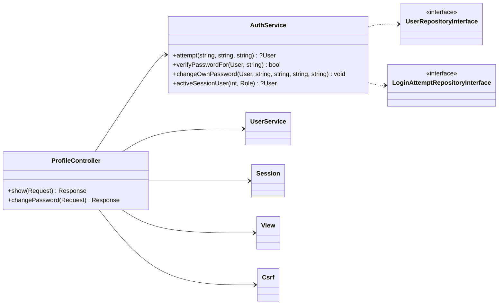

# Implementation Plan: User Profile Page

**Branch**: `002-user-profile-page` (spec folder only; work stays on the current branch) | **Date**: 2026-10-03 | **Spec**: [spec.md](./spec.md)
**Input**: Feature specification from `specs/002-user-profile-page/spec.md`

## Summary

Give every signed-in user (Admin, Sales, Warehouse Staff) a **My profile** page that shows their own
name, email, role, and status (read-only), and lets them **change their own password** with the
current password, a confirmation, and an attempt limit. While planning, an application-wide gap was
found and is fixed here (FR-012): a deactivated or re-roled user kept access until sign-out. Now
every authenticated request re-checks the account.

Technical approach, following the planning constraint **"no new table without a strong reason"**:
- **No schema change.** The attempt limit reuses `login_attempt` through the existing
  `LoginAttemptRepositoryInterface`, with the same counter and limit as sign-in (research R-001).
- Two business methods on the existing `AuthService`: `changeOwnPassword()` (R-002, R-004) and
  `activeSessionUser()` (R-008).
- One thin `ProfileController`, one view, two routes, a sidebar entry, and one plumbing method
  `Session::regenerate()` (R-005).
- A small Boy Scout refactor moves the password-length rule to `User::MIN_PASSWORD_LENGTH` (R-003).

## Technical Context

**Language/Version**: PHP 8.4 exactly (`composer.json` `~8.4.0`, image `php:8.4-apache`), `declare(strict_types=1)` everywhere
**Primary Dependencies**: none at runtime (native PHP, PDO). Dev: PHPUnit 11.5, PHPStan 2.2 (level 6), PHP_CodeSniffer 3.13 (PSR-12)
**Storage**: MySQL 8.0, existing tables `user` and `login_attempt` only — **no new table, column, index, or migration** (data-model.md)
**Testing**: PHPUnit unit suite (in-memory fakes, no DB/session) and integration suite (real MySQL in Docker); `composer check` runs everything
**Target Platform**: Linux container (Apache + PHP) behind Docker Compose; browsers at 360px and desktop
**Project Type**: single web application (server-rendered)
**Architecture Type**: standalone modular monolith, layered Controller → Service → RepositoryInterface → Mysql*Repository, with dependency inversion at the repository boundary (CLAUDE.md, ADR-001)
**Integration Target**: N/A — not a micro-frontend and no external service. Plugs into the existing front controller (`public/index.php`), route table (`config/routes.php`), and container (`config/container.php`)
**Existing Design System**: in-house CSS with tokens in `public/assets/css/tokens.css` (accent `#2563eb`, hue-biased neutrals, status text tokens meeting WCAG AA), components in `public/assets/css/app.css` (`page-header`, `card`, `form-grid`, `field-label field-required`, `field-error`, `badge--*`, `alert`, `btn`), Lucide SVG sprite `public/assets/icons/lucide-sprite.svg`, vanilla JS ES modules (progressive enhancement). No component library or CSS framework (forbidden by the brief)
**Performance Goals**: page renders like existing pages; FR-012 adds one primary-key lookup per authenticated request (negligible at the brief's volume)
**Constraints**: no framework, ORM, or DI container; no new table (user directive); English UI text; Indonesian comments and docs; Service never reads session or superglobals; acting user passed as an argument
**Scale/Scope**: 1 new screen, 2 routes, ~1 controller, 2 service methods, 1 view; 3 demo roles

## UI/UX & Screens (carried from spec)

- **Design reference**: none. Follow the existing design system. Match `Users → Edit` (password
  fields, field errors, summary alert) and the detail pages (read-only summary card).
- **Screens**:
  - **My profile** (`/profile`, US1 + US2)
    - populated: page header "My profile"; summary card with name, email, role badge, and status
      badge; then a "Change password" card with Current password, New password, Confirm new
      password, and a primary "Change password" button.
    - error (422): summary alert plus field errors; **all password fields empty**.
    - rate-limited (429): alert "Too many incorrect attempts. Try again later."; form still shown.
    - success: flash "Your password has been changed." at the top after redirect.
    - loading and empty: not applicable (the page opens complete; a signed-in user always has a
      profile).
- **Primary interactions/flows**: "My profile" sidebar entry for all roles (`activeNav =
  'profile'`); the name and role block in the sidebar footer links to `/profile`; post → redirect
  → get on success; no confirmation dialog (the current password confirms intent).

## Constitution Check

*GATE: Must pass before Phase 0 research. Re-checked after Phase 1 design — still passing.*

| Principle | Gate | Status |
| --- | --- | --- |
| I. Layered boundaries | Rules live in `AuthService`. Controller does HTTP only. Service gets the acting user and IP as arguments and never reads session or superglobals. Repositories are consumed via interfaces (`UserRepositoryInterface`, `LoginAttemptRepositoryInterface`) | ✅ |
| II. Strict mode and typing | New files start with `strict_types`; all params, returns, and properties typed; PHPStan level 6 and PHPCS stay at zero | ✅ (verified by `composer check`) |
| III. Every use case has a unit test | `changeOwnPassword` (each rule in R-004, rate limit, clearing on success) and `activeSessionUser` (missing, inactive, role changed, valid) get unit tests with `InMemoryUserRepository` and `InMemoryLoginAttemptRepository` | ✅ planned |
| IV. Transactions and concurrency | No stock or multi-table write. The password update is a single-row `UPDATE` | ✅ N/A |
| V. Server-side authorization | Both routes require a session and use `$all` roles. Ownership comes from the session, not the request. CSRF on POST (existing front-controller check). FR-012 *strengthens* this principle app-wide. Passwords stay hashed (`password_hash`), session id regenerated after a change | ✅ |
| VI. Design evidence | As-built class diagram, refactor log (R-003 → new entry), and route contract are updated in the same change | ✅ planned (follow-ups) |
| VII. Docker-first | No new service, env var, or migration. Clean-checkout procedure unchanged | ✅ |
| C-003 no over-engineering | No new service class, table, or JS; reuses the limiter, validator, form patterns, and exception handling | ✅ |

## Project Structure

### Documentation (this feature)

```text
specs/002-user-profile-page/
├── spec.md              # /rudis.specify (+ FR-008 refinement, FR-012/SC-007 added in planning)
├── plan.md              # this file
├── research.md          # R-001 … R-008
├── data-model.md        # no schema change; existing tables touched
├── quickstart.md        # manual verification
├── contracts/
│   └── http-routes.md   # GET /profile, POST /profile/password
├── checklists/
│   └── requirements.md
└── tasks.md             # /rudis.tasks (not created here)
```

### Source Code (repository root)

```text
app/
├── Controller/
│   └── ProfileController.php          # NEW — show(), changePassword(); thin, mirrors UserController
├── Service/
│   ├── AuthService.php                # + changeOwnPassword(), + activeSessionUser()
│   └── UserService.php                # uses User::MIN_PASSWORD_LENGTH (refactor R-003)
├── Entity/
│   └── User.php                       # + public const MIN_PASSWORD_LENGTH = 8
└── Support/
    └── Session.php                    # + regenerate()
config/
├── routes.php                         # + GET /profile, POST /profile/password ($all)
└── container.php                      # + ProfileController wiring
public/
└── index.php                          # + FR-012 re-check after authorizeRoute() for non-public routes
views/
├── profile/
│   └── show.php                       # NEW — summary card + change-password card
└── layout/
    └── _nav.php                       # + "My profile" item (all roles); name block links to /profile
tests/
├── Unit/Service/AuthServiceTest.php   # + changeOwnPassword and activeSessionUser cases
└── Integration/ProfileFlowTest.php    # NEW — guard, ownership, shared limit, deactivation/role change ends session
```

**Structure Decision**: Single existing project; files are added into the established layers with
no new folder except `views/profile/`. Naming mirrors the siblings (`UserController` →
`ProfileController`, `views/users/form.php` → `views/profile/show.php`).

### Design sketch (for the as-built class diagram)



## Follow-ups required in the same change (constitution VI, docs consistency)

- `docs/architecture/class-diagram-as-built.md` — add `ProfileController` and the two new
  `AuthService` methods.
- `specs/001-inventory-order-management/contracts/http-routes.md` — merge the two routes.
- `docs/quality/refactor-log.md` — entry for R-003 (shared password policy).
- `README.md` — mention My profile under features/roles; `docs/testing/test-results.md` — new counts.
- `docs/brd/modules/auth.md` and `docs/brd/00-overview.md` — AUTH-CAP-006 becomes implemented (or
  re-run `/rudis.brd`).
- UI-01 evidence — retake the screenshots, since every page's sidebar gains an item; add one for
  `/profile` at desktop and 360px. Re-run the contrast and keyboard audit for the new page.

## Complexity Tracking

No constitution violation to justify. Two scope additions, recorded for transparency:

| Addition | Why Needed | Simpler Alternative Rejected Because |
| --- | --- | --- |
| FR-012 app-wide re-check in `public/index.php` | Real security gap found in planning: deactivated or re-roled users kept access | Profile-only check leaves every other page open (owner chose app-wide) |
| `Session::regenerate()` | FR-007 requires a new session id after a password change | Calling `login()` again for its side effect hides intent |
