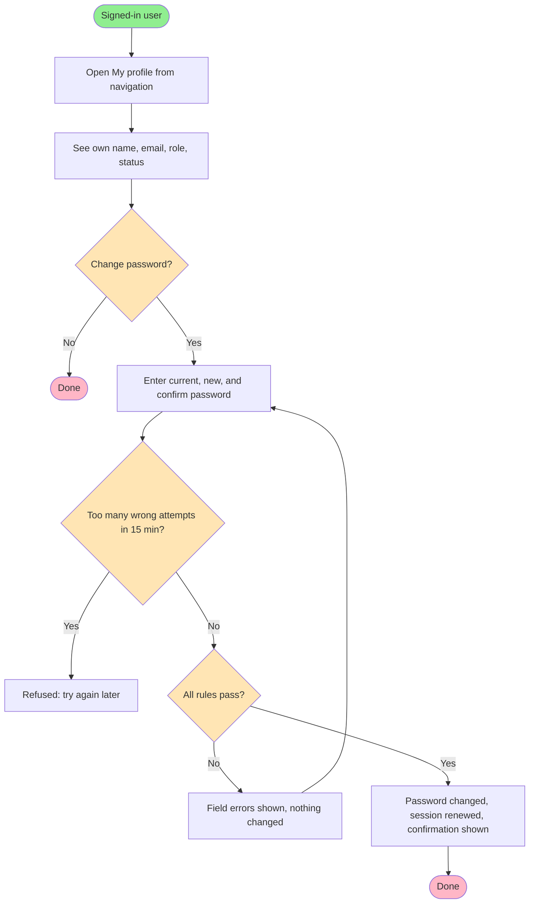

# Feature Specification: User Profile Page

**Feature Branch**: `002-user-profile-page` (spec only — no branch created; work continues on the current branch)
**Created**: 2026-10-03
**Status**: Draft
**Input**: User description: "buatkan halaman profil berdasarkan temuan yang telah dicatat di @docs/brd/modules/auth.md"

**Source finding**: [`docs/brd/modules/auth.md`](../../docs/brd/modules/auth.md) — AUTH-CAP-006 "Melihat profil
sendiri — BELUM ADA". The project brief §1.2 grants **every** role (Admin, Sales, Warehouse Staff) the
activity "Login, logout, profil sendiri"; the application currently shows only the signed-in user's name
and role in the navigation and has no profile screen. Confirmed as a gap to be built (BRD Q1, 2026-10-03).

## User Scenarios & Testing *(mandatory)*

### User Story 1 - View my own profile (Priority: P1)

Any signed-in user — Admin, Sales, or Warehouse Staff — opens "My profile" from the navigation and sees
their own account details: name, email, role, and account status. They can always reach it, whatever
their role, and they only ever see their own account.

**Why this priority**: This is the exact gap the brief requires ("profil sendiri" for all three roles).
On its own it closes the requirement and gives every user a place to confirm which account and role
they are using — important in a system whose permissions differ sharply by role.

**Independent Test**: Sign in as each of the three demo roles, open My profile, and confirm the page
shows that user's own name, email, and role, and nothing belonging to another account.

**Acceptance Scenarios**:

1. **Given** a signed-in Sales user, **When** they open My profile, **Then** they see their own name,
   email, role "Sales", and status "Active".
2. **Given** a signed-in Warehouse Staff user, **When** they open My profile from the navigation,
   **Then** the page opens without any "not allowed" response (all roles may view their own profile).
3. **Given** a signed-in user, **When** they try to view another user's profile by any means (for
   example by changing an identifier in the address), **Then** they still see only their own profile;
   no other account's data is ever shown.
4. **Given** a visitor who is not signed in, **When** they open the profile address, **Then** they are
   sent to the sign-in page.

---

### User Story 2 - Change my own password (Priority: P2)

A signed-in user changes their own password from the profile page by entering their current password,
a new password, and the new password again. They do not need an Admin to do it for them.

**Why this priority**: Today only an Admin can set a user's password, so a Sales or Warehouse user who
wants to change a password handed to them must ask an Admin. Self-service password change is the most
useful action a profile page offers, and it reduces how long an Admin-chosen password stays in use.
It builds on Story 1 but is not required for Story 1 to deliver value.

**Independent Test**: As a Sales user, change the password from the profile page, sign out, then
confirm the new password signs in and the old one no longer does.

**Acceptance Scenarios**:

1. **Given** a signed-in user on My profile, **When** they enter their correct current password and a
   valid new password twice, **Then** the password is changed, they stay signed in, and they see a
   confirmation message.
2. **Given** the password was just changed, **When** the user signs out and signs in again, **Then** the
   new password works and the old password is rejected.
3. **Given** a signed-in user, **When** the current password they enter is wrong, **Then** nothing is
   changed and they see a message that the current password is incorrect.
4. **Given** a signed-in user, **When** the new password and its confirmation differ, or the new
   password is shorter than 8 characters, **Then** nothing is changed and the problem is shown next to
   the field.
5. **Given** a signed-in user, **When** the new password is identical to the current one, **Then**
   nothing is changed and they are asked to choose a different password.

---

### Edge Cases

- A user is deactivated by an Admin while signed in: on their next request — to the profile or to any
  other page — their session ends and they are sent to sign in, which then fails because the account is
  inactive. *(Before this feature the application did not re-check this at all; see FR-012.)*
- An Admin changes a signed-in user's role: on that user's next request their session ends and they
  must sign in again, so they never keep the permissions of their old role.
- An Admin changes this user's password while the user has the profile page open: the user's later
  attempt to change their password with the old current password is rejected as incorrect.
- Repeated wrong "current password" entries: after 5 failures within 15 minutes the password-change
  action is temporarily refused, the same limit used for sign-in, so the form cannot be used to guess
  a password from an unattended signed-in session.
- The form is submitted from another site (cross-site request): it is refused and nothing changes.
- The new password contains leading or trailing spaces: they are removed before the password is
  checked or stored, exactly as at sign-in and when an Admin sets a password, so the password a
  user sets is always the one that signs them in.
- The user's name is very long or contains special characters: it is displayed safely and in full,
  wrapping on a narrow screen.

## Requirements *(mandatory)*

### Functional Requirements

- **FR-001**: System MUST provide every signed-in user, in all three roles, with a "My profile" page
  reachable from the main navigation on every page.
- **FR-002**: The profile page MUST show the signed-in user's own name, email, role, and account status,
  and MUST NOT show any other account's data under any circumstance.
- **FR-003**: The profile page MUST be identified by the signed-in session, not by an identifier the
  user can supply, so that no user can view or change another user's profile through it.
- **FR-004**: Visitors who are not signed in MUST be redirected to the sign-in page when requesting the
  profile page or submitting its forms.
- **FR-005**: Signed-in users MUST be able to change their own password by providing their current
  password, a new password, and a confirmation of the new password.
- **FR-006**: System MUST reject a password change, changing nothing, when the current password is
  wrong; when the new password and confirmation do not match; when the new password is shorter than 8
  characters; or when the new password equals the current password. Each rejection MUST show a specific
  message next to the relevant field, and fields other than password fields MUST keep their entered
  values.
- **FR-007**: After a successful password change, System MUST keep the user signed in, renew their
  session identifier, and show a confirmation message.
- **FR-008**: System MUST limit wrong current-password attempts on the password-change form to 5
  failures per account and client address within 15 minutes — the same counter and limit used for
  sign-in, so wrong guesses on either form count together; beyond that, the action is refused with a
  message to try again later. *(Refined during planning, 2026-10-03: keyed like sign-in so that a
  stranger guessing from another address cannot lock the owner out of their own profile.)*
- **FR-009**: Password-change submissions MUST be protected against cross-site request forgery.
- **FR-010**: An Admin's existing ability to set another user's password (user management) MUST remain
  unchanged.
- **FR-012**: On every request that requires a signed-in user, System MUST confirm that the account
  still exists, is still active, and still has the role recorded at sign-in. If any of these no longer
  holds, System MUST end the session and treat the request as not signed in (redirect to sign-in;
  JSON endpoints answer "unauthenticated"). This applies application-wide, not only to the profile.
  *(Added during planning, 2026-10-03: the gap was found while verifying the edge cases; fixing it
  app-wide was chosen by the product owner.)*
- **FR-011**: The profile MUST be read-only apart from the password: users MUST NOT be able to
  change their own name, email, role, or account status through it. Those remain managed by an
  Admin in user management (USR-01). *(Decided 2026-10-03.)*

### Non-Functional Requirements

- **NFR-001**: Passwords MUST continue to be stored irreversibly hashed; the current and new passwords
  MUST never be displayed, logged, or echoed back into the form after submission.
- **NFR-002**: The profile page MUST be usable on a 360px-wide screen and on desktop, with labelled
  fields, visible keyboard focus, and text contrast meeting WCAG AA, consistent with the rest of the
  application.
- **NFR-003**: All user-facing text on the page MUST be in English, consistent with the application UI.
- **NFR-004**: Rejection messages for a wrong current password MUST NOT reveal anything beyond "the
  current password is incorrect".

### Key Entities *(include if feature involves data)*

- **User (existing)**: The signed-in account. No new entity and no new attributes are introduced.
  - Key attributes shown: name, email, role, active status
  - Changed by this feature: password (only by its owner, through FR-005)
  - State lifecycle: unchanged (active / inactive, controlled by an Admin)
  - Relationships: unchanged
- **Password-change attempt**: A record of a failed current-password check, used only to enforce the
  limit in FR-008. Same nature as the existing sign-in attempt record.

## Success Criteria *(mandatory)*

### Measurable Outcomes

- **SC-001**: 100% of signed-in users in each of the three roles can open their own profile in at most
  one click from any page.
- **SC-002**: In testing, 0 requests, whether manipulated addresses or submissions, can display or change
  another user's account data through the profile feature.
- **SC-003**: A user can change their own password in under 1 minute without Admin involvement.
- **SC-004**: After a password change, sign-in with the old password fails 100% of the time and with the
  new password succeeds 100% of the time.
- **SC-005**: Every rejected password change leaves the stored password unchanged (verified for each
  rejection rule in FR-006 and FR-008).
- **SC-006**: The profile page passes the same 360px, keyboard-only, and contrast checks the rest of the
  application passes, with no new failures.
- **SC-007**: In testing, a user who is deactivated or whose role is changed while signed in is refused
  on 100% of subsequent requests, on any page or JSON endpoint.

## UI/UX & Screens *(mandatory when the feature has a user interface)*

### Design Reference

- **Design source**: none — follow the application's existing design system (tokens, cards, form
  layout, status badges, flash messages).
- **Look & feel / brand**: same as the existing app: light theme, single accent colour, card-based
  layout, compact density.
- **Existing UI to match**: the user form (`Users → Edit`) for the password fields and validation
  messages; the product/order detail pages for the read-only summary layout; the sidebar navigation
  and its user block for the entry point.

### Screen Inventory

| Screen | Purpose | Serves story | Key data shown | Primary actions |
| ------ | ------- | ------------ | -------------- | --------------- |
| My profile | See own account and change own password | US1, US2 | Name, email, role badge, status badge | Change password |

### Per-Screen Key States

- **My profile**: loading = not applicable (the page opens complete, with no partial or skeleton state); populated = summary card with
  name, email, role badge, status badge, followed by a "Change password" card with three password
  fields and a submit button; error = field-level messages beside the failing field plus a summary
  alert, with the password fields cleared; success = confirmation message at the top of the page;
  rate-limited = alert explaining that too many incorrect attempts were made and when to try again;
  empty = not applicable (a signed-in user always has a profile).

### Primary Interactions & Flows

- The user's name and role block in the navigation becomes a link to My profile, and a "My profile"
  entry is also available in the navigation for all roles.
- Submitting the password form returns to the same page with either the success message or the
  field errors; the user is never signed out by a successful change.
- No confirmation dialog is needed before changing a password: the current password already confirms
  intent.

## Business Process Flow *(visual aid)*

### Primary User Journey Flow

## Business Actors & Interactions

| Actor | Role | Key Interactions |
| ----- | ---- | ---------------- |
| Admin | Account owner (for own profile) | Views own profile; changes own password. Still manages other users' accounts and passwords through user management |
| Sales | Account owner | Views own profile; changes own password |
| Warehouse Staff | Account owner | Views own profile; changes own password |
| System | Guard and validator | Identifies the profile from the session, enforces password rules and the attempt limit, renews the session after a change |

## Assumptions

All assumptions below were confirmed by the product owner on 2026-10-03.

- **A-001**: The profile is identified by the session only; there is no profile page for other users
  (Admins view other users through user management).
- **A-002**: The minimum password length is 8 characters, the same rule user management already
  applies; no additional complexity rules (digits, symbols) are introduced.
- **A-003**: The wrong-current-password limit reuses the sign-in limit values (5 failures / 15 minutes)
  so that the two security controls stay consistent.
- **A-004**: A successful password change does not sign out other devices; the application keeps one
  server-side session per browser and has no "sign out everywhere" capability (out of scope).
- **A-005**: No email or notification is sent on password change (no mail infrastructure exists; the
  brief lists simulated email only as a bonus).
- **A-006**: Account status is shown but cannot be changed by its owner; only an Admin activates or
  deactivates accounts. Because FR-012 ends the session of an inactive account, the profile will in
  practice always show "Active". It is still shown deliberately: status is one of the user attributes
  listed in the brief (§1.3), and showing it keeps the profile a complete view of the account.

## Out of Scope

- Password reset via email / "forgot password" (no public self-service flow exists in the system).
- Profile photo / avatar, preferences, language, or notification settings.
- Viewing or editing other users' profiles from this page.
- Editing one's own name, email, role, or status (decided 2026-10-03; see FR-011).
- Signing out other sessions or devices.
