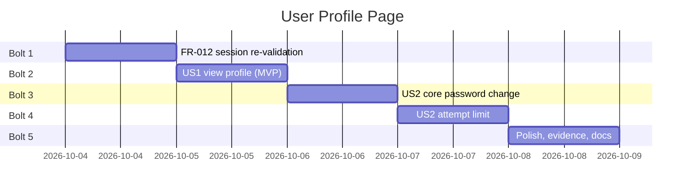

# Tasks: User Profile Page

**Input**: Design documents from `specs/002-user-profile-page/`
**Prerequisites**: plan.md, spec.md, research.md, data-model.md, contracts/http-routes.md, quickstart.md

**Tests**: Included. The spec does not request them explicitly, but constitution Principle III
(NON-NEGOTIABLE) requires a unit test for every public Service method that runs a business rule.
Integration tests cover what unit tests cannot: real MySQL, the shared attempt counter, and session
behaviour. Test tasks come **before** their implementation and must fail first.

**Organization**: Grouped by user story. Every phase is a **Bolt** that ends at a checkpoint: stop,
run the checks, and commit before starting the next.

**Conventions for every task** (from CLAUDE.md and the constitution):
- `declare(strict_types=1);` at the top of every PHP file; every parameter, return, and property
  typed.
- Comments and docs in Indonesian; UI text in English; identifiers in English.
- Services never read `$_SESSION`/superglobals; the acting user and IP are passed in.
- Output escaped with `View::e()`; password values are never echoed back.
- **No new table, column, or migration** (plan constraint; research R-001).

## Format: `[ID] [P?] [Story] [FR-###?] Description`

- **[P]**: can run in parallel (different files, no dependency on an incomplete task)
- **[Story]**: US1, US2 (spec.md)
- **[FR-###]**: requirement(s) satisfied; every FR-001 … FR-012 appears at least once

---

## Phase 1: Setup

**Purpose**: confirm a green baseline. No new dependency, folder, or tooling is needed.

- [X] T001 Run `docker compose exec app composer check` and record the baseline unit/integration counts (expected 374 / 138, all passing) before any change; stop if it is not green

**Checkpoint**: baseline green.

---

## Phase 2: Foundational — session re-validation on every request (FR-012) · Bolt 1

**Purpose**: close the application-wide gap found in planning (research R-008): a deactivated or
re-roled user must lose access on the next request. It blocks the user stories because the
profile's own edge case ("deactivated while signed in") depends on it, and it changes the request
pipeline every route uses.

**Independent test**: sign in as Sales in one browser; as Admin deactivate that user (or change
their role); the Sales browser's next request lands on `/login`, and `/api/*` answers 401 JSON.

- [X] T002 [P] [FR-012] Write failing unit tests for `AuthService::activeSessionUser(int $userId, Role $sessionRole): ?User` in `tests/Unit/Service/AuthServiceTest.php` (use `InMemoryUserRepository` and `InMemoryLoginAttemptRepository`): returns the user when it exists, is active, and its role equals `$sessionRole`; returns `null` for an unknown id, for an inactive user, and for a role that differs from the session role
- [X] T003 [FR-012] Implement `AuthService::activeSessionUser()` in `app/Service/AuthService.php`: `findById($userId)` and return it only if `canSignIn()` and `$user->role === $sessionRole`, else `null`; Indonesian docblock citing FR-012 / research R-008. Make T002 pass
- [X] T004 [FR-012] Wire the re-check in `public/index.php` right after `$authorization->authorizeRoute($route['roles'])`: only when `$route['roles'] !== null` (non-public route), first, if `$session->userId()` or `$session->role()` is `null`, treat it like a failed check (`$session->logout()` then `throw new UnauthenticatedException()`) without calling the Service, so the call site passes a non-null `int` and `Role` (PHPStan level 6); otherwise get `$authService = $container['authService']` and call `activeSessionUser((int) $session->userId(), $session->role())`; on `null`, call `$session->logout()` and `throw new UnauthenticatedException()` (the existing handler already redirects HTML to `/login` and answers `/api/*` with 401 JSON). Add an Indonesian comment explaining why the check is in the front controller and not in `Authorization`
- [X] T005 [FR-012] Add integration tests in `tests/Integration/SessionRevalidationTest.php` (extends `IntegrationTestCase`, uses `SalesOrderFixtures` for users): with `MysqlUserRepository`, `activeSessionUser` returns the user; after `setActive($id, false)` it returns `null`; after saving the user with a different role it returns `null`; for a non-existent id it returns `null`
- [X] T006 [FR-012] Verify over HTTP against the running stack (document the commands in the PR/commit message): sign in as `sales1@ioms.test` with curl, deactivate that user as Admin through `POST /users/{id}/toggle-active`, then confirm the Sales cookie's next `GET /dashboard` returns 302 → `/login` and `GET /api/dashboard/low-stock` (as a WS) or `/api/products/SKU-000001/availability` returns 401 JSON; re-activate the user afterwards

**Checkpoint**: `composer check` green; FR-012 verified over HTTP. Commit.

---

## Phase 3: User Story 1 — View my own profile (Priority: P1) 🎯 MVP · Bolt 2

**Goal**: every signed-in role opens "My profile" and sees only their own name, email, role, and
status.

**Independent test**: sign in as each demo role, open My profile from the sidebar, and see your own
details; `/profile?id=1` as Sales still shows the Sales user; signed out → `/login`.

### Tests for User Story 1

- [X] T007 [P] [US1] [FR-001] [FR-003] [FR-004] Write failing integration tests in `tests/Integration/ProfileFlowTest.php` (pattern: `ApprovalAuthorizationTest` — `Router` built from `config/routes.php`, `Session('IOMS_TEST_SESSION', false)`, `$_SESSION` set via a `signInAs()` helper, `$_GET`/`$_POST` reset in `tearDown`): (a) `GET /profile` is in the route table with roles Admin, Sales, WarehouseStaff; (b) `Authorization::authorizeRoute` for it throws `UnauthenticatedException` with no session; (c) `ProfileController::show()` signed in as the fixture Sales user, with `$_GET['id']` set to the Admin's id, returns 200 and a body containing the Sales email and **not** the Admin email (FR-003)

### Implementation for User Story 1

- [X] T008 [US1] [FR-001] [FR-004] Register `$router->add('GET', '/profile', 'ProfileController', 'show', $all);` in `config/routes.php` under a new "Profile" section with an Indonesian comment (all roles; ownership from session)
- [X] T009 [US1] [FR-002] [FR-003] [FR-011] Create `app/Controller/ProfileController.php` (`final class`, constructor: `View $view, UserService $users, AuthService $auth, Session $session, Csrf $csrf`, mirroring `UserController`): `show(Request $request): Response` loads `$this->users->requireUser($this->currentUserId())`, where `currentUserId()` reads only `Session::userId()` (throws `UnauthenticatedException` when null), and renders `profile/show` with `title` "My profile", `activeNav` "profile", `user`, `errors` `[]`, `rateLimited` `false`, `csrf` `$this->csrf` (same pattern as `UserController::renderForm`, which passes `csrf` to the view). It **never** reads an id from the request
- [X] T010 [P] [US1] Register `'ProfileController' => static fn (): ProfileController => new ProfileController($view, $userService, $authService, $session, $csrf)` in the `controllers` map in `config/container.php` (add the `use` statement)
- [X] T011 [P] [US1] [FR-002] [FR-011] Create `views/profile/show.php`: `page-header` with title "My profile" and subtitle "Your account details."; a summary `card` listing Name, Email, Role (badge using the role label), and Status (Active/Inactive badge) as read-only text — **no editable inputs** for these fields; every value through `View::e()`; long names wrap. Follow `views/products/detail.php` for the read-only layout
- [X] T012 [US1] [FR-001] Update `views/layout/_nav.php`: add `['key' => 'profile', 'href' => '/profile', 'icon' => 'users', 'label' => 'My profile']` to the items for **all three roles** (last item), and turn the `.nav-user-name` name and role block into a link to `/profile` (keep the same text and escaping; visible focus ring)

**Checkpoint**: T007 passes; `composer check` green; each demo role sees their own profile at
desktop and 360px. Commit — this is the MVP that closes AUTH-CAP-006.

---

## Phase 4: User Story 2 — Change my own password (Priority: P2)

**Goal**: a signed-in user changes their own password with current, new, and confirmation, without
an Admin.

**Independent test**: as Sales, change the password on the profile; sign out; the old password is
refused and the new one works (quickstart §2–§4).

### US2 · Bolt 3: core change (rules, success, session renewal)

#### Tests for Bolt 3

- [X] T013 [P] [US2] [FR-005] [FR-006] Write failing unit tests in `tests/Unit/Service/AuthServiceTest.php` for `changeOwnPassword(User $actor, string $currentPassword, string $newPassword, string $confirmation, string $ipAddress): void`: success stores a hash that `password_verify`s the new password; wrong current password → `ValidationException` with key `current_password` and message "Your current password is incorrect."; new password shorter than 8 → key `new_password`; confirmation differs → key `new_password_confirmation`; new equals current → key `new_password` with "Choose a password different from your current one."; the Service stores exactly the value it receives (trimming happens once, in `Request::input()`, as for sign-in). On every rejection, the stored hash is unchanged

#### Implementation for Bolt 3

- [X] T014 [US2] [FR-006] Boy Scout refactor (research R-003): add `public const int MIN_PASSWORD_LENGTH = 8;` to `app/Entity/User.php` and replace `UserService::MIN_PASSWORD_LENGTH` (private) with `User::MIN_PASSWORD_LENGTH` in `app/Service/UserService.php`; `tests/Unit/Service/UserServiceTest.php` must pass **unchanged**
- [X] T015 [US2] [FR-005] [FR-006] Implement `AuthService::changeOwnPassword()` in `app/Service/AuthService.php` with the order from research R-004 (steps 2–5 now; the attempt limit, step 1, is added in T020): `Validator` rules for required fields, length ≥ `User::MIN_PASSWORD_LENGTH`, and confirmation match → one `ValidationException`; then `password_verify($current, $actor->passwordHash)`; then the reuse check; then `$this->users->updatePasswordHash((int) $actor->id, password_hash($new, PASSWORD_DEFAULT))`. Make T013 pass
- [X] T016 [P] [US2] [FR-007] Add `public function regenerate(): void` to `app/Support/Session.php` calling `session_regenerate_id(true)`, with an Indonesian docblock (renew the session id after a sensitive change, FR-007)
- [X] T017 [US2] [FR-005] [FR-007] [FR-009] Register `$router->add('POST', '/profile/password', 'ProfileController', 'changePassword', $all);` in `config/routes.php` and add `ProfileController::changePassword(Request $request): Response` in `app/Controller/ProfileController.php`: load the actor from the session (as in `show`), call `$this->auth->changeOwnPassword($actor, $request->input('current_password'), $request->input('new_password'), $request->input('new_password_confirmation'), $request->ipAddress())`; on success → `$this->session->regenerate()`, flash success "Your password has been changed.", redirect `/profile`; on `ValidationException` → re-render `profile/show` with `$e->errors()` and HTTP 422. CSRF is enforced by the existing front-controller check (FR-009) — add a comment, no duplicate check
- [X] T018 [US2] [FR-005] [FR-006] Add the "Change password" card to `views/profile/show.php`, mirroring the password fields of `views/users/form.php`: three `type="password"` inputs `current_password`, `new_password`, `new_password_confirmation` with `field-label field-required` labels "Current password", "New password", "Confirm new password", `autocomplete="current-password"` / `"new-password"`, hint "At least 8 characters.", `field-error` per field, a summary `alert--error` when `errors` is not empty, the CSRF field, and a primary "Change password" button. Inputs **never** get a `value` attribute (NFR-001)
- [X] T019 [US2] [FR-005] [FR-006] Extend `tests/Integration/ProfileFlowTest.php`: through `AuthService` with `MysqlUserRepository` and `MysqlLoginAttemptRepository`, a successful change makes `attempt(email, old)` return `null` and `attempt(email, new)` return the user (SC-004); a rejected change leaves the stored hash byte-identical (SC-005); `POST /profile/password` is in the route table with roles Admin, Sales, WarehouseStaff; and a `POST /profile/password` whose body also carries `id`/`user_id` of another user changes **only** the signed-in user's hash — the other user's stored hash stays byte-identical (SC-002)

**Checkpoint (Bolt 3)**: unit and integration tests pass; quickstart §2 and §3 behave as written.
Commit.

### US2 · Bolt 4: attempt limit and rate-limited state (FR-008)

#### Tests for Bolt 4

- [X] T020 [P] [US2] [FR-008] Write failing unit tests in `tests/Unit/Service/AuthServiceTest.php`: with 5 recorded failures for `(email, ip)`, `changeOwnPassword` throws `RateLimitException` **even with the correct current password** and does not change the hash; a wrong current password records exactly one failure; format errors (too short, mismatch, missing) record **no** failure; a successful change clears the failures for `(email, ip)`

#### Implementation for Bolt 4

- [X] T021 [US2] [FR-008] Add step 1 of research R-004 to `AuthService::changeOwnPassword()` in `app/Service/AuthService.php`: call the existing private `isLockedOut($actor->email, $ipAddress)` first and throw `RateLimitException`; record `$this->attempts->record($actor->email, $ipAddress, false)` only when the current password is wrong; call `clearFailures` on success. Same counter and limit as `attempt()` (research R-001). Make T020 pass
- [X] T022 [US2] [FR-008] In `ProfileController::changePassword()` (`app/Controller/ProfileController.php`), catch `RateLimitException` and re-render `profile/show` with `rateLimited => true` and HTTP 429; in `views/profile/show.php` show `alert--error` "Too many incorrect attempts. Try again later." above the form when `rateLimited` is true (the form stays visible)
- [X] T023 [US2] [FR-008] Extend `tests/Integration/ProfileFlowTest.php`: after 5 wrong current-password submissions through `changeOwnPassword` (real `MysqlLoginAttemptRepository`, same IP), `AuthService::attempt()` for that email and IP throws `RateLimitException` (shared counter with sign-in), and vice versa

**Checkpoint (Bolt 4)**: all tests pass; quickstart §4 behaves as written. Commit.

---

## Phase 5: Polish & Cross-Cutting Concerns · Bolt 5

- [X] T024 [FR-010] Regression check for the Admin flow: `tests/Unit/Service/UserServiceTest.php` and `tests/Integration/UserAccessTest.php` pass unchanged, and `POST /users/{id}/password` (Admin step-up) still works over HTTP for another user
- [X] T025 [P] Merge both routes into `specs/001-inventory-order-management/contracts/http-routes.md` (roles A S W, session-derived ownership, CSRF, 422/429/403 behaviour) and note the FR-012 front-controller re-check in its access-control preamble
- [X] T026 [P] Update `docs/architecture/class-diagram-as-built.md`: add `ProfileController` (→ `AuthService`, `UserService`, `View`, `Session`, `Csrf`) to the controller diagram and `changeOwnPassword` / `activeSessionUser` to `AuthService` (with `..> UserRepositoryInterface`, `..> LoginAttemptRepositoryInterface`); render-check the Mermaid blocks
- [X] T027 [P] Add refactor-log entry R-7 (shared password policy moved to `User::MIN_PASSWORD_LENGTH`; smell: Duplicate Code risk / misplaced domain rule; technique: Move Field; before and after snippets) in `docs/quality/refactor-log.md`
- [X] T028 [P] Update `docs/testing/use-case-coverage.md` (AuthService 4/4 with the two new methods) and `docs/testing/test-results.md` (new unit and integration counts from `composer check`)
- [X] T029 [P] Update `README.md`: "Fitur" table (Authentication row: own profile and self-service password change; session re-validated on every request) and the Role table (all roles: My profile)
- [X] T030 [P] Update the BRD: `docs/brd/modules/auth.md` (AUTH-CAP-006 implemented with route and entry file, screen row for `/profile`, test coverage, change-log entry) and `docs/brd/00-overview.md` (remove the "profil sendiri" gap; change-log entry)
- [X] T031 Retake the UI-01 evidence (NFR-002, SC-006), since every sidebar gains "My profile": re-run the screenshot script into `docs/testing/screenshots/` adding `/profile` at desktop and 360px, then re-run the contrast and keyboard audit including `/profile` (NFR-002, SC-006); update `docs/testing/responsive-accessibility.md` and `docs/testing/screenshots/run.json` / `docs/testing/a11y-audit.json`
- [X] T032 Final gate: `docs/quality/phpstan-report.txt` and `docs/quality/phpcs-report.txt` regenerated from `composer check` (zero errors and warnings), and the full `quickstart.md` walked through on the running stack, including restoring any changed demo password; also confirm NFR-001 "never logged": after the quickstart, `docker compose logs app` and the Apache logs contain no submitted password value, and no `error_log`/flash call in `ProfileController` or `AuthService` includes a password variable

**Checkpoint**: everything green and documented. Commit.

---

## Requirement Coverage

| Requirement | Tasks |
| --- | --- |
| FR-001 profile reachable for all roles | T007, T008, T012 |
| FR-002 shows own name, email, role, status only | T009, T011 |
| FR-003 identified by session, never by request | T007, T009 |
| FR-004 unauthenticated → sign-in | T007, T008 |
| FR-005 change own password with current password | T013, T015, T017, T018, T019 |
| FR-006 rejection rules + field messages | T013, T014, T015, T018, T019 |
| FR-007 stay signed in, renew session id, confirm | T016, T017 |
| FR-008 attempt limit (shared with sign-in) | T020, T021, T022, T023 |
| FR-009 CSRF on submission | T017 |
| FR-010 Admin flow unchanged | T024 |
| FR-011 read-only apart from password | T009, T011 |
| FR-012 re-validate session user on every request | T002, T003, T004, T005, T006 |
| NFR-001 passwords never echoed or logged | T018 |
| NFR-002 360px / keyboard / WCAG AA | T031 |
| NFR-003 English UI | T011, T018, T022 |
| NFR-004 uniform wrong-password message | T013, T015 |
| SC-004 / SC-005 | T019 |
| SC-007 | T005, T006 |

---

## Dependencies & Execution Order

### Phase Dependencies

- **Phase 1 (Setup)** → **Phase 2 (FR-012)** → **Phase 3 (US1, MVP)** → **Phase 4 (US2: Bolt 3 → Bolt 4)** → **Phase 5 (Polish)**
- US2 depends on US1 for the controller, route group, and view it extends (T009, T011).
- Bolt 4 depends on Bolt 3 (it extends `changeOwnPassword` and the same view and controller).

### Within each Bolt

- Tests first (they must fail), then implementation, then the checkpoint.
- Same-file tasks are sequential: `AuthService.php` (T003 → T015 → T021), `ProfileController.php`
  (T009 → T017 → T022), `views/profile/show.php` (T011 → T018 → T022), `config/routes.php`
  (T008 → T017), `AuthServiceTest.php` (T002 → T013 → T020), `ProfileFlowTest.php`
  (T007 → T019 → T023).

### Parallel Opportunities

- Phase 2: T002 can be written while reading the front controller for T004.
- Phase 3: T010 (container) and T011 (view) in parallel once T009's constructor is fixed.
- Bolt 3: T013 (tests), T014 (refactor), and T016 (`Session`) touch different files.
- Phase 5: T025–T030 are all independent documentation files.

## Parallel Example: Phase 5

```text
T025 contracts/http-routes.md   T026 class-diagram-as-built.md   T027 refactor-log.md
T028 testing docs               T029 README.md                    T030 docs/brd/*
```

## Implementation Strategy

### MVP first

Phases 1–3 deliver the brief's missing requirement ("profil sendiri" for all roles) together with
the FR-012 security fix. Stop at the Phase 3 checkpoint and demo it.

### Incremental delivery (one Bolt at a time)

1. Bolt 1 (FR-012) → commit `fix: re-validate the session user on every request`
2. Bolt 2 (US1) → commit `feat: add My profile page for all roles`
3. Bolt 3 (US2 core) → commit `refactor: move password length rule to User` (T014 alone), then `feat: let users change their own password`
4. Bolt 4 (US2 limit) → commit `feat: share the sign-in attempt limit with password change`
5. Bolt 5 → commit `docs: profile page evidence, diagrams and BRD`

(Commit only when the user asks; these are suggested messages.)

## Task Dependencies & Timeline

### Dependency Graph

```mermaid
graph LR
    T001["T001 baseline"] --> T002["T002 tests FR-012"]
    T002 --> T003["T003 activeSessionUser"]
    T003 --> T004["T004 front controller"]
    T004 --> T005["T005 integration"]
    T005 --> T006["T006 HTTP verify"]
    T006 --> T007["T007 US1 tests"]
    T007 --> T008["T008 route"]
    T008 --> T009["T009 controller show"]
    T009 --> T010["T010 container"]
    T009 --> T011["T011 view summary"]
    T009 --> T012["T012 nav"]
    T011 --> T013["T013 US2 tests"]
    T013 --> T014["T014 refactor"]
    T014 --> T015["T015 changeOwnPassword"]
    T015 --> T017["T017 POST route+action"]
    T016["T016 Session::regenerate"] --> T017
    T017 --> T018["T018 password card"]
    T018 --> T019["T019 integration"]
    T019 --> T020["T020 limit tests"]
    T020 --> T021["T021 limit impl"]
    T021 --> T022["T022 429 state"]
    T022 --> T023["T023 shared counter"]
    T023 --> T024["T024 regression"]
    T024 --> T031["T031 screenshots+a11y"]
    T031 --> T032["T032 final gate"]

    style T001 fill:#90EE90
    style T004 fill:#FFD700
    style T009 fill:#DDA0DD
    style T015 fill:#DDA0DD
    style T021 fill:#DDA0DD
    style T032 fill:#FFB6C6
```



### Gantt Timeline



### Critical Path

T001 → T004 (front-controller change, the riskiest: it touches every authenticated request) →
T009 → T015 → T021 → T031 → T032. The documentation tasks T025–T030 sit off the critical path.

## Notes

- FR-012 changes behaviour for **every** authenticated request. If T006 shows any regression
  (e.g. the demo accounts being signed out unexpectedly), stop and fix before Phase 3.
- Changing a demo password while testing changes shared demo data; restore it (quickstart §2.3)
  or run `composer db:reset`.
- Never add a migration in this feature. If an implementation step seems to need one, stop and
  revisit research R-001.
