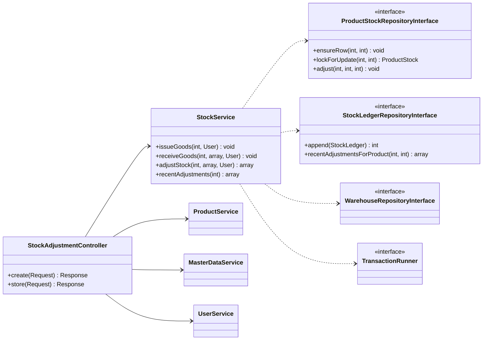
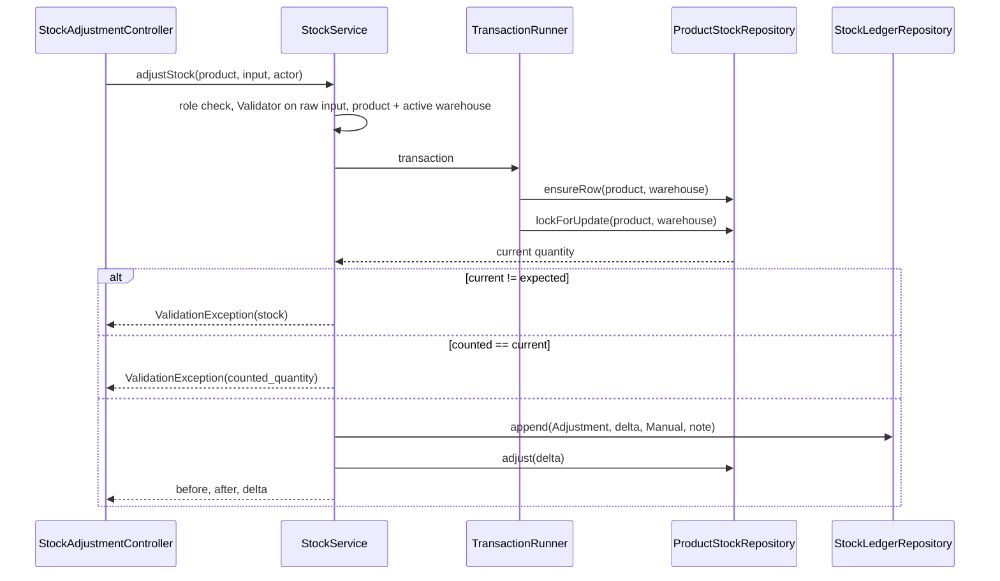

# Implementation Plan: Stock Adjustment (stock count correction)

**Branch**: `003-stock-adjustment` (spec folder only; work stays on the current branch) | **Date**: 2026-10-03 | **Spec**: [spec.md](./spec.md)
**Input**: Feature specification from `specs/003-stock-adjustment/spec.md`

## Summary

Admin and Warehouse Staff record a physical stock count for one product in one warehouse; the system
writes the difference as a `stock_ledger` row of type **Adjustment** (reference **Manual**, with a
required reason) and updates `product_stock` in the same transaction under the same row lock used by
goods issue and receipt. Product detail shows the 10 most recent adjustments, and the stock movement
CSV gains a `Reason` column. This closes BRD STOCK-CAP-005.

Technical approach:
- **One schema change** (owner-approved deviation): `stock_ledger.note VARCHAR(255) NULL` plus two
  CHECKs, in a new migration `004_ledger_note.sql` (research R-001). No new table.
- One business method on the existing `StockService` — still the only path that changes stock —
  `adjustStock()` (R-003, R-004), and one read method `recentAdjustments()` (R-006).
- Lock-safe for a pair never stocked: ensure the row exists, then `FOR UPDATE` (R-002).
- A thin `StockAdjustmentController`, one form view, two routes, a card and button on product detail.

## Technical Context

**Language/Version**: PHP 8.4 exactly, `declare(strict_types=1)` everywhere
**Primary Dependencies**: none at runtime (native PHP, PDO). Dev: PHPUnit 11.5, PHPStan 2.2 (level 6), PHP_CodeSniffer 3.13 (PSR-12)
**Storage**: MySQL 8.0 — `stock_ledger` gains column `note` and two CHECKs (`database/004_ledger_note.sql`); `product_stock` unchanged
**Testing**: PHPUnit unit suite (in-memory fakes) and integration suite (real MySQL, including a two-connection concurrency test); `composer check`
**Target Platform**: Linux container (Apache + PHP) behind Docker Compose; browsers at 360px and desktop
**Project Type**: single web application (server-rendered)
**Architecture Type**: standalone modular monolith, Controller → Service → RepositoryInterface → Mysql*Repository, dependency inversion at the repository boundary (CLAUDE.md, ADR-001)
**Integration Target**: N/A — plugs into `public/index.php`, `config/routes.php`, `config/container.php`
**Existing Design System**: in-house CSS tokens in `public/assets/css/tokens.css` (accent `#2563eb`, status `--*-text` tokens for AA text), components in `public/assets/css/app.css` (`page-header`, `stat-grid`/`stat`, `card`, `form-grid`, `field-label field-required`, `field-error`, `alert--*`, `badge--*`, `table-wrap`/`table`, `empty-state`, `btn`), Lucide sprite `public/assets/icons/lucide-sprite.svg`, vanilla JS progressive enhancement. No component library (forbidden by the brief)
**Performance Goals**: one adjustment = one short transaction on one row; the history card is one indexed query per product view (`ix_ledger_product_warehouse_date`)
**Constraints**: no framework/ORM/DI container; stock changes only in `StockService` with the ledger in one transaction; append-only ledger; English UI, Indonesian comments and docs (`specs/` in English); acting user passed as an argument
**Scale/Scope**: 1 new screen + 1 extended screen, 2 routes, 1 controller, 2 service methods, 2 repository methods, 1 migration

## UI/UX & Screens (carried from spec)

- **Design reference**: none — follow the existing design system; match product detail (summary tiles,
  "Stock by warehouse" card) and existing forms (labels, field errors, summary alert).
- **Screens**:
  - **Product detail** (`/products/{id}`, extended): header button **Adjust stock** and new card **Stock
    adjustments** below "Stock by warehouse" — both for Admin and Warehouse Staff only (A-009): table of up to 10 rows (date and
    time, warehouse, change as coloured `+n`/`−n`, resulting quantity, user, reason); empty state "No
    stock adjustments yet." with helper text; success flash at the top after a correction.
  - **Adjust stock** (`/products/{id}/adjust-stock`): page header "Adjust stock" with the product name
    and SKU; warehouse selector (GET, no JS) and the **system quantity** tile for that warehouse; form
    card with Counted quantity, Reason, hidden expected quantity, primary **Record adjustment**, Cancel.
    States: error (422) = summary alert + field errors, values kept; stale = alert with the new system
    quantity; zero difference = field error; loading/empty = not applicable.
  - **Reports**: unchanged UI; CSV gains `Reason`.
- **Primary interactions**: product → Adjust stock → submit → back to product with confirmation;
  Cancel returns without changes; no confirmation dialog.

## Constitution Check

*GATE: Must pass before Phase 0 research. Re-checked after Phase 1 design — still passing.*

| Principle | Gate | Status |
| --- | --- | --- |
| I. Layered boundaries | Rules in `StockService`; controller does HTTP only; Service gets the acting user as an argument; repositories via interfaces (`ProductStockRepositoryInterface`, `StockLedgerRepositoryInterface`, `WarehouseRepositoryInterface`, `ProductRepositoryInterface`) | ✅ |
| II. Strict mode and typing | New files `strict_types`; typed params/returns/properties; array shapes documented; PHPStan 6 and PHPCS stay at zero | ✅ (verified by `composer check`) |
| III. Every use case has a unit test | `adjustStock` (each rule: role, validation, warehouse, product, stale, zero, +/−, never-stocked pair, ledger row content) and `recentAdjustments` get unit tests with in-memory fakes | ✅ planned |
| IV. Transactions and concurrency | One transaction; ensure-row then `SELECT … FOR UPDATE` on the single `product_stock` row; ledger and stock written together; stale check under lock; two-connection integration test; ADR-002 gains an addendum | ✅ |
| V. Server-side authorization | Route roles A + W; Sales → 403 at the guard **and** refused in `StockService`; CSRF; reason escaped; no stack traces | ✅ |
| VI. Design evidence | As-built class diagram, ERD (`note` column), ADR-002 addendum, refactor-log entry for `ensureRow()` extraction, tech-debt/BRD updated in the same change | ✅ planned (follow-ups) |
| VII. Docker-first | Migration applied automatically by the entrypoint; no new service or env var | ✅ |
| C-003 no over-engineering | No new service, table, JS module, or exception class; reuses Validator, form patterns, CSV neutralisation | ✅ |

## Project Structure

### Documentation (this feature)

```text
specs/003-stock-adjustment/
├── spec.md
├── plan.md              # this file
├── research.md          # R-001 … R-010
├── data-model.md        # D-1 (note column) + constraints
├── quickstart.md
├── contracts/
│   └── http-routes.md
├── checklists/
│   └── requirements.md
└── tasks.md             # /rudis.tasks
```

### Source Code (repository root)

```text
database/
└── 004_ledger_note.sql                       # NEW — note column + 2 CHECKs
app/
├── Controller/
│   ├── StockAdjustmentController.php         # NEW — create(), store()
│   └── ProductController.php                 # + StockService dep; recent adjustments + canAdjust
├── Service/
│   ├── StockService.php                      # + WarehouseRepositoryInterface dep; adjustStock(), recentAdjustments()
│   └── ReportService.php                     # + note field / Reason header
├── Entity/
│   ├── StockLedger.php                       # + ?string $note; adjustment() factory
│   └── Enum/MovementType.php                 # docblock: Adjustment now used
└── Repository/
    ├── ProductStockRepositoryInterface.php   # + ensureRow()
    ├── StockLedgerRepositoryInterface.php    # + recentAdjustmentsForProduct()
    └── Mysql/
        ├── MysqlProductStockRepository.php   # ensureRow(); adjust() reuses it
        └── MysqlStockLedgerRepository.php    # note in append/hydrate/movementsBetween; recentAdjustmentsForProduct()
config/
├── routes.php                                # + GET/POST /products/{id}/adjust-stock ($adminWarehouse)
└── container.php                             # StockService deps; StockAdjustmentController; ProductController deps
views/
├── stock-adjustments/
│   └── form.php                              # NEW
└── products/
    └── detail.php                            # + Adjust stock button, Stock adjustments card
tests/
├── Unit/
│   ├── Fake/InMemoryProductStockRepository.php   # + ensureRow()
│   ├── Fake/InMemoryStockLedgerRepository.php    # + note, recentAdjustmentsForProduct()
│   └── Service/StockServiceAdjustmentTest.php    # NEW
│   └── Service/ReportServiceTest.php             # Reason column
└── Integration/
    ├── StockAdjustmentFlowTest.php               # NEW — MySQL, CHECKs, history, CSV, route roles
    └── ConcurrentStockAdjustmentTest.php         # NEW — two connections: stale refusal, never-stocked pair
```

**Structure Decision**: single existing project; one new view folder `views/stock-adjustments/`. Naming
mirrors siblings (`PurchaseOrderController` → `StockAdjustmentController`, `views/purchase-orders/form.php`
→ `views/stock-adjustments/form.php`). The existing `tests/Integration/StockAdjustmentTest.php` covers the
repository's `adjust()` and keeps its name; the new tests use distinct names.

### Design sketch (for the as-built class diagram)



### Adjustment sequence



## Follow-ups required in the same change (constitution VI, docs consistency)

- `docs/architecture/class-diagram-as-built.md` — `StockAdjustmentController`, new `StockService`
  methods and dependency, new repository methods.
- `docs/architecture/adr-002-concurrency-control.md` — addendum: adjustments use the same row lock;
  ensure-row before lock for never-stocked pairs; stale check.
- `docs/planning/erd.md` and `specs/001-inventory-order-management/data-model.md` — `note` column and
  CHECKs, marked as the 003 deviation.
- `specs/001-inventory-order-management/contracts/http-routes.md` — the two routes and matrix row;
  `specs/001-…/spec.md` A-006 — note pointing to 003.
- `docs/quality/refactor-log.md` — R-8: `ensureRow()` extracted from `adjust()`.
- `docs/brd/modules/stock.md`, `docs/brd/00-overview.md` — STOCK-CAP-005 implemented.
- `README.md` — Stock row and roles; `docs/testing/*` — counts, coverage, screenshots for the adjust
  form and product detail (Admin/WS) at desktop and 360px; contrast and keyboard audit for the form.

## Complexity Tracking

No constitution violation to justify. Recorded for transparency:

| Addition | Why Needed | Simpler Alternative Rejected Because |
| --- | --- | --- |
| `stock_ledger.note` column (schema deviation from the brief) | Owner requires a traceable reason for every correction (spec A-002) | Separate table adds a join and a second write for one attribute |
| `StockService` 7th dependency (`WarehouseRepositoryInterface`) | "Warehouse must be active" is a business rule and belongs in the Service | Checking it in the controller moves a rule out of the tested layer |
| `ensureRow()` before locking | A never-stocked pair has no row to lock; concurrent first corrections would deadlock (R-002) | Retrying on deadlock hides the race instead of removing it |
