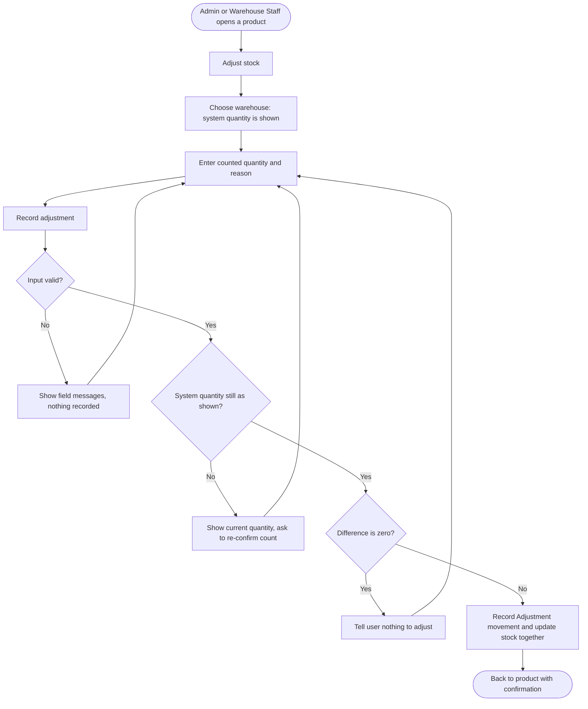
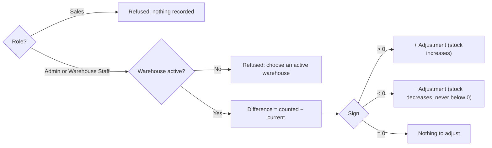

# Feature Specification: Stock Adjustment (stock count correction)

**Feature Branch**: `003-stock-adjustment` (spec only — no branch created; work continues on the current branch)
**Created**: 2026-10-03
**Status**: Draft
**Input**: User description: "Koreksi stok manual / stock opname (STOCK-CAP-005, docs/brd/modules/stock.md) memakai
movement type Adjustment dengan reference Manual. Keputusan user: (1) Admin dan Warehouse Staff boleh melakukan
koreksi, Sales tidak; (2) tambah satu kolom note nullable pada stock_ledger, wajib diisi untuk Adjustment (deviasi
kecil dari schema mirror, disetujui user); (3) user memasukkan quantity fisik hasil hitung per (product, warehouse),
sistem menghitung selisih dan menulis ledger +/−, selisih 0 ditolak; (4) wajib lewat StockService dalam satu
transaction dengan lock product_stock yang sama seperti goods issue/receipt, invariant SUM(ledger)=product_stock
tetap."

**Source finding**: [`docs/brd/modules/stock.md`](../../docs/brd/modules/stock.md) — STOCK-CAP-005 "Koreksi stock
manual / stock opname — TERTUNDA" (BRD Q2, 2026-10-03: a planned feature, not out of scope).

**Source model**: the project brief (kept outside the repository, not copied here) defines the stock movement
history with movement types **Receipt / Issue / Adjustment** and states that stock is *never* changed directly by
the UI — only through a service that records a movement and updates the stock quantity in one transaction
(§1.3). The digest already in the repository is the reference:
[`../001-inventory-order-management/inputs/project-brief-resource-model.md`](../001-inventory-order-management/inputs/project-brief-resource-model.md).
The brief's role matrix (§1.2) has **no row** for stock correction and no requirement asks for it; the owner
decided who may do it (see Assumptions A-001).

## User Scenarios & Testing *(mandatory)*

### User Story 1 - Correct a stock count (Priority: P1)

An Admin or Warehouse Staff user counts a product physically in one warehouse (stock opname, or after finding
damaged or missing goods). They open the product, choose the warehouse, see the quantity the system holds,
enter the quantity they actually counted and a reason, and record the correction. The system works out the
difference, records it as an Adjustment movement, and the stock now equals what was counted.

**Why this priority**: Today a physical count that differs from the system cannot be fixed at all except by
editing the database by hand, which breaks the rule that every stock change is traceable to a movement. This
story alone closes that gap.

**Independent Test**: As Warehouse Staff, record that a product with 12 units in Warehouse A was counted as 9
with reason "3 units water-damaged"; the product now shows 9 in Warehouse A, and a −3 Adjustment movement exists
with that reason, by that user.

**Acceptance Scenarios**:

1. **Given** product P has 12 units in Warehouse A, **When** Warehouse Staff records a count of 9 with a reason,
   **Then** P shows 9 in Warehouse A, one Adjustment movement of −3 is recorded with the reason, the user, and
   the time, and a confirmation shows the change (12 → 9).
2. **Given** product P has 4 units in Warehouse A, **When** an Admin records a count of 10 with a reason,
   **Then** P shows 10 and one Adjustment movement of +6 is recorded.
3. **Given** product P has never been stocked in Warehouse B (system quantity 0), **When** an Admin records a
   count of 5 with a reason, **Then** P shows 5 in Warehouse B and a +5 Adjustment movement is recorded.
4. **Given** product P has 7 units, **When** the user records a count of 7, **Then** nothing is recorded and the
   user is told the count matches the system, so there is nothing to correct.
5. **Given** any user, **When** the reason is empty, or the counted quantity is negative, not a whole number,
   or missing, **Then** nothing is recorded and the problem is shown next to the field; the entered values stay
   in the form.
6. **Given** a Sales user, **When** they try to open the correction screen or submit a correction by any means,
   **Then** they are refused and nothing is recorded.

---

### User Story 2 - Trace stock corrections (Priority: P2)

Admin and Warehouse Staff — the roles who make corrections — can see which corrections were made to a
product: when, in which warehouse, by whom, by how much, and why. The stock movement export includes
corrections together with their reasons. Sales users, who only browse the catalogue, do not see this history.

**Why this priority**: A correction without an audit trail would make stock figures unaccountable — the very
thing the brief says the ledger exists to prevent. It is P2 because the movements are already recorded by
Story 1; this story makes them visible.

**Independent Test**: After the correction in Story 1, open the product's detail page and see the correction
listed; export the stock movement report for today and find the same row with movement type Adjustment and its
reason.

**Acceptance Scenarios**:

1. **Given** corrections were recorded for product P, **When** an Admin or Warehouse Staff user opens its
   detail page, **Then** they see the most recent corrections for P (up to 10, newest first) with date and
   time, warehouse, change (+/−), resulting quantity, user, and reason.
2. **Given** the same product, **When** a Sales user opens its detail page, **Then** no corrections area and no
   "Adjust stock" action are shown.
3. **Given** a product with no corrections, **When** an Admin or Warehouse Staff user opens its detail page,
   **Then** the corrections area says there are none yet.
4. **Given** corrections were recorded in a date range, **When** the stock movement report is exported for that
   range, **Then** each correction appears as a row with movement type "Adjustment", reference "Manual", the
   signed quantity, and the reason; receipts and issues show an empty reason.

---

### Edge Cases

- **The stock changes while the user is counting**: the user saw 12, but before they submit a goods issue
  takes 2. Applying "set to 9" now would silently wipe out the issue; applying "−3" would leave stock at 7,
  not what was counted. The correction is therefore **refused** when the system quantity at the moment of
  recording differs from the one the user saw; the user is shown the current quantity and asked to confirm
  their count again. Nothing is recorded.
- **Two users correct the same product in the same warehouse at nearly the same time**: they are processed
  one after the other; the second sees a changed quantity and is refused as above. Stock never ends up
  reflecting only one of them by accident.
- **A correction and a goods issue for the same product and warehouse at nearly the same time**: they are
  processed one after the other, exactly as two goods issues are today; no oversell and no lost update.
- **A wrong correction was recorded**: corrections are never edited or deleted. The fix is a new correction
  with its own reason.
- **Inactive product**: a deactivated product may still have physical stock, so it can still be corrected.
- **Inactive warehouse**: cannot be chosen; only active warehouses are offered and accepted.
- **Product does not exist**: the correction screen answers "not found".
- **A very long reason**: limited to 255 characters; longer input is refused with a field message.
- **A reason that looks like a spreadsheet formula** (starts with `=`, `+`, `-`, `@`): stored as typed, shown as
  plain text, and neutralised in the export so it cannot run as a formula when the file is opened.

## Requirements *(mandatory)*

### Functional Requirements

- **FR-001**: Admin and Warehouse Staff users MUST be able to record a stock count correction for one product in
  one warehouse. Sales users MUST NOT be able to open the correction screen or record a correction by any means;
  the refusal MUST be enforced by the system, not only by hiding the action.
- **FR-002**: A correction MUST take: the warehouse (any **active** warehouse, including one where the product
  has never been stocked), the **counted quantity** (a whole number ≥ 0), and a **reason** (required, 1–255
  characters after trimming).
- **FR-003**: The system MUST compute the difference as *counted quantity − current system quantity* and MUST
  refuse a correction whose difference is zero, changing nothing.
- **FR-004**: The system MUST record the correction only if the system quantity at the moment of recording
  equals the quantity the user was shown; otherwise it MUST refuse, change nothing, and show the current
  quantity so the user can re-confirm their count.
- **FR-005**: A recorded correction MUST produce exactly one stock movement of type **Adjustment** with reference
  **Manual** (no purchase or sales order), the signed difference as quantity, the acting user, the time, and the
  reason; and the stock quantity for that product and warehouse MUST change by the same amount in the same
  all-or-nothing step, so stock always equals the sum of its movements.
- **FR-006**: Corrections MUST be serialised with goods receipts, goods issues, and other corrections for the
  same product and warehouse, so concurrent operations never lose an update or drive stock below zero.
- **FR-007**: Corrections MUST never be edited or deleted after they are recorded; a mistaken correction is
  fixed by recording another one.
- **FR-008**: After a successful correction, the user MUST return to the product and see a confirmation naming
  the warehouse and the change (for example "Stock adjusted in Warehouse A: 12 → 9 (−3).").
- **FR-009**: For Admin and Warehouse Staff users, the product detail page MUST show the product's most recent
  corrections (up to 10, newest first) with date and time, warehouse, change, resulting quantity, user, and
  reason, or an empty-state message when there are none. Sales users MUST NOT be shown this history.
- **FR-010**: The stock movement export MUST include corrections with their reason, and MUST show an empty
  reason for receipts and issues.
- **FR-011**: Correction submissions MUST be protected against cross-site request forgery.
- **FR-012**: Low-stock status, stock totals, the dashboards, and the stock availability lookup MUST reflect the
  corrected quantity on the next view, with no further action.

### Non-Functional Requirements

- **NFR-001**: The reason is free text from users: it MUST be displayed as plain text everywhere and MUST be
  neutralised in the export so it cannot execute as a spreadsheet formula.
- **NFR-002**: The correction screen MUST be usable on a 360px-wide screen and on desktop, with labelled fields,
  keyboard-only operation, visible focus, and text contrast meeting WCAG AA — the same checks the rest of the
  application passes.
- **NFR-003**: All user-facing text MUST be in English, consistent with the application UI.

### Key Entities *(include if feature involves data)*

- **Stock movement** (existing; brief "StockLedger"): one row of the append-only stock history.
  - Key attributes (from the brief): product, warehouse, movement type, quantity (signed), reference (purchase or
    sales order, or none for a manual correction), performed by, timestamp.
  - **Added by this feature**: **reason** — required for Adjustment movements, empty for Receipt and Issue. This
    is the one approved deviation from the brief's attribute list (owner decision, 2026-10-03).
  - Movement types: Receipt / Issue / **Adjustment** (all three from the brief; this feature is the first to use
    Adjustment). Reference kinds: Purchase Order / Sales Order / **Manual** (Manual has no order).
  - State lifecycle: none — append-only; a movement is never changed after it is written.
  - Relationships: belongs to one product, one warehouse, and the user who performed it.
- **Product stock** (existing; brief "ProductStock"): the current quantity of one product in one warehouse;
  never below zero; always equal to the sum of that pair's movements. A correction may create it when the
  product was never stocked in that warehouse.

## Success Criteria *(mandatory)*

### Measurable Outcomes

- **SC-001**: An Admin or Warehouse Staff user can record a correction from a product's page in under 1 minute.
- **SC-002**: After any mix of corrections, goods receipts, and goods issues, stock equals the sum of recorded
  movements for 100% of product-warehouse pairs.
- **SC-003**: In testing, 0 correction attempts by a Sales user succeed, whether through the screen or by
  submitting directly.
- **SC-004**: Every refused correction (zero difference, invalid input, stale quantity, not permitted) leaves
  stock and movement history unchanged — verified for each refusal rule.
- **SC-005**: Two corrections, or a correction and a goods issue, submitted at nearly the same time for the same
  product and warehouse never produce a lost update or negative stock; the later stale one is refused.
- **SC-006**: 100% of corrections show who made them, when, by how much, and why — on the product page (for
  Admin and Warehouse Staff) and in the stock movement export.
- **SC-007**: The correction screen passes the same 360px, keyboard-only, and contrast checks as the rest of the
  application.

## UI/UX & Screens *(mandatory when the feature has a user interface)*

### Design Reference

- **Design source**: none — follow the application's existing design system.
- **Look & feel / brand**: same as the rest of the application (light, card-based, one accent colour, status
  chips).
- **Existing UI to match**: the product detail page (summary tiles, "Stock by warehouse" card) and the existing
  create/edit forms (field labels, field errors, summary alert).

### Screen Inventory

| Screen | Purpose | Serves story | Key data shown | Primary actions |
| ------ | ------- | ------------ | -------------- | --------------- |
| Product detail (existing, extended) | See stock and its corrections | US1, US2 | stock by warehouse; recent corrections (Admin, Warehouse Staff only) | **Adjust stock** (Admin, Warehouse Staff) |
| Adjust stock | Record a counted quantity | US1 | product name and SKU; chosen warehouse; system quantity | choose warehouse; enter counted quantity and reason; **Record adjustment**; Cancel |
| Reports (existing) | Export stock movements | US2 | — | export now includes the reason column |

### Per-Screen Key States

- **Product detail**: corrections card empty = "No stock adjustments yet." with a short helper line; populated =
  table of up to 10 corrections, change shown as a coloured +/− value; after success, a confirmation at the top
  ("Stock adjusted in Warehouse A: 12 → 9 (−3)."). The card and the "Adjust stock" action are shown to Admin
  and Warehouse Staff only.
- **Adjust stock**: populated = product summary, warehouse selector, the system quantity for the chosen
  warehouse, counted quantity, reason, primary button; no live preview of the difference is built (planning
  decision, research R-009) — the confirmation after recording states the exact change; error = summary alert plus field messages with entered values kept;
  stale = alert "The stock in this warehouse changed to N while you were counting. Check your count and submit
  again." with the new system quantity shown; zero difference = field message "The count matches the system
  quantity — nothing to adjust."; loading = not applicable (page opens complete).

### Primary Interactions & Flows

- "Adjust stock" on the product detail page opens the Adjust stock screen; choosing a different warehouse
  reloads the screen with that warehouse's system quantity (works without JavaScript).
- Success returns to the product detail page with the confirmation; Cancel returns without changes.
- No extra confirmation dialog: the reason field and the shown system quantity already make intent explicit.

## Business Process Flow *(visual aid)*

### Primary User Journey Flow

### Decision Logic

## Assumptions

- **A-001**: Admin and Warehouse Staff may correct stock; Sales may not. The brief's role matrix has no row for
  this; the choice follows who already processes goods receipts and issues (owner decision, 2026-10-03).
- **A-002**: A reason is required for every correction and is stored with the movement; receipts and issues do
  not carry one (owner decision, 2026-10-03). This is a recorded deviation from the brief's attribute list.
- **A-003**: The user enters the counted quantity, not a difference; the system computes the difference (owner
  decision, 2026-10-03).
- **A-004**: A correction is refused if the system quantity changed after the user was shown it (FR-004), rather
  than applied blindly. This protects goods issues and receipts that happen during a count.
- **A-005**: No approval step: a correction takes effect immediately. Segregation of duties is not required by
  the brief for stock correction, and every correction is fully traceable (FR-009, FR-010).
- **A-006**: Inactive products can be corrected (physical stock may remain); inactive warehouses cannot.
- **A-007**: The product detail page shows the 10 most recent corrections; the full history is available
  through the stock movement export.
- **A-008**: No new notification, dashboard tile, or JSON endpoint is added; existing stock figures update by
  themselves (FR-012).
- **A-009**: The corrections history on the product page is shown to Admin and Warehouse Staff only. The brief
  limits Sales to browsing the catalogue (§1.2), and the history names staff and their reasons
  (`/rudis.analyze` finding S1, resolved 2026-10-03).

## Out of Scope

- Batch stock opname (counting many products in one submission) and printable count sheets.
- Approval workflow for corrections.
- Editing, reversing, or deleting a recorded movement.
- Transfers between warehouses.
