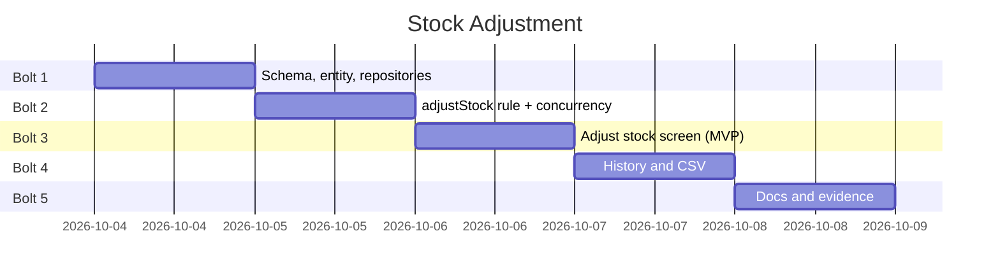

# Tasks: Stock Adjustment (stock count correction)

**Input**: Design documents from `specs/003-stock-adjustment/`
**Prerequisites**: plan.md, spec.md, research.md, data-model.md, contracts/http-routes.md, quickstart.md

**Tests**: Included. Constitution Principle III (NON-NEGOTIABLE) requires a unit test for every public
Service method that runs a business rule, and Principle IV requires a controlled concurrency scenario
for any stock-changing mechanism. Test tasks come **before** their implementation and must fail first.

**Organization**: Grouped by user story. Every phase is a **Bolt** that ends at a checkpoint: stop, run
the checks, and propose a commit before starting the next (commit only when the owner asks).

**Conventions for every task** (CLAUDE.md, constitution v1.2.0):
- `declare(strict_types=1);` in every PHP file; every parameter, return, and property typed; array
  shapes documented for PHPStan level 6.
- Comments and docs in Indonesian; UI text in English; identifiers in English; this folder in English.
- Stock changes **only** in `StockService`, ledger and stock in one transaction; the ledger is
  append-only — never add an UPDATE or DELETE path to `stock_ledger`.
- Services never read `$_SESSION`/superglobals; the acting user is passed in.
- Output escaped with `View::e()`; all SQL prepared.

## Format: `[ID] [P?] [Story] [FR-###?] Description`

- **[P]**: can run in parallel (different files, no dependency on an incomplete task)
- **[Story]**: US1, US2 (spec.md)
- **[FR-###]**: requirement(s) satisfied; every FR-001 … FR-012 appears at least once

---

## Phase 1: Setup

**Purpose**: confirm a green baseline. No new dependency or tooling is needed.

- [X] T001 Run `docker compose exec app composer check` and record the baseline counts (expected unit 389, integration 153, all passing) before any change; stop if it is not green

**Checkpoint**: baseline green.

---

## Phase 2: Foundational — schema, entity, repositories · Bolt 1

**Purpose**: everything both stories need: the `note` column with its CHECKs, the entity factory, the
repository changes, and the new `StockService` dependency wired through every construction site.

**Independent test**: the migration applies on a running database; MySQL refuses an Adjustment row
without a reason and a Receipt row with one; the full suite stays green.

- [X] T002 [FR-005] [FR-007] Write integration tests in `tests/Integration/StockAdjustmentFlowTest.php` (extends `IntegrationTestCase`; seed its own category/product/warehouse/user like `ApprovalAuthorizationTest::seedFixtures`) that insert raw rows via PDO and assert MySQL rejects: an `Adjustment`/`Manual` row with `note` NULL; a `Receipt`/`PurchaseOrder` row with a `note`; an `Adjustment` row with `reference_type = 'PurchaseOrder'`; and accepts an `Adjustment`/`Manual`/`reference_id NULL` row with a note. Run them now with `composer db:test` + `composer test:integration` — they must fail, because `004_ledger_note.sql` does not exist yet
- [X] T003 [FR-005] Create `database/004_ledger_note.sql` exactly as in research R-001 (`ADD COLUMN note VARCHAR(255) NULL AFTER reference_id`, `ck_ledger_note_adjustment`, `ck_ledger_adjustment_manual`) with an Indonesian header comment in the style of `003_date_indexes.sql` (why a new file, which spec decision, why the CHECKs); apply it with `docker compose exec app php database/migrate.php` and `composer db:test`; T002 must now pass
- [X] T004 [FR-005] In `app/Entity/StockLedger.php` add `public readonly ?string $note = null` as the last constructor parameter and `public static function adjustment(int $productId, int $warehouseId, int $delta, string $note, int $performedBy): self` (MovementType::Adjustment, ReferenceType::Manual, referenceId null, quantity keeps the sign of `$delta`), Indonesian docblock mirroring `receipt()`/`issue()`
- [X] T005 [FR-005] [FR-010] In `app/Repository/Mysql/MysqlStockLedgerRepository.php`: add `note` to the `SELECT` constant, to `append()` (column + `:note`), to `hydrate()` (`$row['note'] === null ? null : (string) $row['note']`), and `sl.note` to `movementsBetween()`; update `tests/Unit/Fake/InMemoryStockLedgerRepository.php` to store and return `note`
- [X] T006 [FR-005] [FR-006] Add `ensureRow(int $productId, int $warehouseId): void` to `app/Repository/ProductStockRepositoryInterface.php` (Indonesian docblock: why — research R-002), implement it in `app/Repository/Mysql/MysqlProductStockRepository.php` by moving the existing `INSERT … ON DUPLICATE KEY UPDATE id = id` out of `adjust()` and calling it from `adjust()` (Boy Scout, refactor-log R-8; `adjust()` behaviour unchanged), and implement it in `tests/Unit/Fake/InMemoryProductStockRepository.php` (create a 0-quantity entry if missing)
- [X] T007 Add `private readonly WarehouseRepositoryInterface $warehouses` to the `StockService` constructor in `app/Service/StockService.php` (place it after `$products`, before `$transactions`) and pass it in **every** construction site: `config/container.php` (`$warehouseRepository`), `tests/Unit/Service/StockServiceTest.php` (`InMemoryWarehouseRepository`), and `tests/Integration/{ConcurrentGoodsIssueTest,GoodsIssueTest,GoodsReceiptTest,LedgerReconciliationTest,RepositoryCoverageTest}.php` (`MysqlWarehouseRepository`); no behaviour change
- [X] T008 Extend `tests/Integration/RepositoryCoverageTest.php` so `MysqlProductStockRepository::ensureRow()` is executed against MySQL (new pair → row with quantity 0; existing pair → quantity unchanged), keeping the "every MySQL repository method executed" guarantee (tech-debt TD-2b)

**Checkpoint**: `composer check` green; migration applied in dev and test DBs. Commit suggestion:
`refactor: extract ensureRow from product stock adjust` (T006 alone) then
`feat: add reason column to stock ledger for adjustments`.

---

## Phase 3: User Story 1 — Correct a stock count (Priority: P1) 🎯 MVP

**Goal**: Admin and Warehouse Staff record a counted quantity; the difference is written as one
Adjustment movement and stock changes in the same transaction.

**Independent test**: as Warehouse Staff, count 12 → 9 with a reason; the product shows 9 and a −3
Adjustment row exists with that reason and user (quickstart §1).

### US1 · Bolt 2: service rule

#### Tests for Bolt 2

- [X] T009 [P] [US1] [FR-001] [FR-002] [FR-003] [FR-004] [FR-005] Write failing unit tests in `tests/Unit/Service/StockServiceAdjustmentTest.php` (in-memory fakes + `ImmediateTransactionRunner`, setup like `StockServiceTest`) for `adjustStock(int $productId, array $input, User $actor): array{before: int, after: int, delta: int}` where `$input` holds the raw submitted strings `warehouse_id`, `counted_quantity`, `expected_quantity`, `note` (research R-004): decrease 12→9 writes one ledger entry (Adjustment, Manual, null reference, −3, note, actor id) and stock 9, returns `['before' => 12, 'after' => 9, 'delta' => -3]`; increase 4→10 (+6); never-stocked pair 0→5 (+5); Warehouse Staff allowed; Sales → `ForbiddenException`; counted `-1`, `2.5`, `abc`, and empty → `ValidationException` key `counted_quantity` (never truncated to an integer); missing or non-numeric `expected_quantity` → key `expected_quantity`; missing `warehouse_id` → key `warehouse_id`; empty/whitespace note and a 256-char note → key `note`; unknown warehouse and inactive warehouse → key `warehouse_id`; unknown product → `NotFoundException`; inactive product allowed; expected ≠ current → key `stock` with the current quantity in the message; counted = current → key `counted_quantity` "The count matches the system quantity — nothing to adjust."; on **every** refusal the stock and the ledger are unchanged

#### Implementation for Bolt 2

- [X] T010 [US1] [FR-001] [FR-002] [FR-003] [FR-004] [FR-005] [FR-006] Implement `StockService::adjustStock()` in `app/Service/StockService.php` exactly in the order of research R-004 (role check → `Validator` on the raw `$input`: `warehouse_id` required + whole number, `counted_quantity` and `expected_quantity` required + integerMin 0, `note` required + maxLength 255 on the trimmed value; cast to `int` only after validation → product via `$this->products` (NotFoundException) → warehouse via `$this->warehouses` active check → `$this->transactions` run: `ensureRow` → `lockForUpdate` → stale check → zero check → `ledger->append(StockLedger::adjustment(...))` → `stocks->adjust($delta)`), Indonesian docblock explaining the stale check and why there is no order lock; make T009 pass
- [X] T011 [US1] [FR-005] [FR-006] [FR-007] [FR-012] Extend `tests/Integration/StockAdjustmentFlowTest.php` against MySQL: decrease and increase change `product_stock` and append exactly one row with the note; `StockLedgerRepository::sumQuantity()` equals `product_stock.quantity` after each (SC-002); a never-stocked pair ends with a row of the counted quantity; each refusal (zero, stale, invalid) leaves `product_stock` and the ledger row count unchanged (SC-004); a product brought to its reorder point is reported by the `ProductRepository` low-stock filter afterwards, and `StockService::availableFor()` and `ProductService::availableQuantity()` (the JSON availability path) return the corrected quantity (FR-012)
- [X] T012 [US1] [FR-004] [FR-006] Write `tests/Integration/ConcurrentStockAdjustmentTest.php` following `ConcurrentGoodsIssueTest` (`wrapsInTransaction()` false, two real connections, `innodb_lock_wait_timeout` lowered on connection B, fixtures cleaned up). PHPUnit is single-threaded, so waiting is proven by B's **lock wait timeout**, and staleness by a **separate** step after A commits: (a1) A opens a transaction and locks the pair's `product_stock` row; B's `adjustStock` for the same pair fails with a lock wait timeout and leaves stock and ledger unchanged; (a2) A then records a goods issue for that pair and commits; B's `adjustStock` with the `expected_quantity` read before (a1) is refused with key `stock`; (b) for a never-stocked pair, A runs `ensureRow` + `lockForUpdate` in an open transaction; B's `adjustStock` for that pair fails with a lock wait timeout — **not** a deadlock error and not a success (proves research R-002); after A rolls back, B's retry with expected 0 succeeds. After every scenario `sumQuantity()` equals `product_stock.quantity` (SC-005)

**Checkpoint (Bolt 2)**: unit and integration tests pass; `composer check` green.

### US1 · Bolt 3: HTTP and screen

- [X] T013 [US1] [FR-001] Register in `config/routes.php` under the product section, with an Indonesian comment: `$router->add('GET', '/products/{id}/adjust-stock', 'StockAdjustmentController', 'create', $adminWarehouse);` and `$router->add('POST', '/products/{id}/adjust-stock', 'StockAdjustmentController', 'store', $adminWarehouse);`; add a route-table test to `tests/Integration/StockAdjustmentFlowTest.php` asserting both routes allow exactly `[Role::Admin, Role::WarehouseStaff]` and that `Authorization::authorizeRoute` refuses Sales with `ForbiddenException`
- [X] T014 [US1] [FR-002] [FR-004] [FR-008] [FR-011] Create `app/Controller/StockAdjustmentController.php` (`final class`, constructor `View, StockService, ProductService, MasterDataService, UserService, Session, Csrf`, mirroring `PurchaseOrderController`): `create()` loads the product (404 if missing), active warehouses, the selected warehouse from `queryInt('warehouse_id')` falling back to the first active one, and its system quantity via `StockService::availableFor()`; `store()` passes the raw body (`$request->bodyAll()`, which carries `warehouse_id`, `counted_quantity`, `expected_quantity`, `note`) to `adjustStock()` with the acting user loaded via `UserService::requireUser(Session::userId())`, as `PurchaseOrderController` does, on success flashes "Stock adjusted in {warehouse}: {before} → {after} ({+/-delta})." and redirects to `/products/{id}`, on `ValidationException` re-renders with HTTP 422, the errors, the entered values, and the **re-read** system quantity. CSRF is enforced by the front controller (FR-011) — comment, no duplicate check. The controller never casts or validates the quantities itself (research R-004)
- [X] T015 [P] [US1] Register `'StockAdjustmentController'` in the `controllers` map of `config/container.php` (add the `use`)
- [X] T016 [P] [US1] [FR-002] [FR-004] Create `views/stock-adjustments/form.php`: `page-header` "Adjust stock" with product name and SKU and a "Back to product" link; a GET form (`warehouse_id` select of active warehouses + "Show" button) and a `stat` tile "System quantity" for the chosen warehouse; a `card` POST form with CSRF, hidden `warehouse_id` and `expected_quantity`, `counted_quantity` (`type="number" min="0" step="1"`, label "Counted quantity", required), `note` (`textarea maxlength="255"`, label "Reason", required, hint "Why the count differs, e.g. damaged, lost, found."), field errors with `aria-describedby`, a summary `alert--error` listing errors (including the `stock` stale message), primary "Record adjustment" and ghost "Cancel"; every value through `View::e()`
- [X] T017 [US1] [FR-001] [FR-009] In `app/Controller/ProductController.php::show()` pass `'canAdjust' => in_array($this->session->role(), [Role::Admin, Role::WarehouseStaff], true)` and in `views/products/detail.php` add an "Adjust stock" button (`btn`, link to `/products/{id}/adjust-stock`) in the page header when `canAdjust` (presentation only — the route table enforces)
- [X] T018 [US1] [FR-001] [FR-003] [FR-004] [FR-008] [FR-011] Verify over HTTP against the running stack (quickstart §1–§3, curl with cookie jars): WS decrease → 302 + flash + new quantity, timing the flow from product page to confirmation (SC-001, < 1 minute, recorded as a manual observation); Admin increase on a never-stocked warehouse; zero difference → 422; stale (submit an old `expected_quantity`) → 422; missing CSRF → 403; Sales GET and POST → 403; Sales `GET /products/{id}` shows neither the "Adjust stock" button nor the "Stock adjustments" card (after US2); record the commands and results in `implementation-log.md`, then restore the demo quantities with opposite adjustments

**Checkpoint (Bolt 3)**: `composer check` green; quickstart §1–§3 behave as written. This is the MVP that
closes STOCK-CAP-005.

---

## Phase 4: User Story 2 — Trace stock corrections (Priority: P2) · Bolt 4

**Goal**: corrections are visible on the product page and in the stock movement CSV, with reasons.

**Independent test**: after a correction, the product page lists it and the CSV for today contains
the row with type Adjustment, reference Manual, and the reason (quickstart §4).

### Tests for Bolt 4

- [X] T019 [P] [US2] [FR-009] Write failing unit tests in `tests/Unit/Service/StockServiceAdjustmentTest.php` for `StockService::recentAdjustments(int $productId): list<array{createdAt: string, warehouseName: string, quantity: int, balanceAfter: int, performedByName: string, note: string}>`: newest first, at most 10, only Adjustment rows of that product, `balanceAfter` equals the running ledger sum for that warehouse (including receipts/issues before it); empty list for a product without adjustments
- [X] T020 [P] [US2] [FR-010] [NFR-001] Extend `tests/Unit/Service/ReportServiceTest.php`: stock movement header ends with `Reason`; an Adjustment row's reason appears in the last cell; a Receipt row's last cell is empty; a reason `=1+1` is written as `'=1+1`

### Implementation for Bolt 4

- [X] T021 [US2] [FR-009] Add `recentAdjustmentsForProduct(int $productId, int $limit): array` (documented shape) to `app/Repository/StockLedgerRepositoryInterface.php`; implement it in `app/Repository/Mysql/MysqlStockLedgerRepository.php` with the window-function query of research R-006 (prepared, `LIMIT :limit`), and in `tests/Unit/Fake/InMemoryStockLedgerRepository.php` (compute the running sum in PHP; the fake needs warehouse/user names — accept them via constructor maps or resolve from injected fakes, matching how other fakes expose read models)
- [X] T022 [US2] [FR-009] Implement `StockService::recentAdjustments()` (limit constant `RECENT_ADJUSTMENTS = 10`) in `app/Service/StockService.php`; make T019 pass
- [X] T023 [US2] [FR-009] [NFR-001] Give `ProductController` a `StockService` dependency (`app/Controller/ProductController.php` constructor + `config/container.php`), pass `'adjustments' => $canAdjust ? $this->stockService->recentAdjustments($id) : []` in `show()` (the query is not run for Sales; spec FR-009, A-009), and add, only when `canAdjust`, a "Stock adjustments" `card` to `views/products/detail.php` below "Stock by warehouse": `table-wrap` table with Date (`d M Y H:i`), Warehouse, Change (coloured `+n`/`−n` using the existing success/danger text tokens, tabular numerals), Resulting quantity, By, Reason (wraps); empty state "No stock adjustments yet." with helper "Corrections made with Adjust stock appear here."; all values via `View::e()`
- [X] T024 [US2] [FR-010] In `app/Service/ReportService.php` append `'note'` to `STOCK_MOVEMENT_FIELDS` and `'Reason'` to `STOCK_MOVEMENT_HEADER`; update any expectation of the header in `tests/Integration/DashboardReportConsistencyTest.php`; make T020 pass
- [X] T025 [US2] [FR-009] [FR-010] Extend `tests/Integration/StockAdjustmentFlowTest.php` against MySQL: `recentAdjustmentsForProduct` returns newest-first rows with correct `balanceAfter` after a receipt, an adjustment, an issue, and a second adjustment; `movementsBetween` returns the `note` for the adjustment and NULL for the receipt; and add `recentAdjustmentsForProduct` to `tests/Integration/RepositoryCoverageTest.php`

**Checkpoint (Bolt 4)**: all tests pass; quickstart §4 behaves as written.

---

## Phase 5: Polish & Cross-Cutting Concerns · Bolt 5

- [X] T026 [P] Align the stale wording: `app/Entity/Enum/MovementType.php` docblock (Adjustment is now produced by `StockService::adjustStock`, spec 003); a note under A-006 in `specs/001-inventory-order-management/spec.md` pointing to spec 003; the `note` column and CHECKs (marked "003 deviation D-1") in `specs/001-inventory-order-management/data-model.md` and `docs/planning/erd.md`
- [X] T027 [P] Add an addendum to `docs/architecture/adr-002-concurrency-control.md`: adjustments take the same `product_stock` row lock, ensure-row-before-lock for never-stocked pairs (why gap locks are not enough), stale check under the lock, and the test that proves it (`ConcurrentStockAdjustmentTest`)
- [X] T028 [P] Update `docs/architecture/class-diagram-as-built.md`: `StockAdjustmentController` (→ `StockService`, `ProductService`, `MasterDataService`, `UserService`, `View`, `Session`, `Csrf`), `ProductController --> StockService`, `StockService ..> WarehouseRepositoryInterface`, the new methods on `StockService`, `ProductStockRepositoryInterface`, `StockLedgerRepositoryInterface`; render-check all Mermaid blocks
- [X] T029 [P] Add refactor-log entry R-8 in `docs/quality/refactor-log.md` (Extract Method `ensureRow()` out of `adjust()`; smell: a step needed by a second caller buried in one method; before/after snippets; behaviour unchanged, `StockAdjustmentTest` and goods issue/receipt tests green)
- [X] T030 [P] Merge the routes and the matrix row into `specs/001-inventory-order-management/contracts/http-routes.md` (from `contracts/http-routes.md` of this feature), including the CSV `Reason` column note
- [X] T031 [P] Update `docs/brd/modules/stock.md` (STOCK-CAP-005 implemented; entities, API surface, data flow, screen rows, tests, change log; gap removed), `docs/brd/00-overview.md` (gap removed, Q2 fulfilled, change log), `docs/brd/modules/product.md` if it lists the detail page contents, and `README.md` (Stock row: manual correction with reason; Warehouse Staff and Admin responsibilities)
- [X] T032 [P] Update `docs/testing/use-case-coverage.md` (StockService adjustStock/recentAdjustments), `docs/testing/test-results.md` (new counts and the two new integration rows: concurrency of adjustments, reconciliation), and `docs/quality/tech-debt.md` if any shortcut was taken
- [X] T033 [NFR-002] [NFR-003] Retake UI evidence with the evidence harness: `08-product-detail-*` (now with the adjustments card), new `22-stock-adjustment-form-*` and `23-stock-adjustment-error-*` (422) at desktop and 360px, overflow 0 / clipped 0; contrast audit including the form and the detail card; keyboard audit through the form; update `docs/testing/responsive-accessibility.md`, `screenshots/run.json`, `a11y-audit.json`; restore demo data afterwards (opposite adjustments or `composer db:reset`, recorded in the log)
- [X] T034 [FR-007] Final gate: `composer check` green; regenerate `docs/quality/phpstan-report.txt` and `phpcs-report.txt`; walk the full `quickstart.md` on the running stack; confirm no reason text or quantity is written to `error_log`, and that no code path issues `UPDATE` or `DELETE` on `stock_ledger` (`grep`)

**Checkpoint**: everything green and documented. Commit suggestions are listed in the final report.

---

## Requirement Coverage

| Requirement | Tasks |
| --- | --- |
| FR-001 Admin + WS only; enforced server-side | T009, T010, T013, T017, T018 |
| FR-002 warehouse, counted quantity, reason | T009, T010, T014, T016 |
| FR-003 zero difference refused | T009, T010, T018 |
| FR-004 stale quantity refused | T009, T010, T012, T014, T016, T018 |
| FR-005 one Adjustment/Manual movement + stock together | T002, T003, T004, T005, T006, T009, T010, T011 |
| FR-006 serialised with issue/receipt/adjustments | T006, T010, T011, T012 |
| FR-007 never edited or deleted | T002, T011, T034 |
| FR-008 confirmation after success | T014, T018 |
| FR-009 recent adjustments on product detail (A, W only) | T018, T019, T021, T022, T023, T025 |
| FR-010 reason in CSV export | T005, T020, T024, T025 |
| FR-011 CSRF | T014, T018 |
| FR-012 figures reflect the correction (low stock, availability) | T011 |
| NFR-001 plain text + CSV neutralisation | T020, T023 |
| NFR-002 360px / keyboard / contrast | T033 |
| NFR-003 English UI | T016, T023, T033 |
| SC-002 / SC-004 | T011 |
| SC-003 | T009, T013, T018 |
| SC-005 | T012 |
| SC-006 | T023, T024, T025 |

---

## Dependencies & Execution Order

- **Phase 1** → **Phase 2 (Bolt 1)** → **Phase 3 (Bolt 2 → Bolt 3)** → **Phase 4 (Bolt 4)** → **Phase 5 (Bolt 5)**
- US2 depends on US1 only for having adjustments to show; its code paths (read model, CSV) depend on
  Phase 2, not on US1's controller.
- Same-file chains: `StockService.php` (T007 → T010 → T022), `StockServiceAdjustmentTest.php`
  (T009 → T019), `StockAdjustmentFlowTest.php` (T002 → T011 → T013 → T025),
  `MysqlStockLedgerRepository.php` (T005 → T021), `InMemoryStockLedgerRepository.php` (T005 → T021),
  `ProductController.php` / `detail.php` (T017 → T023), `config/container.php` (T007 → T015 → T023),
  `RepositoryCoverageTest.php` (T007 → T008 → T025).

### Parallel Opportunities

- Bolt 1: T004 (entity) and T006 (`ensureRow`) after T003; T002 (schema tests) comes first and must be red.
- Bolt 3: T015 (container) and T016 (view) once T014's constructor is fixed.
- Bolt 4: T019 and T020 (tests) together.
- Bolt 5: T026–T032 are independent documentation files.

## Implementation Strategy

### MVP first

Phases 1–3 deliver the missing capability (record a correction safely). Stop at the Bolt 3 checkpoint and
demo quickstart §1–§3.

### Incremental delivery (one Bolt at a time; commit only when asked)

1. Bolt 1 → `refactor: extract ensureRow from product stock adjust`, `feat: add reason column to stock ledger for adjustments`
2. Bolt 2 → `feat: record stock count corrections as ledger adjustments`
3. Bolt 3 → `feat: add adjust stock screen for admin and warehouse staff`
4. Bolt 4 → `feat: show recent stock adjustments and export their reasons`
5. Bolt 5 → `docs: stock adjustment evidence, diagrams, ADR and BRD`

## Task Dependencies & Timeline

```mermaid
graph LR
    T001["T001 baseline"] --> T002["T002 schema tests (red)"]
    T002 --> T003["T003 migration"]
    T003 --> T004["T004 entity"]
    T004 --> T005["T005 ledger repo"]
    T003 --> T006["T006 ensureRow"]
    T006 --> T007["T007 StockService dep"]
    T005 --> T007
    T007 --> T008["T008 coverage"]
    T008 --> T009["T009 unit tests"]
    T009 --> T010["T010 adjustStock"]
    T010 --> T011["T011 integration"]
    T010 --> T012["T012 concurrency"]
    T011 --> T013["T013 routes"]
    T012 --> T013
    T013 --> T014["T014 controller"]
    T014 --> T015["T015 container"]
    T014 --> T016["T016 form view"]
    T014 --> T017["T017 button"]
    T016 --> T018["T018 HTTP verify"]
    T017 --> T018
    T018 --> T019["T019 history tests"]
    T018 --> T020["T020 CSV tests"]
    T019 --> T021["T021 read model"]
    T021 --> T022["T022 recentAdjustments"]
    T022 --> T023["T023 detail card"]
    T020 --> T024["T024 CSV reason"]
    T023 --> T025["T025 integration"]
    T024 --> T025
    T025 --> T033["T033 evidence"]
    T033 --> T034["T034 final gate"]

    style T001 fill:#90EE90
    style T010 fill:#FFD700
    style T012 fill:#FFD700
    style T034 fill:#FFB6C6
```

### Critical Path

T001 → T002 → T003 → T006 → T007 → T010 (the stock-changing rule) → T012 (concurrency proof) → T014 → T018 →
T023 → T033 → T034. Documentation tasks T026–T032 sit off the critical path.

## Notes

- Adjustments made while testing change demo data permanently (the ledger is append-only); restore with
  opposite adjustments or `composer db:reset`, and say which in the log.
- If T012 shows a deadlock instead of a clean stale refusal, stop: R-002's ensure-row step is not
  working and must be fixed before any UI work.
