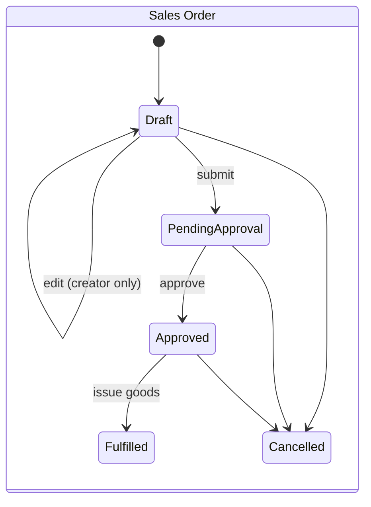
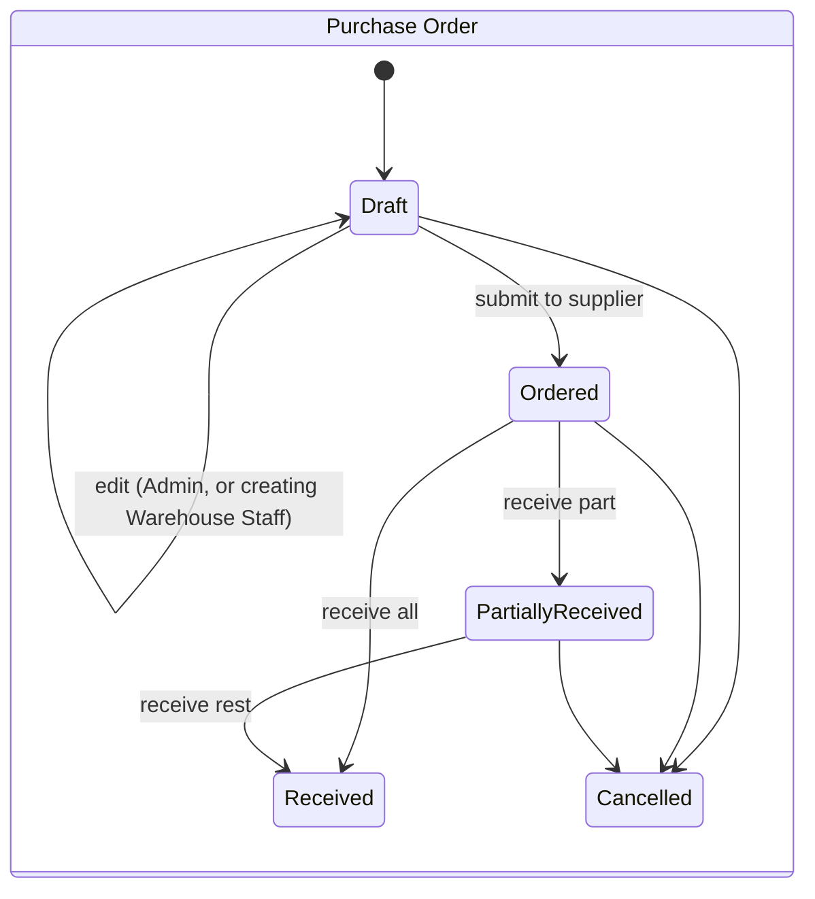

# Data Model: Edit Draft Orders

**Feature**: `004-edit-draft-orders` · **Date**: 2026-10-04

## Schema changes

**None.** No table, column, index, constraint, or migration is added. The schema stays a mirror of the
brief's resource model ([`../001-inventory-order-management/data-model.md`](../001-inventory-order-management/data-model.md)).
This feature only changes **when** existing columns may be written.

## Conformance check against the source

| Source resource (brief §1.3) | Table | Change |
| --- | --- | --- |
| PurchaseOrder | `purchase_order` | none — `supplier_id`, `warehouse_id`, `order_date`, `updated_at` written on edit |
| PurchaseOrderItem | `purchase_order_item` | none — rows replaced on edit while Draft |
| SalesOrder | `sales_order` | none — `customer_id`, `warehouse_id`, `order_date`, `updated_at` written on edit |
| SalesOrderItem | `sales_order_item` | none — rows replaced on edit while Draft |

Nothing is added, renamed, merged, or dropped.

## Write rules introduced

### Sales Order (`sales_order`, `sales_order_item`)

| Column | On edit |
| --- | --- |
| `id`, `order_number`, `created_by`, `created_at` | never written |
| `status` | never written by edit; used as the condition `status = 'Draft'` |
| `approved_by`, `approved_at` | never written (always NULL while Draft) |
| `customer_id`, `warehouse_id`, `order_date` | written |
| `updated_at` | set to `NOW()` |
| `sales_order_item.*` | all rows of the order deleted and re-inserted; `selling_price` re-read from `product.selling_price` |

### Purchase Order (`purchase_order`, `purchase_order_item`)

| Column | On edit |
| --- | --- |
| `id`, `order_number`, `created_by`, `created_at` | never written |
| `status` | never written by edit; used as the condition `status = 'Draft'` |
| `supplier_id`, `warehouse_id`, `order_date` | written |
| `updated_at` | set to `NOW()` |
| `purchase_order_item.*` | all rows of the order deleted and re-inserted; `received_quantity = 0`; `purchase_price` re-read from `product.purchase_price` |

## Invariants

- **INV-1**: Only an order whose stored status is `Draft` can have its header or lines written by an edit.
  Enforced by the conditional `UPDATE … WHERE status = 'Draft'` inside the same transaction as the line
  replacement (research R-003, R-004).
- **INV-2**: An order always has at least one line after an edit (validation rule shared with create).
- **INV-3**: Header and lines of one edit are committed together or not at all.
- **INV-4**: An edit never writes `stock_ledger` or `product_stock`. A Draft has no ledger rows, and its line
  ids are referenced by nothing, which is why the lines can be replaced rather than diffed.
- **INV-5**: Existing foreign keys and CHECKs still hold for the replaced lines (`quantity > 0`,
  `received_quantity` between 0 and `quantity`, prices ≥ 0).

## State lifecycle (unchanged)

`Draft → Draft: edit` is a self-transition: status does not change; it is drawn only to show where editing
is allowed.

## Repository additions (no schema impact)

| Interface | Method | Contract |
| --- | --- | --- |
| `SalesOrderRepositoryInterface` | `updateDraft(SalesOrder $order): bool` | Updates customer, warehouse, order date, `updated_at` **only if** stored status is `Draft`; returns false otherwise |
| `SalesOrderRepositoryInterface` | `replaceItems(int $orderId, list<SalesOrderItem> $items): void` | Deletes the order's lines and inserts the given ones; must run inside the caller's transaction |
| `PurchaseOrderRepositoryInterface` | `updateDraft(PurchaseOrder $order): bool` | Same as above for supplier, warehouse, order date |
| `PurchaseOrderRepositoryInterface` | `replaceItems(int $orderId, list<PurchaseOrderItem> $items): void` | Same as above |

Both have a MySQL implementation and an in-memory fake (constitution Principle I).
