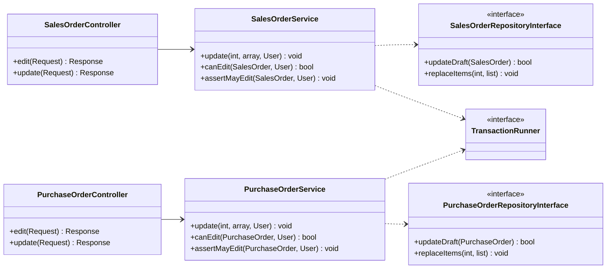
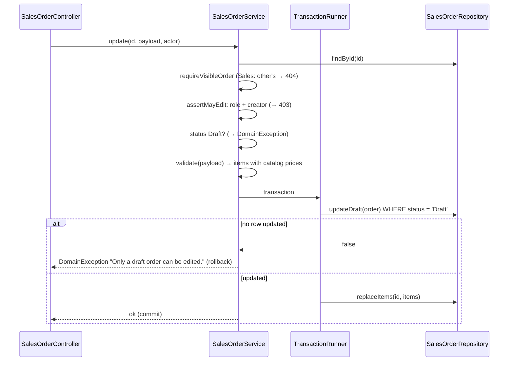

# Implementation Plan: Edit Draft Orders

**Branch**: `004-edit-draft-orders` (spec folder only; work stays on the current branch) | **Date**: 2026-10-04 | **Spec**: [spec.md](./spec.md)
**Input**: Feature specification from `specs/004-edit-draft-orders/spec.md`

## Summary

A Draft Sales Order can be edited by its creator; a Draft Purchase Order by any Admin or by the Warehouse
Staff user who created it. An edit changes the header (customer/supplier, warehouse, order date) and
replaces the lines; it never changes number, status, creator, or stock. This is an owner-requested addition
beyond the project brief (D-04).

Technical approach:
- **No schema change.** Two repository methods per order type: a compare-and-set `updateDraft()` (`WHERE
  status = 'Draft'`) and `replaceItems()` (research R-003, R-004).
- Each order service gains `update()`, `canEdit()`, and `assertMayEdit()` (the permission part, shared by the
  edit screen and the save so both check in the same order — contracts "Check order"), and receives the existing `TransactionRunner` so
  header and lines are saved in one transaction — the `StockService` pattern (R-001, R-004).
- `update()` reuses the private `validate()` of `create()`, so validation and catalog price snapshots are
  identical to Create (R-005).
- Four routes mirroring the product edit routes; the existing create forms take an optional `$order`;
  the detail pages show **Edit** from `canEdit()` (R-006, R-007).

## Technical Context

**Language/Version**: PHP 8.4 exactly, `declare(strict_types=1)` everywhere
**Primary Dependencies**: none at runtime (native PHP, PDO). Dev: PHPUnit 11.5, PHPStan 2.2 (level 6), PHP_CodeSniffer 3.13 (PSR-12)
**Storage**: MySQL 8.0 — no schema change; writes to existing `sales_order`, `sales_order_item`, `purchase_order`, `purchase_order_item`
**Testing**: PHPUnit unit suite (in-memory fakes, `ImmediateTransactionRunner`) and integration suite (real MySQL); `composer check`
**Target Platform**: Linux container (Apache + PHP) behind Docker Compose; browsers at 360px and desktop
**Project Type**: single web application (server-rendered)
**Architecture Type**: standalone modular monolith, Controller → Service → RepositoryInterface → Mysql*Repository, dependency inversion at the repository boundary (CLAUDE.md, ADR-001)
**Integration Target**: N/A — plugs into `config/routes.php` and `config/container.php`
**Existing Design System**: in-house CSS tokens in `public/assets/css/tokens.css`; components in `public/assets/css/app.css` (`page-header`, `card`, `form-grid`, `field-label field-required`, `field-error`, `alert--*`, `table-wrap`/`table`, `btn`, `btn--primary`, `btn--ghost`, `.modal` confirmation); Lucide sprite `public/assets/icons/lucide-sprite.svg` (no pencil icon — Edit stays text-only, like product detail); vanilla JS `order-lines.js` for Add line / Remove and `confirm.js` for the confirmation modal. No component library (forbidden by the brief)
**Performance Goals**: one edit = one short transaction: 1 conditional UPDATE + 1 DELETE + N INSERTs (N = lines, typically < 10)
**Constraints**: no framework/ORM/DI container; acting user passed as an argument; English UI, Indonesian code comments and docs, `specs/` in English; never touch stock
**Scale/Scope**: 2 new screens (as modes of 2 existing forms), 2 extended detail screens, 4 routes, 2 service methods × 2, 2 repository methods × 2 (+ fakes), 0 migrations

## UI/UX & Screens (carried from spec)

- **Design reference**: none — the existing design system. The edit screens are the create screens in edit
  mode (same Order details card, Order lines table, Add line / Remove, summary alert + field errors).
- **Screens**:
  - **Sales Order detail** (`/sales-orders/{id}`, extended): **Edit** (`btn`, text-only) in the action row,
    left of Submit, only when `canEdit()`; success flash "Sales order updated.".
  - **Edit sales order** (`/sales-orders/{id}/edit`): title "Edit sales order SO-…", subtitle "Changes keep
    the order as a draft. Prices are re-read from the catalog when you save."; pre-filled header and lines;
    available-stock hint per line as on create; primary **Save changes** (confirmation modal "Save changes
    to this draft order?"); Cancel → detail. States: populated, error (422, values kept), not-Draft (redirect
    with flash), forbidden (403) / not found (404); loading not applicable.
  - **Purchase Order detail** (`/purchase-orders/{id}`, extended): **Edit** as above; flash "Purchase order
    updated.".
  - **Edit purchase order** (`/purchase-orders/{id}/edit`): same pattern with supplier and destination
    warehouse.
- **Primary interactions**: detail → Edit → change → Save changes → confirm → detail with flash. The submit
  confirmations already say editing ends at submit; they stay as they are (FR-015 now true).

## Constitution Check

*GATE: Must pass before Phase 0 research. Re-checked after Phase 1 design — still passing.*

| Principle | Gate | Status |
| --- | --- | --- |
| I. Layered boundaries | Rules in `SalesOrderService` / `PurchaseOrderService`; controllers do HTTP only; repositories via interfaces with MySQL + in-memory implementations; `TransactionRunner` injected by constructor | ✅ |
| II. Strict mode and typing | Typed params/returns; `list<…Item>` shapes documented; PHPStan 6 and PHPCS stay at zero | ✅ (verified by `composer check`) |
| III. Every use case has a unit test | `update()` and `canEdit()` for both services: each permission row of R-002, not-Draft before and at save, validation reuse, price re-snapshot, header/lines replaced, number/status/creator unchanged | ✅ planned |
| IV. Transactions and concurrency | Header CAS + line replacement in one transaction; integration test for "left Draft before save → refused, lines intact"; no stock written (ADR-002 untouched) | ✅ |
| V. Server-side authorization | Route guard roles = create roles; service re-checks role and ownership; 404 for Sales on others' orders, 403 otherwise; CSRF on both POSTs; payload never sets creator/status/prices | ✅ |
| VI. Design evidence | As-built class diagram, `decisions.md` D-04, 001 route contract and matrix, BRD module maps updated in the same change | ✅ planned (follow-ups) |
| VII. Docker-first | No new service, env var, or migration | ✅ |
| C-003 no over-engineering | No new service class, table, JS module, view file, or exception class; reuses `validate()`, forms, `order-lines.js`, confirmation modal | ✅ |

## Project Structure

### Documentation (this feature)

```text
specs/004-edit-draft-orders/
├── spec.md
├── plan.md              # this file
├── research.md          # R-001 … R-010
├── data-model.md        # no schema change; write rules + repository additions
├── quickstart.md
├── contracts/
│   └── http-routes.md
├── checklists/
│   └── requirements.md
├── tasks.md             # /rudis.tasks
└── implementation-log.md  # /rudis.implement (created by T001)
```

### Source Code (repository root)

```text
app/
├── Controller/
│   ├── SalesOrderController.php          # + edit(), update(); renderForm() takes ?SalesOrder; detailData canEdit
│   └── PurchaseOrderController.php       # + edit(), update(); renderForm() takes ?PurchaseOrder; detailData canEdit
├── Service/
│   ├── SalesOrderService.php             # + TransactionRunner dep; update(), canEdit()
│   └── PurchaseOrderService.php          # + TransactionRunner dep; update(), canEdit()
└── Repository/
    ├── SalesOrderRepositoryInterface.php      # + updateDraft(), replaceItems()
    ├── PurchaseOrderRepositoryInterface.php   # + updateDraft(), replaceItems()
    └── Mysql/
        ├── MysqlSalesOrderRepository.php      # implementations
        └── MysqlPurchaseOrderRepository.php   # implementations
config/
├── routes.php                            # + 4 routes (R-006)
└── container.php                         # pass $database (TransactionRunner) to both order services
views/
├── sales-orders/
│   ├── form.php                          # edit mode via optional $order
│   └── detail.php                        # + Edit button
└── purchase-orders/
    ├── form.php                          # edit mode via optional $order
    └── detail.php                        # + Edit button
tests/
├── Unit/
│   ├── Fake/InMemorySalesOrderRepository.php      # + updateDraft(), replaceItems()
│   ├── Fake/InMemoryPurchaseOrderRepository.php   # + updateDraft(), replaceItems()
│   ├── Service/SalesOrderServiceEditTest.php      # NEW
│   ├── Service/PurchaseOrderServiceEditTest.php   # NEW
│   ├── Service/SalesOrderServiceTest.php          # constructor gains ImmediateTransactionRunner
│   └── Service/PurchaseOrderServiceTest.php       # constructor gains ImmediateTransactionRunner
└── Integration/
    ├── EditDraftOrderTest.php                     # NEW — MySQL CAS, line replacement, rollback, route roles
    ├── ApprovalAuthorizationTest.php              # constructor call gains the Database as TransactionRunner
    └── ConcurrentGoodsIssueTest.php               # constructor call gains the Database as TransactionRunner
```

**Structure Decision**: single existing project; no new folder. New test classes are separate files named
after the use case (`…EditTest`), as `StockServiceAdjustmentTest` was for 003, so the existing service tests
change only in their constructor call. The five places that construct the two services today
(`config/container.php`, `SalesOrderServiceTest`, `PurchaseOrderServiceTest`, `ApprovalAuthorizationTest`,
`ConcurrentGoodsIssueTest`) gain the `TransactionRunner` argument — `tasks.md` must list them.

### Design sketch (for the as-built class diagram)



### Edit sequence (Sales Order; Purchase Order is identical with its own rules)



## Follow-ups required in the same change (constitution VI, docs consistency)

- `docs/planning/decisions.md` — **D-04** "Edit Draft orders: addition beyond the brief", with the Q1–Q3
  rules, where enforced, and the rollback if rejected (R-010).
- `docs/quality/tech-debt.md` — **TD-10**: order validation checks existence, not active status (R-005);
  constitution VI requires the known gap to be recorded.
- `ai-usage-log.md` — feature 004 entries, including the AI outputs corrected during planning.
- `specs/001-inventory-order-management/contracts/http-routes.md` — the four routes and matrix rows.
- `docs/architecture/class-diagram-as-built.md` — new service and repository methods, `TransactionRunner`
  on both order services.
- `docs/brd/modules/sales-order.md`, `docs/brd/modules/purchase-order.md` — capability "edit draft" and
  screens; Change Log entry.
- `README.md` — order flow and role table mention editing drafts.
- `docs/testing/*` — scenario rows in `test-scenarios.md`; screenshots of both edit forms at desktop and
  360px with the same overflow/clipped measurement; counts in `test-results.md`.
- `SOP-Penggunaan-IOMS.pdf` (local, not in git) — A-06/S-02 sections can mention Edit; outside this
  repository's change.

## Complexity Tracking

No constitution violation to justify. Recorded for transparency:

| Addition | Why Needed | Simpler Alternative Rejected Because |
| --- | --- | --- |
| `TransactionRunner` as 6th constructor dependency of both order services | Header and lines must commit together (FR-011) | A transaction opened inside the repository splits transaction ownership across layers (R-004) |
| Two repository methods per order type instead of reusing `save()` | Edit needs a status condition and line replacement | `save()`'s update branch has neither; changing it would alter what fixtures rely on (R-004) |
| Line replacement instead of a per-line diff | Simplest correct write for a Draft (no receipts, no ledger, no references to line ids) | A diff adds code and queries for no user-visible benefit (R-004) |
