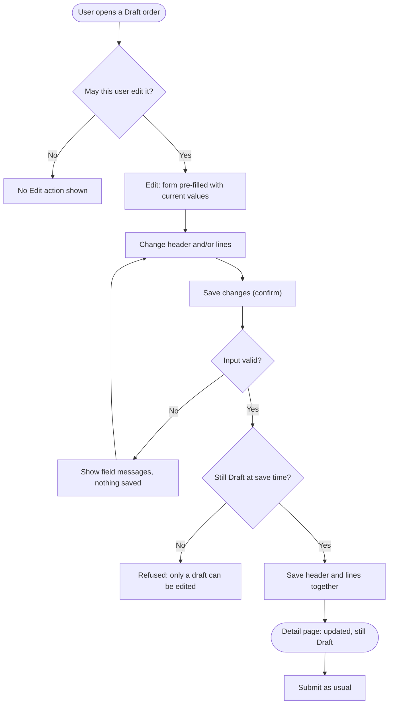
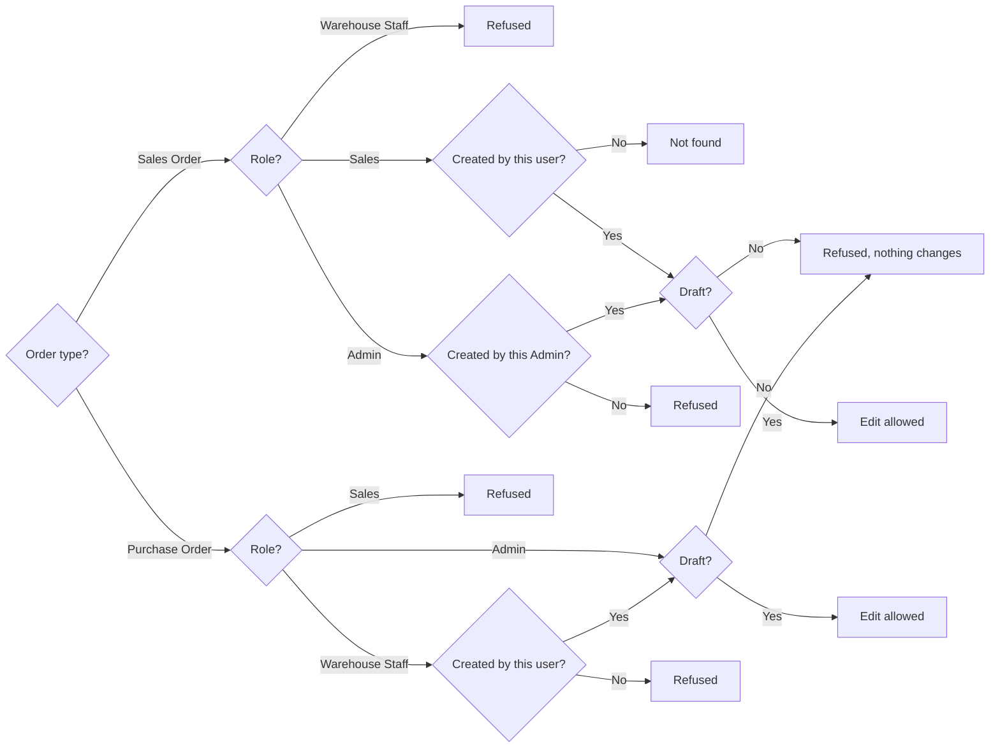

# Feature Specification: Edit Draft Orders

**Feature Branch**: `004-edit-draft-orders` (spec only — no branch created; work continues on the current branch)
**Created**: 2026-10-04
**Status**: Draft
**Input**: User description: "Tambahkan fitur edit untuk order Draft (PO dan/atau SO), aturan di service (hanya Draft,
Sales hanya order miliknya)"

**Source model**: the project brief does **not** cover this case. Its digest
([`../001-inventory-order-management/inputs/project-brief-resource-model.md`](../001-inventory-order-management/inputs/project-brief-resource-model.md))
defines the Purchase Order lifecycle `Draft → Ordered → PartiallyReceived / Received → Cancelled` and the Sales Order
lifecycle `Draft → PendingApproval → Approved → Fulfilled` (or `Cancelled` before Fulfilled), and its role matrix
(§1.2) lists only *create*, *submit*, *approve/reject*, *goods receipt* and *goods issue* for orders — no edit. The
brief neither asks for nor forbids editing a Draft. This feature is an **owner-requested addition** beyond the brief
(owner decision, 2026-10-04), and must be recorded as such in `docs/planning/decisions.md`.

## Clarifications

### Session 2026-10-04

- Q: The request says "PO dan/atau SO" — both order types, or only one? → A: Both Purchase Orders and Sales Orders.
- Q: May Warehouse Staff edit any Draft Purchase Order, or only their own? → A: Warehouse Staff only the Draft
  Purchase Orders they created; Admin any Draft Purchase Order.
- Q: May an Admin edit a Draft Sales Order created by someone else? → A: No — only the creator edits a Draft Sales
  Order, whatever their role. This keeps the approver ≠ creator rule meaningful: an Admin can never change the
  contents of an order and then approve it.
- Assumptions A-004 (prices re-read on save), A-005 (last save wins), and A-007 (save asks for confirmation) were
  presented with the questions and not objected to.

**Problem today**: a Draft order cannot be changed at all. A mistake (wrong supplier, wrong quantity, a missing line)
can only be fixed by cancelling the order and creating a new one. Meanwhile the submit confirmations already say
*"you will no longer be able to edit its lines"* (Purchase Order) and *"You will not be able to edit it afterwards"*
(Sales Order) — promising an edit step that does not exist.

## User Scenarios & Testing *(mandatory)*

### User Story 1 - Edit a draft Sales Order (Priority: P1)

A Sales user creates a draft Sales Order, notices a mistake before submitting it (wrong customer, wrong quantity, a
missing or extra line), opens the draft, corrects it, and saves. The order keeps its number and stays a Draft; they
can then submit it for approval as usual.

**Why this priority**: Sales Orders are created most often and by the most users, and a wrong order that reaches
approval wastes an Admin's review. Cancel-and-recreate also leaves a trail of cancelled orders that distorts the
order-status report.

**Independent Test**: As `sales1`, create a draft with 2 lines, open it, change the quantity of one line, remove the
other, add a new one, and save; the order shows the same number, status Draft, the new lines and total, and can be
submitted.

**Acceptance Scenarios**:

1. **Given** a Draft Sales Order created by Sales user S, **When** S opens it, **Then** an **Edit** action is shown.
2. **Given** S is editing their Draft, **When** they change the customer, source warehouse, order date, line
   quantities, add lines, or remove lines, and save, **Then** the order shows the new values, the same order number,
   status Draft, the same creator, and a confirmation "Sales order updated.".
3. **Given** S is editing, **When** the input is invalid (no lines, quantity not a whole number above zero, no
   customer, warehouse, or product chosen), **Then** nothing is saved, the problems are shown next to the fields,
   and the entered values stay in the form.
4. **Given** a Sales Order created by another Sales user, **When** S tries to open its edit screen or save changes to
   it by any means, **Then** the system answers "not found" and nothing changes.
5. **Given** S's order is no longer Draft (submitted, approved, fulfilled, or cancelled), **When** S tries to edit it
   by any means, **Then** the edit is refused, nothing changes, and S is told only a draft can be edited.
6. **Given** a Warehouse Staff user, **When** they try to edit any Sales Order by any means, **Then** they are refused.
7. **Given** a Draft Sales Order created by a Sales user, **When** an Admin opens it, **Then** no Edit action is
   shown, and an attempt to open its edit screen or save changes by any means is refused with nothing changed —
   only the creator may edit a draft Sales Order.

---

### User Story 2 - Edit a draft Purchase Order (Priority: P2)

An Admin or Warehouse Staff user creates a draft Purchase Order, notices a mistake before sending it to the supplier,
opens the draft, corrects the supplier, destination warehouse, order date, or lines, and saves. The order keeps its
number and stays a Draft.

**Why this priority**: Purchase Orders are fewer and created by trained staff, but a wrong Purchase Order that is
sent to a supplier leads to wrong goods arriving. P2 because the Sales Order case affects more users.

**Independent Test**: As Warehouse Staff, open a Draft Purchase Order, change a line quantity and the destination
warehouse, and save; the order shows the same number, status Draft, the new values and total, and can be submitted
to the supplier.

**Acceptance Scenarios**:

1. **Given** a Draft Purchase Order, **When** an Admin opens it, or the Warehouse Staff user who created it opens it,
   **Then** an **Edit** action is shown.
2. **Given** a permitted user is editing the Draft, **When** they change the supplier, destination warehouse, order
   date, line quantities, add lines, or remove lines, and save, **Then** the order shows the new values, the same
   order number, status Draft, the same creator, and a confirmation "Purchase order updated.".
3. **Given** a permitted user is editing, **When** the input is invalid (no lines, quantity not a whole number above
   zero, no supplier, warehouse, or product chosen), **Then** nothing is saved, the problems are shown next to the
   fields, and the entered values stay in the form.
4. **Given** the Purchase Order is no longer Draft (Ordered, Partially Received, Received, or Cancelled), **When** any
   user tries to edit it by any means, **Then** the edit is refused and nothing changes.
5. **Given** a Sales user, **When** they try to edit any Purchase Order by any means, **Then** they are refused.
6. **Given** a Draft Purchase Order created by another user, **When** a Warehouse Staff user opens it, **Then** no
   Edit action is shown, and an attempt to open its edit screen or save changes by any means is refused with
   nothing changed.

---

### User Story 3 - Honest confirmations and visible rules (Priority: P3)

Users understand when an order can still be changed. The submit confirmations tell the truth — editing is possible
until the order is submitted, and not after — and the detail page offers Edit only when the current user may use it.

**Why this priority**: Small, but it is what makes the rule discoverable instead of learned by failing.

**Independent Test**: Open a Draft and a submitted order as each role; Edit appears only on the Draft and only for
permitted users; the submit confirmation states that the order can no longer be edited afterwards.

**Acceptance Scenarios**:

1. **Given** a Draft order the current user may edit, **When** they open its detail page, **Then** Edit is shown next
   to the existing Submit and Cancel actions.
2. **Given** any order that is not Draft, or a user who may not edit it, **When** its detail page is shown, **Then**
   no Edit action is shown.
3. **Given** a user submits a Draft, **When** the confirmation appears, **Then** it states that the order can no
   longer be edited after submitting.

---

### Edge Cases

- **The order is submitted or cancelled while someone is editing it**: the save is refused because the order is no
  longer Draft; nothing changes, and the user sees the order's current status.
- **Two permitted users edit the same Draft at nearly the same time**: both saves succeed in turn and the later save
  replaces the earlier one completely (last save wins). The order is never left with a mix of the two edits.
- **A save that fails part-way**: header and lines are saved all together or not at all; an order never ends up with
  a new header and old lines, or with no lines.
- **The order's current customer, supplier, warehouse, or a product on a line was deactivated after the draft was
  created**: the edit screen offers active records only, as the create screen does, so that header field or line
  appears unselected and the user must pick an active one or remove the line before saving.
- **Catalog prices changed since the draft was created**: on save, every line takes the price in effect at that
  moment (see A-004), the same way a newly created order would.
- **Editing does not touch stock**: a Draft has no stock movements; editing creates none and changes none.
- **Unknown or non-numeric order id** in the edit address: "not found".
- **Cross-site request forgery**: edit submissions without a valid form token are refused.
- **An Admin views a draft Sales Order created by a Sales user**: the Admin may still view and cancel it as today,
  but may not edit it. Otherwise an Admin could change an order's contents and then approve it, defeating the
  approver ≠ creator rule.
- **A Warehouse Staff user's draft Purchase Order**: the Admin may edit it (and is the only other user who can);
  another Warehouse Staff user may not.

## Requirements *(mandatory)*

### Functional Requirements

- **FR-001**: The system MUST allow a Draft Sales Order to be edited **only by its creator**, whether Sales or Admin.
  An Admin MUST NOT be able to edit a Sales Order created by another user; the refusal MUST change nothing.
- **FR-002**: A Sales user MUST NOT be able to open the edit screen of, or save changes to, a Sales Order created by
  another user; the system MUST answer "not found", exactly as it already does for viewing such an order.
- **FR-003**: Warehouse Staff MUST NOT be able to edit any Sales Order; Sales users MUST NOT be able to edit any
  Purchase Order.
- **FR-004**: The system MUST allow a Draft Purchase Order to be edited by an **Admin** (any Draft Purchase Order)
  and by **Warehouse Staff only for the drafts they created**. A Warehouse Staff user's attempt to edit another
  user's Purchase Order MUST be refused with nothing changed.
- **FR-005**: Only an order in status **Draft** MAY be edited. The check MUST be made by the system at the moment of
  saving, not only when the edit screen is opened; an order that is no longer Draft MUST be refused with nothing
  changed.
- **FR-006**: All permission and status rules (FR-001 to FR-005) MUST be enforced by the system on every save,
  independent of what the screen shows; hiding the Edit action is not sufficient.
- **FR-007**: An edit MAY change, for a Sales Order: customer, source warehouse, order date, and lines (product and
  quantity; add and remove); for a Purchase Order: supplier, destination warehouse, order date, and lines (product
  and quantity; add and remove).
- **FR-008**: An edit MUST NOT change the order number, status, creator, or creation time; it MUST NOT set an
  approver.
- **FR-009**: An edit MUST apply the same validation as creating an order: at least one line; quantities are whole
  numbers above zero; customer or supplier, warehouse, and products must exist **and be active** (enforced by the
  server since tech-debt TD-10, 2026-10-04, for create and edit alike). As on the create screen, the edit screen
  offers only active records. On failure nothing is saved, problems are shown next to the fields, and the entered
  values are kept. *(Planning first aligned this with the then-existing create rule, which only checked existence —
  research R-005; TD-10 then closed that gap for both.)*
- **FR-010**: On save, line prices MUST be set the same way as when an order is created (A-004).
- **FR-011**: Header and lines MUST be saved together in a single all-or-nothing step.
- **FR-012**: Editing MUST NOT create, change, or remove any stock movement or stock quantity.
- **FR-013**: After a successful save the user MUST return to the order's detail page with a confirmation ("Sales
  order updated." / "Purchase order updated.") showing the new values and total.
- **FR-014**: The order detail page MUST show an **Edit** action only when the order is Draft and the current user
  may edit it.
- **FR-015**: The submit confirmations MUST state that the order can no longer be edited after submitting, which is
  now true.
- **FR-016**: Edit submissions MUST be protected against cross-site request forgery.
- **FR-017**: Every rule in FR-001 to FR-012 MUST be covered by unit tests of the service that enforces it, using no
  database, session, or network (constitution Principle III).

### Non-Functional Requirements

- **NFR-001**: The edit screens MUST be usable on a 360px-wide screen and on desktop, with labelled fields,
  keyboard-only operation, visible focus, and WCAG AA text contrast — the same checks the create screens pass.
- **NFR-002**: All user-facing text MUST be in English, consistent with the application UI.
- **NFR-003**: No new framework, library, or dependency may be introduced (constitution; spec C-003 of feature 001).

### Key Entities *(include if feature involves data)*

No new entity and no new attribute. The feature changes when existing attributes may be written.

- **Purchase Order** (existing; brief "PurchaseOrder"): supplier, destination warehouse, status, order date, number,
  created by.
  - Owns: one or more **Purchase Order lines** (product, quantity, purchase price, received quantity — always 0 while
    Draft).
  - State lifecycle (unchanged): `Draft → Ordered → PartiallyReceived / Received`, `Cancelled` before Received.
    **New rule**: header and lines are editable only while `Draft`.
- **Sales Order** (existing; brief "SalesOrder"): customer, source warehouse, status, order date, number, created
  by, approved by.
  - Owns: one or more **Sales Order lines** (product, quantity, selling price).
  - State lifecycle (unchanged): `Draft → PendingApproval → Approved → Fulfilled`, or `Cancelled` before Fulfilled.
    **New rule**: header and lines are editable only while `Draft`.

## Success Criteria *(mandatory)*

### Measurable Outcomes

- **SC-001**: A user can correct a mistake in a Draft order (change one quantity, add or remove one line) in under 1
  minute, without cancelling and recreating the order.
- **SC-002**: In testing, 0 edit attempts succeed on an order that is not Draft, by any role, through the screen or by
  submitting directly.
- **SC-003**: In testing, 0 edit attempts by a Sales user succeed on another user's Sales Order, and every such
  attempt answers "not found".
- **SC-004**: In testing, 0 edit attempts succeed for a user not permitted to edit that order: Warehouse Staff on
  any Sales Order, Sales on any Purchase Order, an Admin on a Sales Order created by someone else, and Warehouse
  Staff on a Purchase Order created by someone else.
- **SC-005**: After any edit, the order has the same number, status Draft, and creator; its lines and total match
  exactly what was saved; and stock quantities and stock movements are unchanged — verified for both order types.
- **SC-006**: Every refused edit (invalid input, not Draft, not permitted) leaves the order exactly as it was.
- **SC-007**: The edit screens pass the same 360px, keyboard-only, and contrast checks as the create screens.

## UI/UX & Screens *(mandatory when the feature has a user interface)*

### Design Reference

- **Design source**: none — follow the application's existing design system.
- **Existing UI to match**: the **Create sales order** and **Create purchase order** screens (Order details card,
  Order lines table with Add line / Remove, summary alert plus field errors), and the order detail pages' action row.

### Screen Inventory

| Screen | Purpose | Serves story | Key data shown | Primary actions |
| ------ | ------- | ------------ | -------------- | --------------- |
| Sales Order detail (existing, extended) | Inspect one sale | US1, US3 | as today | **Edit** (Draft, permitted users only), Submit, Cancel |
| Edit sales order (new) | Correct a draft sale | US1 | order number; customer, source warehouse, order date; lines with available stock | change header, add/remove lines, **Save changes**, Cancel |
| Purchase Order detail (existing, extended) | Inspect one purchase | US2, US3 | as today | **Edit** (Draft, permitted users only), Submit to supplier, Cancel order |
| Edit purchase order (new) | Correct a draft purchase | US2 | order number; supplier, destination warehouse, order date; lines | change header, add/remove lines, **Save changes**, Cancel |

### Per-Screen Key States

- **Edit sales order / Edit purchase order**: populated = the same layout as the create screen, pre-filled with the
  order's current header and lines, title "Edit sales order SO-…" / "Edit purchase order PO-…", and a note that the
  order stays a draft; error = summary alert plus field messages with the entered values kept; not Draft = the user
  is returned to the detail page with "Only a draft order can be edited."; not permitted = refused (Sales Order of
  another user: "not found"); loading = not applicable (page opens complete).
- **Order detail**: Edit appears in the action row only for a Draft the current user may edit; after a save, a
  confirmation at the top ("Sales order updated." / "Purchase order updated.").

### Primary Interactions & Flows

- **Edit** on the detail page opens the edit screen; **Save changes** asks for confirmation through the application's
  confirmation modal, as Create does, then returns to the detail page; **Cancel** returns without changes.
- Add line / Remove and the available-stock hint on Sales Order lines behave as on the create screens.

## Business Process Flow *(visual aid)*

### Primary User Journey Flow

### Decision Logic

## Assumptions

- **A-001**: This feature goes beyond the project brief, which does not mention editing orders (see Source model). It
  is an owner decision (2026-10-04) and is recorded in `docs/planning/decisions.md`.
- **A-002**: Both order types are in scope (owner decision, Q1).
- **A-003**: Who may edit is narrower than who may create: a Draft Sales Order only by its creator (Q3); a Draft
  Purchase Order by any Admin, or by the Warehouse Staff user who created it (Q2 — brief §1.2: Warehouse Staff "may
  propose" Purchase Orders, so they keep control of their own proposals only).
- **A-004**: On save, Sales Order line prices are re-read from the catalog selling price and Purchase Order line
  prices from the catalog purchase price — the same as creating a new order. A Draft has not been committed to
  anyone, so it reflects current prices; prices freeze when the order leaves Draft.
- **A-005**: Concurrent edits of the same Draft: last save wins, as a whole. No version check or edit lock is added —
  drafts are short-lived and edited by few people.
- **A-006**: No edit history is kept beyond the order's last-updated time. Stock movements are unaffected because a
  Draft has none.
- **A-007**: Saving changes asks for confirmation through the existing confirmation modal, consistent with Create.

## Out of Scope

- Editing an order after it leaves Draft (Pending Approval, Approved, Ordered, and later). Such orders are still
  corrected by cancelling and recreating.
- An edit history or change log per order.
- Deleting a Draft order (Cancel remains the only way to discard one).
- Changing order numbering, statuses, or the approval rules.
