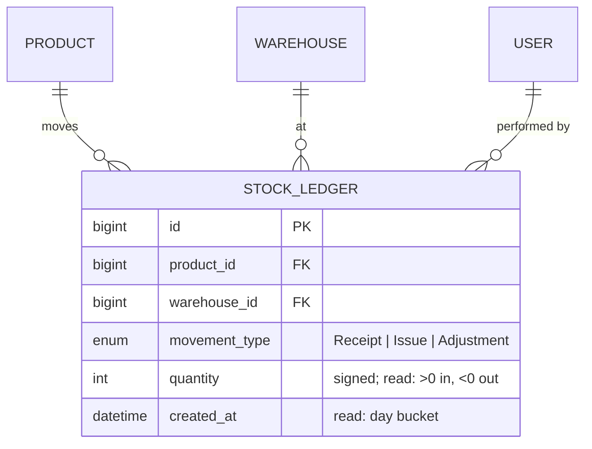
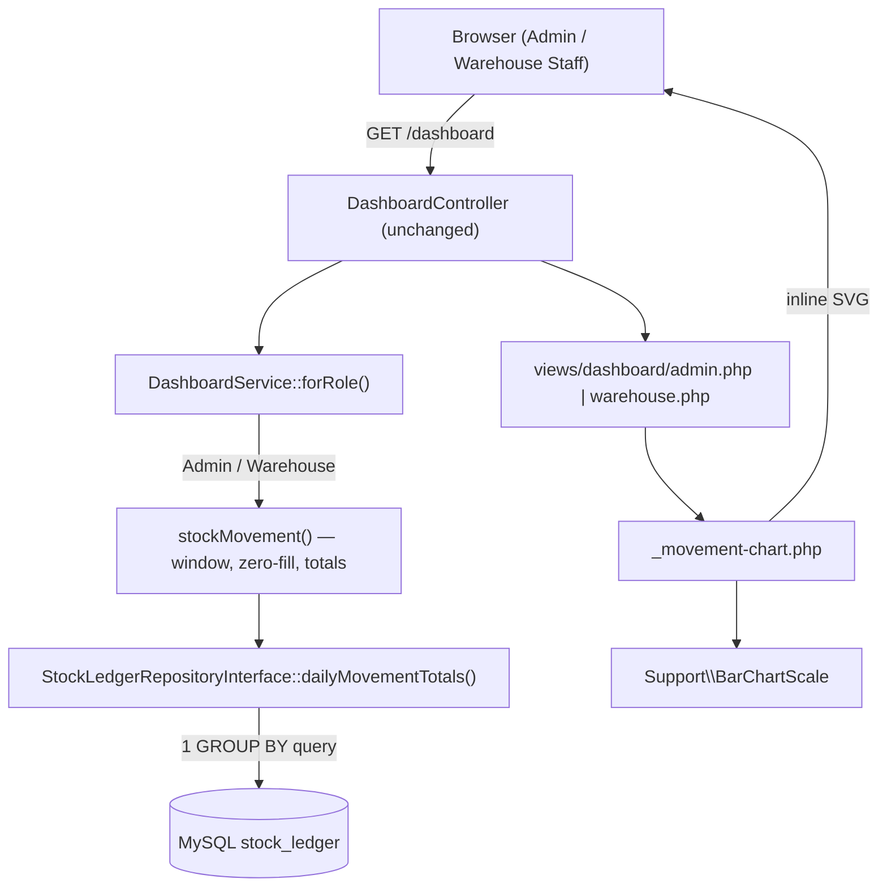
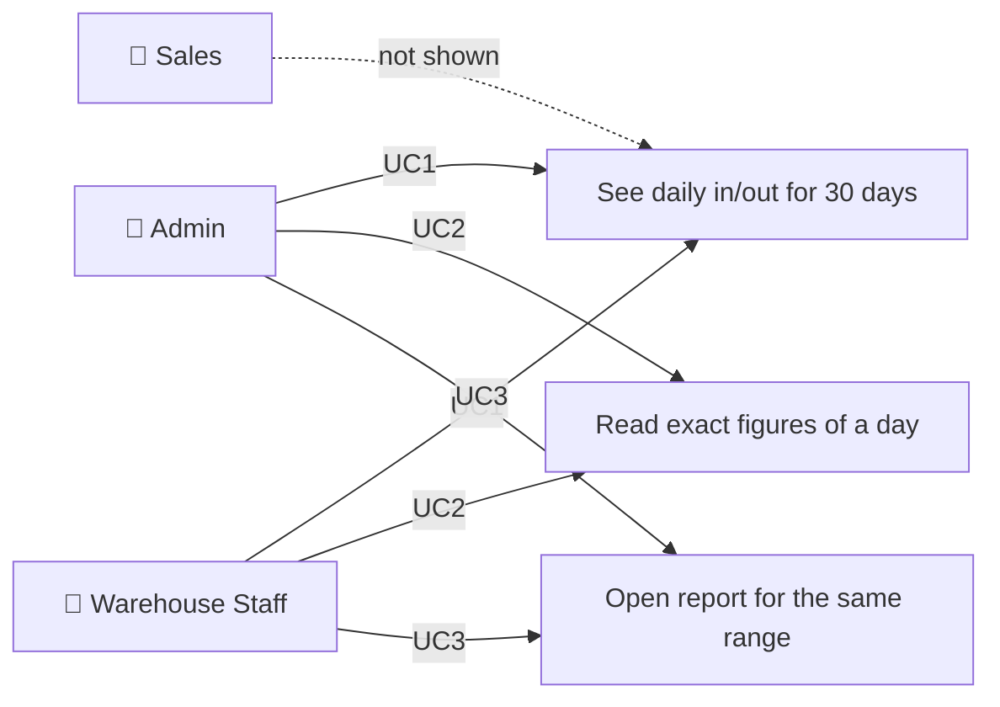
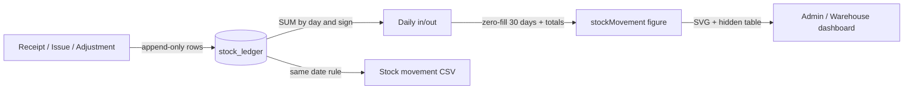

# Implementation Plan: Stock Movement Chart on the Dashboard

**Branch**: `005-stock-movement-chart` (spec folder only; work stays on the current branch) | **Date**: 2026-10-04 | **Spec**: [spec.md](./spec.md)
**Input**: Feature specification from `specs/005-stock-movement-chart/spec.md`

## Summary

The Admin and Warehouse Staff dashboards gain a card showing, for each of the last 30 days, the units that came into
stock and the units that went out, across all warehouses, computed from the stock ledger on every load. Adjustments
count by sign. The chart is a hand-built inline SVG — no library, no JavaScript. This is the brief's **bonus** item
"dashboard grafik (SVG/canvas buatan sendiri)", and it makes the ledger visible on the dashboard.

Technical approach:
- **No schema change.** One new repository method, `dailyMovementTotals()`: a single `GROUP BY DATE(created_at)`
  query with the **same date predicate** as the stock movement report, splitting by the sign of `quantity` (R-002).
- `DashboardService` receives the ledger repository and the clock; a private `stockMovement()` builds the zero-filled
  30-day window and totals, added to the Admin and Warehouse Staff figures only (R-001, R-003).
- A view partial `dashboard/_movement-chart.php` draws the SVG; a small pure helper `App\Support\BarChartScale`
  computes the axis and bar heights so the arithmetic is unit-tested (R-004, R-005).
- Hover/focus figures via SVG `<title>` + CSS, plus a visually hidden data table (R-006).

## Technical Context

**Language/Version**: PHP 8.4 exactly, `declare(strict_types=1)` everywhere
**Primary Dependencies**: none at runtime (native PHP, PDO). Dev: PHPUnit 11.5, PHPStan 2.2 (level 6), PHP_CodeSniffer 3.13 (PSR-12). No charting library (FR-012)
**Storage**: MySQL 8.0 — no schema change; reads `stock_ledger` (`created_at`, `quantity`) using the existing `created_at` index (`003_date_indexes.sql`)
**Testing**: PHPUnit unit suite (in-memory fakes, `FixedClock`) and integration suite (real MySQL); `composer check`
**Target Platform**: Linux container (Apache + PHP) behind Docker Compose; browsers at 360 px and desktop
**Project Type**: single web application (server-rendered)
**Architecture Type**: standalone modular monolith, Controller → Service → RepositoryInterface → Mysql*Repository, dependency inversion at the repository boundary (CLAUDE.md, ADR-001)
**Integration Target**: N/A — wiring in `config/container.php` only; no route change
**Existing Design System**: in-house CSS tokens in `public/assets/css/tokens.css` (`--success`, `--danger`, `--border-default`, `--text-muted`, `--success-text`, `--danger-text`, radius/shadow tokens); components in `public/assets/css/app.css` (`card`, `card-header`, `card-title`, `card-body`, `btn btn--ghost btn--sm`, `stat-grid`, `.visually-hidden`); partials `layout/_empty-state`, `dashboard/_status-tally`, `dashboard/_low-stock`; Lucide sprite `public/assets/icons/lucide-sprite.svg`. No component library (forbidden by the brief)
**Performance Goals**: one extra aggregate query per Admin/Warehouse dashboard load over ≤ 30 days of ledger rows (NFR-001)
**Constraints**: no framework/ORM/DI container/JS library; read-only (NFR-004); English UI, Indonesian code comments and docs, `specs/` in English
**Scale/Scope**: 0 routes, 0 migrations, 1 repository method (+ fake), 1 service method, 1 support helper, 1 view partial, 2 view edits, CSS additions

## UI/UX & Screens (carried from spec)

- **Design reference**: none — the existing dashboard cards. In = success green, Out = danger red.
- **Screens**:
  - **Admin dashboard** (`/`, `/dashboard`): new card "Stock movement — last 30 days" after "Purchase orders by
    status", before "Products needing attention". Header link **View stock movement report** (`btn--ghost`).
    Body: summary row (Units in · Units out · Net change, signed), legend, SVG chart with 30 day slots (In bar left,
    Out bar right), date labels every 5th day and on today, 4–5 whole-number gridlines with values.
  - **Warehouse Staff dashboard**: the same card after "Issue queue", before "Products needing attention".
  - **Sales dashboard**: unchanged.
- **States**: populated (above); empty — `_empty-state` with icon `warehouse`, "No stock moved in the last 30 days",
  "Receipts, issues and adjustments will appear here as they are recorded."; loading not applicable
  (server-rendered); error — existing safe error page.
- **Primary interactions**: hover any day, or Tab to a day that has movement → its date and exact In/Out shown, with
  focus outline (empty days are not tab stops; all 30 are in the hidden table); link → Reports
  with the same 30-day range.

## Constitution Check

*GATE: Must pass before Phase 0 research. Re-checked after Phase 1 design — still passing.*

| Principle | Gate | Status |
| --- | --- | --- |
| I. Layered boundaries | Aggregation in `MysqlStockLedgerRepository` behind `StockLedgerRepositoryInterface` (+ in-memory fake); window, zero-fill and totals in `DashboardService`; controller unchanged; view only prints; geometry in a `Support` helper with no business rule | ✅ |
| II. Strict mode and typing | Typed params/returns; array shapes documented (`array{start, end, days, totalIn, totalOut, net}`); PHPStan 6 and PHPCS stay at zero | ✅ (verified by `composer check`) |
| III. Every use case has a unit test | `DashboardServiceTest`: 30 zero-filled days, totals, adjustments by sign, window from `FixedClock`, Sales gets nothing. `BarChartScaleTest`: axis max, gridlines, heights, 1 px minimum | ✅ planned |
| IV. Transactions and concurrency | Read-only; no transaction, no lock, no stock or ledger write (NFR-004) | ✅ |
| V. Server-side authorization | Sales never receives the figure — role dispatch in `DashboardService::forRole()`, not view hiding; no new route | ✅ |
| VI. Design evidence | As-built class diagram, BRD dashboard module, test results, SOP screenshots updated; bonus recorded as bonus | ✅ planned (follow-ups) |
| VII. Docker-first | No new service, env var, or migration | ✅ |
| C-003 no over-engineering | One helper class (justified below); no new service, table, route, JS file or library | ✅ |
| C-005 bonus only after mandatory is stable | `composer check` green; API-01, JOB-01, REPORT-01 verified 2026-10-04 | ✅ |

## Project Structure

### Documentation (this feature)

```text
specs/005-stock-movement-chart/
├── spec.md
├── plan.md              # this file
├── research.md          # R-001 … R-010
├── data-model.md        # no schema change; derived structures and invariants DM-1 … DM-5
├── quickstart.md        # manual verification
├── contracts/
│   └── dashboard-stock-movement.md
├── checklists/
│   └── requirements.md
└── tasks.md             # /rudis.tasks
```

### Source Code (repository root)

```text
app/
├── Repository/
│   ├── StockLedgerRepositoryInterface.php      # + dailyMovementTotals()
│   └── Mysql/MysqlStockLedgerRepository.php    # + dailyMovementTotals() — one GROUP BY query
├── Service/
│   └── DashboardService.php                    # + ledger repo, clock; stockMovement(); MOVEMENT_DAYS = 30
└── Support/
    └── BarChartScale.php                       # NEW — axis max, gridlines, bar height (pure)
config/
└── container.php                               # DashboardService gets $stockLedgerRepository, $clock
views/dashboard/
├── _movement-chart.php                         # NEW — card: summary, legend, inline SVG, hidden table, empty state
├── admin.php                                   # include partial
└── warehouse.php                               # include partial
public/assets/css/
└── app.css                                     # chart styles (bars, gridlines, focus tip, responsive)
tests/
├── Unit/Fake/InMemoryStockLedgerRepository.php # + dailyMovementTotals()
├── Unit/Service/DashboardServiceTest.php       # + stock movement section; constructor updated
├── Unit/Support/BarChartScaleTest.php          # NEW
└── Integration/DashboardReportConsistencyTest.php  # + chart = CSV per day on MySQL; constructor updated
```

**Structure Decision**: existing layout; the only new production files are one helper and one partial.

## Complexity Tracking

| Addition | Why Needed | Simpler Alternative Rejected Because |
| --- | --- | --- |
| `App\Support\BarChartScale` (new class) | Axis rounding and bar-height arithmetic has edge cases (all zero, one huge day, 1 px minimum) that must be unit-tested | Arithmetic in the template is untestable (constitution III); putting presentation geometry in `DashboardService` mixes rendering with business figures |

---

## Technical Diagrams

### Data Design Decisions

| Source resource / sub-resource | Table(s) | Mapping | Rationale |
| --- | --- | --- | --- |
| StockLedger (brief §1.3) | `stock_ledger` | mirror, unchanged — read only | Daily totals are derived per request, never stored |

### Data Model (Entity Relationship Diagram)



### System Architecture



### Use Case Diagram



### Data Flow Diagram (Level 0)



### API Contract Overview

No HTTP or JSON API change. See [contracts/dashboard-stock-movement.md](./contracts/dashboard-stock-movement.md) for
the repository method, the view-model shape and the rendered card.

| Operation | Endpoint | Method | Purpose |
| --- | --- | --- | --- |
| Dashboard (existing) | `/dashboard` | GET | Now includes the stock movement card for Admin and Warehouse Staff |

### Deployment Architecture

Unchanged — the existing `app` (PHP 8.4 + Apache) and `db` (MySQL 8) containers from `compose.yaml`. No new service,
volume, or environment variable.
