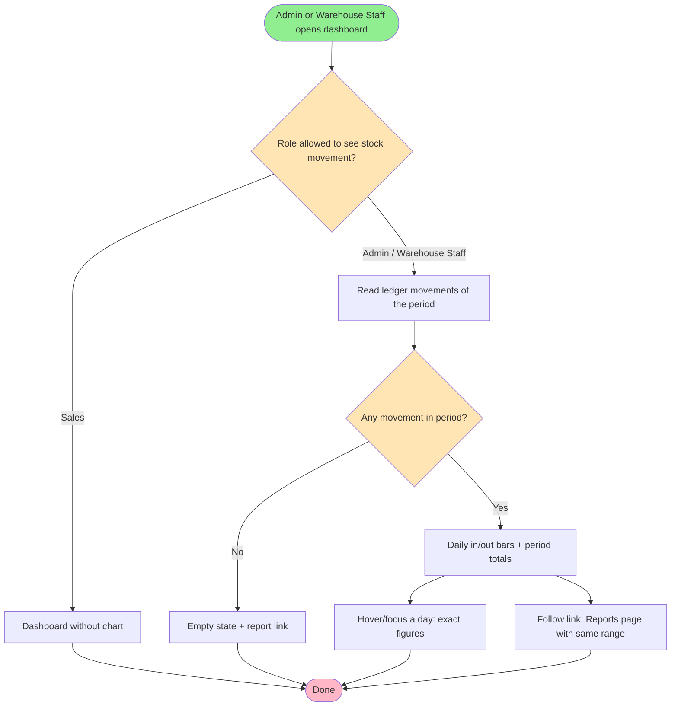
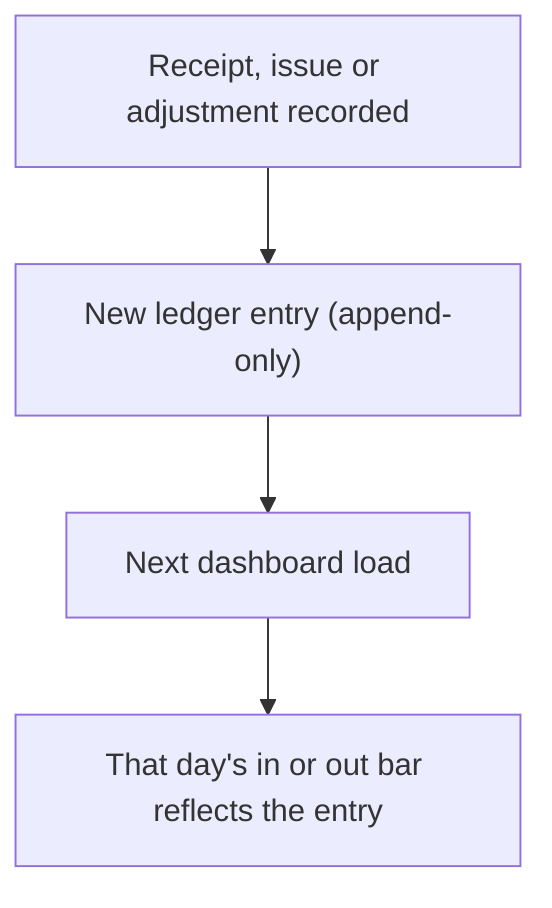

# Feature Specification: Stock Movement Chart on the Dashboard

**Feature Branch**: `005-stock-movement-chart` (spec only — no branch created; work continues on the current branch)
**Created**: 2026-10-04
**Status**: Draft
**Input**: User description: "Bonus: dashboard grafik SVG buatan sendiri (tanpa library) yang menampilkan stock
movement harian (masuk vs keluar) dari stock_ledger untuk dashboard Admin dan Warehouse Staff, sehingga ledger
terlihat langsung di dashboard"

**Source model**: the project brief lists *"dashboard grafik (SVG/canvas buatan sendiri)"* as an example of
**bonus** work, and states that bonus work cannot make up for a mandatory requirement that does not work. Its digest
([`../001-inventory-order-management/inputs/project-brief-resource-model.md`](../001-inventory-order-management/inputs/project-brief-resource-model.md))
defines the Stock Ledger (§1.3) as the record of every stock movement — type Receipt, Issue or Adjustment, a signed
quantity, a warehouse, a product, a time and the user who made it — and requires that *"dashboard dan laporan
dihitung dari data ini, bukan angka statis"*. Spec 001 constraint C-005 allows bonus work only once every mandatory
requirement is stable; as of 2026-10-04 the full quality gate is green and API-01 and JOB-01 have been verified.

**Problem today**: no dashboard shows the stock ledger. The stock figures on the Admin and Warehouse Staff dashboards
(inventory value, products below reorder point) are read from the running stock balance, which always equals the sum
of the ledger. But nothing on the dashboard shows the *movements* themselves, so a user cannot see when goods came in
or went out, and an assessor reading the brief literally cannot point at the ledger on the dashboard. The ledger can
only be seen row by row in the stock movement CSV, or per order and per product on detail pages.

## Clarifications

### Session 2026-10-04

- Q: How many days does the chart cover? → A: The last 30 calendar days, ending today.
- Q: How do stock adjustments appear? → A: By sign — a positive adjustment counts as "in", a negative one as "out".
  No separate series. The chart's totals therefore always equal the real change in stock and match the stock
  movement CSV.
- Q: What do the bars measure? → A: Units of stock (quantities), summed across all products and warehouses — not
  rupiah value and not the number of transactions.
- Assumptions A-002 (day boundary — refined after analysis to the UTC rule the report already uses), A-003 (no date picker), A-004 (same figures for Admin and Warehouse
  Staff), FR-011 (no chart for Sales) and the card position were presented with the questions and not objected to.

## User Scenarios & Testing *(mandatory)*

### User Story 1 - See daily stock in and out at a glance (Priority: P1)

An Admin or Warehouse Staff user opens their dashboard and sees a chart of the recent days: for each day, how many
units came into stock and how many went out, across all warehouses. They can tell at once which days were busy, and
whether more goods arrived than left over the period.

**Why this priority**: this is the whole feature — it makes the ledger visible on the dashboard and is the bonus item
the brief names.

**Independent Test**: as `warehouse1`, record a goods receipt of 5 units today; open the dashboard; today's "in" bar
has grown by 5 and the period total for "in" has grown by 5.

**Acceptance Scenarios**:

1. **Given** the ledger has receipts and issues within the chart period, **When** an Admin opens the dashboard,
   **Then** a chart shows one column per day of the period, each with a bar for units in and a bar for units out.
2. **Given** the same ledger, **When** a Warehouse Staff user opens the dashboard, **Then** they see the same chart
   with the same figures.
3. **Given** a goods receipt of N units is recorded today, **When** the dashboard is reloaded, **Then** today's
   "in" figure has grown by exactly N; **Given** a goods issue of M units, **Then** today's "out" figure has grown
   by exactly M.
4. **Given** the chart is shown, **When** the user reads the summary next to it, **Then** they see the total units
   in, the total units out and the net change for the period, and these totals equal the sum of the daily bars.
5. **Given** a Sales user, **When** they open their dashboard, **Then** no stock movement chart is shown.

---

### User Story 2 - Read the exact figure for one day (Priority: P2)

A user looking at the chart wants the exact number behind a bar — for example to compare one day with the stock
movement report.

**Why this priority**: a chart without exact figures cannot be checked against the report; it adds trust but the
chart is useful without it.

**Independent Test**: point at (or focus) the bar for a day with a known receipt; the exact date and number of units
in and out for that day are shown.

**Acceptance Scenarios**:

1. **Given** the chart is shown, **When** the user hovers over or keyboard-focuses a day, **Then** the date and the
   exact units in and out for that day are shown.
2. **Given** a screen-reader user, **When** they reach the chart, **Then** they can read the same daily figures as a
   text table, not only as a picture.
3. **Given** a day's figures on the chart, **When** the user exports the stock movement CSV for that same single day,
   **Then** the sum of positive quantities equals the chart's "in" and the sum of negative quantities equals the
   chart's "out" for that day.

---

### User Story 3 - Go from the chart to the detail (Priority: P3)

Having noticed an unusual day, the user wants the movements behind it.

**Why this priority**: convenient, but the report page already offers the same export.

**Independent Test**: from the chart, follow the link to the report; the report page opens with the chart's period
already filled in.

**Acceptance Scenarios**:

1. **Given** the chart is shown, **When** the user follows its "View stock movement report" link, **Then** the
   Reports page opens with the chart's date range already selected.

---

### Edge Cases

- **No movement at all in the period**: the chart area shows an empty state ("No stock moved in the last N days")
  instead of an empty grid; totals show 0.
- **Days without movement inside the period**: those days still appear on the axis with no bar, so gaps in activity
  are visible rather than collapsed.
- **Adjustments**: a stock correction counts by its sign — a positive correction adds to that day's "in", a negative
  one to its "out" — exactly like a receipt or an issue.
- **One very large day**: the scale adapts to the largest daily figure in the period, so every bar stays within the
  chart; small bars on other days may become short but remain readable through the exact figures (US2).
- **A movement recorded near midnight**: a movement belongs to the UTC calendar day of its recorded time (A-002) —
  the same rule the stock movement report uses for its date range, so chart and CSV never disagree about the day.
- **Many warehouses**: figures are totals across all warehouses; there is no per-warehouse breakdown (see Out of
  Scope).
- **A deactivated product or warehouse**: its past movements still count — the ledger is history and is never
  filtered by today's active status (satisfied by design: the daily totals read the ledger alone, with no join to
  product or warehouse — research R-002).
- **Narrow screens**: on a phone-width screen the chart stays legible (it scales down or scrolls inside its card)
  and never makes the whole page scroll sideways.

## Requirements *(mandatory)*

### Functional Requirements

- **FR-001**: The Admin dashboard and the Warehouse Staff dashboard MUST show a stock movement chart covering the
  most recent 30 calendar days, ending today (today and the 29 days before it).
- **FR-002**: For each day of the period the chart MUST show the units that entered stock and the units that left
  stock on that day, across all warehouses, as two visually distinct bars.
- **FR-003**: Every figure on the chart MUST be computed from the stock ledger at the time the dashboard is opened —
  no stored or hand-written totals. Units in for a day = sum of positive ledger quantities recorded that day; units
  out = sum of the absolute values of negative ledger quantities recorded that day.
- **FR-004**: Adjustments MUST be counted by their sign — a positive adjustment as units in, a negative adjustment as
  units out — with no separate series, so that in minus out for the period equals the net change in stock.
- **FR-005**: The chart MUST measure units of stock (ledger quantities), summed across all products and warehouses —
  not monetary value and not the number of movements.
- **FR-006**: Days in the period with no movement MUST still appear on the chart's time axis.
- **FR-007**: Next to the chart the dashboard MUST show the period totals — units in, units out, and net change
  (in minus out) — and these MUST equal the sum of the daily figures.
- **FR-008**: The exact date and the in/out figures of each day MUST be available on hover, and on keyboard focus for
  every day that has movement (days with no movement are not tab stops, so a keyboard user is not forced through 30
  empty stops; their zero figures remain in the text alternative),
  and MUST also be available as text to assistive technology.
- **FR-009**: When the ledger has no movement in the period, the chart MUST be replaced by an empty state that says so.
- **FR-010**: The chart MUST include a link to the Reports page with the chart's period pre-selected as the date
  range.
- **FR-011**: The chart MUST NOT be shown to Sales users, and no stock movement figures may be computed for them —
  stock movement is not part of the Sales role (brief §1.2; the stock movement export is already closed to Sales).
- **FR-012**: The chart MUST be drawn by the application itself — no charting library and no external script or
  image service (brief bonus wording: "buatan sendiri").
- **FR-013**: For any single day, the chart's in and out figures MUST equal the positive and negative totals of the
  stock movement CSV exported for that day (follows from FR-003 plus the shared date rule of A-002; stated separately
  because it is tested separately).

### Non-Functional Requirements

- **NFR-001**: Opening a dashboard with the chart MUST NOT be noticeably slower than today — the chart adds at most
  one summary query over the period, not one query per day or per movement.
- **NFR-002**: The chart MUST meet the same accessibility bar as the rest of the dashboard: a text alternative for
  the figures, colours for in/out that are distinguishable without relying on colour alone (e.g. a legend with
  labels, and distinct bar position), and sufficient contrast in the existing light theme.
- **NFR-003**: The chart MUST stay legible from phone width (360 px) to desktop without horizontal page scrolling.
- **NFR-004**: The feature MUST NOT change any stock figure, any ledger row, or any existing dashboard figure; it only
  reads.

### Key Entities *(include if feature involves data)*

No new entity. The feature reads one existing entity:

- **Stock Ledger entry** (existing, brief §1.3): one stock movement.
  - Key attributes used: movement type (Receipt, Issue, Adjustment), signed quantity (positive = into stock,
    negative = out of stock), time recorded. Product and warehouse exist but are not broken down.
  - State lifecycle: none — entries are append-only and never change.
  - Relationships: belongs to a product and a warehouse; may reference a Purchase Order or Sales Order.
- **Daily movement summary** (derived, not stored): for one calendar day, units in and units out. Computed on demand
  from ledger entries; never persisted.

## Success Criteria *(mandatory)*

### Measurable Outcomes

- **SC-001**: An Admin or Warehouse Staff user can see, without leaving the dashboard, how many units came in and went
  out on any day of the chart period.
- **SC-002**: After a receipt or issue of N units, the next dashboard load shows that day's figure changed by exactly
  N — in 100% of tested cases.
- **SC-003**: For every day checked, the chart's in/out figures match the stock movement CSV for that day exactly
  (zero discrepancy).
- **SC-004**: Period totals equal the sum of the daily bars in 100% of cases, including a period with no movement.
- **SC-005**: A Sales user never sees the chart or any stock movement figure on their dashboard.
- **SC-006**: The dashboard remains fully usable at 360 px width with no horizontal page scroll.
- **SC-007**: The application still ships with no charting library or external script — the dependency list is
  unchanged.

## UI/UX & Screens *(mandatory when the feature has a user interface)*

### Design Reference

- **Design source**: none — follow the existing dashboard.
- **Look & feel / brand**: the existing IOMS design system (native CSS, card layout, accent blue, success green and
  danger red for status, Lucide icon sprite). "In" uses the success hue, "out" uses the danger hue — matching how
  the app already colours receipts/stock up versus issues/stock down.
- **Existing UI to match**: the current Admin and Warehouse Staff dashboards (cards such as "Sales orders by status"
  and "Products needing attention": card header with title and a right-aligned link, body below).

### Screen Inventory

| Screen | Purpose | Serves story | Key data shown | Primary actions |
| ------ | ------- | ------------ | -------------- | --------------- |
| Admin dashboard | Overview of all warehouses and orders | US1, US2, US3 | New card "Stock movement — last 30 days": daily in/out bars, period totals in, out, net | Hover/focus a day; follow "View stock movement report" |
| Warehouse Staff dashboard | Stock and fulfilment overview | US1, US2, US3 | Same card, same figures | Same |
| Sales dashboard | Own orders | US1 (negative case) | Unchanged — no chart | — |

### Per-Screen Key States

- **Admin / Warehouse Staff dashboard — Stock movement card**:
  - loading = not applicable; the page is rendered on the server with the figures already in place.
  - empty = icon + heading "No stock moved in the last N days" + helper text "Receipts, issues and adjustments will
    appear here as they are recorded." + link to the Reports page.
  - error = if the figures cannot be read, the dashboard's existing safe error handling applies; the chart never
    shows partial or invented data.
  - populated = a summary row above the chart (Units in · Units out · Net change for the period), then the bar chart
    with a date axis and a legend (In / Out), then the report link.

### Primary Interactions & Flows

- Hovering a day, or Tab-focusing a day that has movement, shows its date and exact in/out units (no click needed,
  no page reload). Days without movement are skipped by Tab; all 30 days are in the screen-reader table.
- "View stock movement report" opens the Reports page with the chart's start and end dates filled in.
- The card's position on the dashboard: below the order-status cards and above "Products needing attention" on the
  Admin dashboard; in the equivalent position on the Warehouse Staff dashboard.

## Business Process Flow *(visual aid)*

### Primary User Journey Flow

### Alternative/Secondary Flows

## Business Actors & Interactions

| Actor | Role | Key Interactions |
| ----- | ---- | ---------------- |
| Admin | Full authority | Sees the chart on their dashboard; follows the link to the report |
| Warehouse Staff | Moves physical goods | Sees the same chart; uses it to spot busy days and reconcile with the report |
| Sales | Own orders only | Does not see the chart |
| System | Ledger keeper | Records every movement as a ledger entry; computes the daily summary on each dashboard load |

## Assumptions

- **A-001**: Units of different products (pcs, roll, unit) are summed as plain numbers; the chart shows volume of
  movement, not a like-for-like quantity of one product (Clarification Q3).
- **A-002**: A day is a **UTC** calendar day — the application and the database both run in UTC and have no
  separate time-zone setting — the same rule the stock movement report uses for its date range. For users in
  Indonesia (WIB, UTC+7) a day therefore runs from 07:00 to 07:00 local time: goods received at 06:00 WIB count on
  the previous day, in the chart and in the CSV alike. Changing the application's time zone is out of scope.
- **A-003**: The period always ends today and moves with the date; there is no date picker on the dashboard — the
  Reports page already offers arbitrary ranges.
- **A-004**: Admin and Warehouse Staff see identical figures (both see all warehouses today).
- **A-005**: The existing dashboard figures, layout order and wording stay unchanged apart from the added card.

## Out of Scope

- Per-warehouse or per-product breakdown, filters, or a date picker on the dashboard.
- Charts for orders, inventory value over time, or any other figure.
- Any change to the ledger, stock balances, the stock movement report, or the JSON API.
- Exporting the chart as an image.
- The other bonus items (simulated e-mail, master-data audit trail) — the audit trail may follow as a separate spec.
